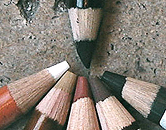
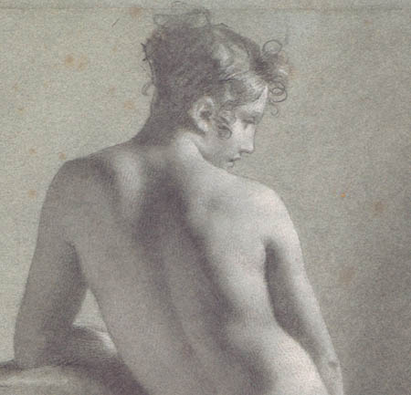
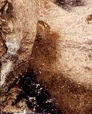

## Académies
### Dessin académique
 **Académies**

[\[accès direct poses académiques\]](academies.html#posesacademiques)



_Il est communément admis que l'académisme ne se borne pas tant à des choix techniques qu'à une manière d'envisager l'art. C'est dans l'esprit de l'académisme, par exemple, de proscrire autant que possible le contour__, de travailler avant tout la valeur, le [modelé](modele.html), à l'aide de couleurs bien définies : noir, sanguine, sépia ou bistre sur fond blanc, crème ou gris (éventuellement bleuté), parfois rehaussé de blanc. La sépia et le bistre sont théoriquement des encres mais l'emploi à sec est admis. La sanguine elle-même peut être utilisée sous forme d'encre ou de craie ([lire article](sanguine.html))._

_Ce type de dessins, indépendamment des choix techniques, s'oppose radicalement à l'illustration (médiévale aussi bien que contemporaine), qui s'intéresse avant tout à l'impact expressif renforcé par des contours prononcés facilitant la lecture._

_Cependant, entre_ 

 _- le travail de pur modelé, qui ouvre sur la composition et permet d'ailleurs de préparer des tableaux_

 _- et la "ligne claire" de la bande dessinée franco-belge ou aussi bien les aplats colorés des enluminures du Moyen-âge,_ 

_il existe un vaste univers qui n'a certainement pas fini d'être exploré bien que ces questions furent posées dès Lascaux. De nos jours, de l'expressivité de la ligne au pur travail de composition réalisé au [fusain](fusain.html), il n'y a pas forcément opposition et il existe des expressions intermédiaires._

Cela n'empêche pas, encore aujourd'hui, que les jurys de certaines écoles d'art perpétuent ou accentuent même certains choix liés au matériel proprement dit, notamment dans le domaine des couleurs. Nous avons par exemple recueilli le témoignage d'une étudiante recalée à Paris (nous ne citerons pas le nom de l'école où elle postulait) pour avoir utilisé des couleurs trop peu académiques malgré un travail figuratif sans contour, en fait remarquable et original sans excès d'excentricité. Il s'agissait d'un parfait exemple d'exploration intelligente de cet "univers" que nous évoquions ci-dessus.

Revenons cependant à l'académisme "strict" qui - ne soyons pas injustes - donne des résultats époustouflants avec très peu de moyens comme dans l'image ci-dessous, détail d'un exceptionnel travail de lumière et de modelé de Prud'hon réalisé avec des crayons noir et blanc sur papier originellement bleu.

 

 

**Les poses académiques**

Un autre aspect de l'académisme concerne les poses autorisées aux modèles artistiques. Elles furent limitées à des figures célèbres - par exemple le discobole - issues de l'art antique.

Cette tradition se perpétue, notamment en Italie. Ainsi, le logiciel de synthèse corporelle MakeHuman ([lien](http://www.google.fr/#hl=fr&gs_nf=1&cp=5&gs_id=i&xhr=t&q=makehuman&pf=p&output=search&sclient=psy-ab&oq=makeh&gs_l=&pbx=1&bav=on.2,or.r_gc.r_pw.r_qf.,cf.osb&fp=ee984ad18e456e7c&biw=1440&bih=817)), dont le fondateur est italien, propose-t-il toujours, y compris dans sa plus récente version, une bibliothèque de poses de ce type.

Un autre Italien, Modigliani, semble avoir été le premier ou l'un des tout premiers parmi les artistes latins à rompre avec la tradition classique afin de travailler sur d'autres expressions corporelles y compris dans les cadres pédagogiques.



Evoquons maintenant les techniques proprement dites, les matériaux utilisés pour les "académies" :

> \* le [fusain](fusain.html) et la [gomme mie de pain](gommemiedepain.html)
> 
> \* certaines encres : la [sanguine](sanguine.html), la [sépia](sepia.html) et [l'encre de Chine](encredechine.html), travaillées à la [plume](plume.html) et/ou en [lavis](lavis1.html)
> 
> \* les crayons de type pierre noire, crayon fusain, crayon carbone
> 
> \* les crayons et craies carrées blanche, sanguine, sépia et ocre jaune à la rigueur
> 
> \* les mines des mêmes couleurs, éventuellement mêlées de gomme arabique, comme l'ancienne [sanguine](sanguine.html)
> 
> \* les crayons noirs, mines de plomb et mines hexagonales (lire l'article sur [les crayons](crayon.html))
> 
> \* les papiers teintés ou blancs à grain fin : 'C à grain' ®, Ingres et vergés divers, vélins et BFK Rives ® (papiers destinés à la gravure), papiers pour l'aquarelle, certaines 'Mi-teintes' ®, Accademia ®, etc. Les couleurs sont généralement soit dans les ocres, soit dans des bleus gris, soit du blanc.

On retrouve finalement dans les académies à peu de choses près les couleurs de l'art paléolithique. D'ailleurs certaines réalisations de cette époque sont pour ainsi dire académiques. Un exemple :



Dans cette tête d'animal à la renverse, en pleine chute (Lascaux), il n'y a aucune accentuation des contours mais bien des zones savamment estompées. Comme souvent dans l'art pariétal, la surface est mise à profit à l'instar du grain d'un papier ou d'une toile dans les pratiques plus récentes.

Pensons donc que nos ancètres travaillaient probablement avec des blocs comme ceux-ci :


(il s'agit ici de [pierre noire](pierrenoire.html), un matériau assez rare)... ou bien, plus souvent encore, avec des terres réduite en poudre ou des morceaux de bois carbonisé, parfois un peu de graisse animale, etc.

_Mais... et c'est le but de la démonstration, quand ils avaient la chance de tomber - par exemple - sur un filon de violet de manganèse, ils ne se privaient pas de s'en servir. Sans cette liberté, l'art aurait-il évolué ?_ L'artiste ne doit-il pas être ouvert, ne doit-il pas même s'entraîner à une ouverture raisonnée ? N'est-il pas important, y compris sur le plan pédagogique, de mettre en question une conception trop rigide de l'académisme tant sur le plan des matériaux employés que sur celui des couleurs là où une évolution sainement ouverte a fait ses preuves depuis des dizaines de milliers d'années ?


 [Communication](http://www.artrealite.com/annonceurs.htm) 

[](index-2.html#20131014)


```
title: Académies
date: Fri Dec 22 2023 11:25:53 GMT+0100 (Central European Standard Time)
author: postite
```
