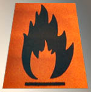

## Acétone
### Acétone, usage en arts plastiques
 **Acétone**

_Nom féminin._

Formule : CH3\-CO-CH3 (deux [méthyles](methyle.html) liés par un [cétone](cetone.html)). Liquide incolore.

Dissolvant [volatil](volatil.html) puissant des graisses (notamment des peintures grasses, de l'huile aux polyuréthanes) et de quelques autres produits. Très performant pour le nettoyage des palettes (peinture à l'huile).

L'acétone pourrait servir d'agent durcissant pour les [détrempes](detrempe.html) décoratives et la peinture à la [caséine](caseine.html) (on signale même l'emploi d'acétone pour le nettoyage des surfaces peintes ou enduites avec ce produit). Elle servirait d'imperméabilisant pour les [gélatines](gelatine.html) animales, mais est déconseillée pour cet usage par certains auteurs (elle les rendrait friables).

Son action sur les [protéines](proteine.html) (durcissement, imperméabilisation) est comparable à celle du [formol](formol.html). L'acétone doit être appliquée par pulvérisation ou en couche légère à la brosse. Elle ne dissout pas vraiment les peintures protéiques, contrairement à l'[alcool](alcools.html) et autres solvants.

L'utilisation d'acétone pour les [transferts](transfert.html) d'imprimés ne s'avère pas toujours d'une efficacité époustouflante.

Une feuille [d'acétate](acetate.html) imbibée d'[acétone](acetone.html) adhèrerait à elle-même (information récente non confirmée à ce jour).

L'acétone est un produit volatil **facilement inflammable**, aux vapeurs pouvant devenir entêtantes, mais utilisable quand même en atelier ou en appartement. Ouvrez les fenêtres (fermez les immédiatement en cas d'ignition), ne fumez pas, éloignez ou éteignez les sources de flammes proches (radiateur, chauffe-eau à gaz), et comme toujours, repérez préalablement l'emplacement d'un extincteur et d'un téléphone dans votre environnement.

**Éviter absolument tout contact avec les yeux (irritant grave).**

Moyennant ces précautions, l'acétone ne pose aucun problème. Elle se révèle d'un usage courant très secourable. Il est préférable de l'entreposer _hors de portée des enfants et des animaux_ et de la manipuler dans une atmosphère calme.

[Voir diluants, solvants et dissolvants](diluantssolvants.html)

