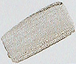

## Acier
### Acier, usage en arts plastiques
 **Acier**

_Lire en premier de préférence d'article du glossaire consacré à ce métal.  
[Cliquer ici.](aciergloss.html)_

En peinture, ce métal est proposé comme couleur iridescente dans certaines [gammes](gammes.html) extra-fines (photo ci-dessus). Nous ignorons s'il s'agit véritablement d'acier ou d'une imitation [micacée](mica.html). De toute manière, certains fabricants de pigments incluent bien la poudre d'acier dans leur offre commerciale, mais nous ignorons de quelle variété il s'agit précisément. Nous conseillons aux acheteurs potentiels de s'en informer. Il est également possible de récupérer soi-même les résidus de traitements comme le sciage ou l'abrasion ([limaille](limaille.html), [battitures](battitures.html)).

L'acier inoxydable (voir [galvanisation](galvaniser.html)), n'apporterait rien sur le plan pigmentaire. En effet, c'est sa fine surface [chromée](chrome.html#chromage) qui en empêche l'oxydation. Mettre en poudre une pièce en inox revient peu ou prou à travailler avec ce que l'on nomme "l'acier pour emballage", c'est-à-dire non encore galvanisé.

L'avantage des imitations pigmentaires est qu'elles sont garanties quant à leur permanence - lorsque les fabricants sont fiables.

Lire également ["Acier : comment l'oxyder"](courrierdeslecteurs2008c070.html#20081208st)  
in Courrier des Lecteurs


 [Communication](http://www.artrealite.com/annonceurs.htm) 

[](index-2.html#20131014)


```
title: Acier
date: Fri Dec 22 2023 11:25:55 GMT+0100 (Central European Standard Time)
author: postite
```
