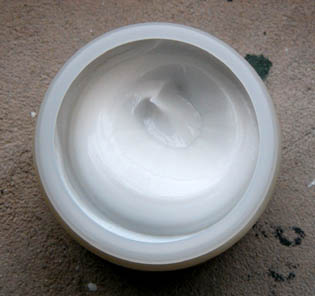

## Acrylique
### Acrylique, usage en arts plastiques
 **Acrylique(s)**

_Les nombreux adjuvants que proposent les fabricants permettent cependant d'ajouter du brillant, du satiné, de la transparence à la pâte de sorte à retrouver le mystère que la transparence donne à la peinture à l'huile appliquée en [glacis](glacis.html)._

_Les réserves émises quant à la jeunesse de ce produit et l'absence de toute expérience de conservation à long terme s'évaporent progressivement avec le temps. Les toutes premières acryliques se sont mal comportées : sensibles aux UV, elles craquelaient. Mais il y a eu correction.  
La longévité d'une bonne acrylique actuelle se compte a minima en décennies._

_**L"épineuse question des origines**_

> _\* [Xavier de Langlais](livres.html#langlais) situe les premières recherches sur l'acrylique et le vinyle dans l'Allemagne des années 1930 ("environ 25 ans" avant la publication de la première édition du livre en 1959)._ 
> 
> _\* [André Béguin](livres.html#beguin) situe la commercialisation des premières versions à usage artistique en 1958, aux États-unis, introduites en Europe peu après._ 
> 
> _\* **D'autres sources** non confirmées donnent la primeur au Mexique des années 1950 par le biais de l'utilisation détournée d'acryliques décoratives à des fins artistiques._ 
> 
> _\* [François Perego](livres.html#perego) rappelle qu'en 1843, Redtenbacher - vraisemblablement Joseph - découvrit le moyen d'obtenir de l'acide acrylique sur la base d'un produit se polymérisant spontanément, l'acroléine. Dans les années qui suivirent, différents chercheurs se seraient employés en Europe germanophone à former à l'aide de cet acide des [esters](ester.html) [polymériques](polymere.html)._
> 
> _En 1901, Otto Röhm soutient une thèse (une dissertation selon d'autres sources) sur les produits de polymérisation de l'acide acrylique (à Tübingen ou à Munich) après quoi il fonde l'entreprise "Otto Haas" (à Esslingen en 1907 puis à Darmstadt à partir de 1909, selon d'autres sources qui ne spécifient pas, contrairement à F. Perego, si Otto Haas est une personne réelle ou seulement le nom de l'entreprise). Cette entreprise commercialise le polyméthacrylate de méthyle (en 1927), à savoir la première "acrylique", puis de nombreux dérivés, tous encore coûteux à l'époque selon le même auteur. Leur vocation, selon celui-ci, ne rejoint la peinture artistique qu'à partir de 1949 (gamme Magna ® de Bocour Artist Colours, Etats-Unis). Malheureusement, F. Perego n'évoque pas les peintures décoratives._
> 
> _Suivent en 59 la Liquitex ® de Permanent Pigments (en France seulement en 67) - qui existe toujours -, en 62 Lascaux (Suisse), en 63 Lefranc & Bourgeois, Talens en 65, etc._ 
> 
> _\* **Selon un lecteur de Dotapea** qui nous a contactés, l'acrylique aurait "_été inventée au Mexique au début du XXème siècle vers 1905 (au moment de la révolution mexicaine contre la dictature de Porfirio Diaz ) par des chimistes de l'Institut National Polytechnique de Mexico, et en collaboration avec les maîtres peintres muralistes mexicains, lors de la réalisation des fresques sur les façades de l'université de Mexico. Les écrits de David-Alfaro Siqueiros (peintre-muraliste mexicain) : "L'art et la Révolution", racontent dans le détail la mise au point de cette technique picturale) mise sur le marché en 1950. Elle apparaît en France dans les années 1960 (à confirmer).
> 
> Par contre pendant les premiers essais de cette technique picturale,le Mexique ne s'est jamais approprié l'invention de l'aérographe (lui aussi utilisé pendant cette période) qui, lui, a été inventé par Charles Burdick peintre aquarelliste anglais en 1897. Ces deux techniques ont bel et bien été utilisées conjointement à partir de 1913 lors de la réalisation des fresques qui ornent les façades de l'université de Mexico._"._

_Comme on le voit, les opinions divergent. N'hésitez pas à [nous signaler](ecrire.html) des cas précis._

**_Chimie de l'acrylique_**

_Les peintures acryliques sont des esters fabriqués à partir d'acide acrylique \[( CH2)2\-CO2\] et d'acétylène (notamment). Pour plus d'informations, consulter [l'article du glossaire](acryliquegloss.html)._

_La chimie de l'acrylique, **à base [éthylénique](ethylenique.html) comme [l'huile de lin](huiledelin.html)**, peut produire de nombreuses sortes de peintures et de colles aux propriétés étonnement variées. Elle est paraît-il plus complexe que la chimie du [vinyle](vinylegloss.html)._

_Le choix d'une peinture acrylique repose donc en bonne partie sur la qualité chimique du liant et sur son adéquation au travail à effectuer. Certaines peintures destinées à la finition des carrosseries automobiles ou des radiateurs risquent de ne pas donner d'excellents résultats pour l'artiste qui peint sur toile. Il y a de bonnes surprises, mais la prudence est de mise._

_Les acrylates possèderaient des fonctions acides hydrophiles, donc il y aurait toujours une  
action de l'humidité ambiante. Les [vinyles](vinyle.html) seraient plus résistants de ce point de vue._ 

_L'affirmation selon laquelle n'importe quel vernis acrylique dilué peut servir de liant est on ne peut plus hasardeuse (voir_ [Détournements](detournement.html)_). Elle se justifie par contre assez bien en ce qui concerne les vernis destinés à l'ébénisterie._

Diluants : [eau](eau.html) mais aussi essences pour certaines variétés de produits (quelques vernis acryliques, notamment).

Solvants, dissolvants : [alcool à brûler](alcools.html#methanol) (pas toujours très efficace comme détachant, il peut nécessiter un peu de patience), [hydrocarbures benzéniques](benzene.html) (contenus dans les "diluants pour peintures synthétiques non cellulosiques" du commerce).

Voir [Diluants, solvants, dissolvants](diluantssolvants.html).

_**ETONNANT :**_

_Bien que le diluant utilisé pour ces peintures soit généralement l'eau, les acryliques présentent, avec les peintures grasses, de surprenantes analogies . Et même davantage :_

_Certains auteurs affirment que les liants acryliques et vinyliques **sont** des corps gras comparables à des huiles. Comme beaucoup de peintres, considérant ces produits comme maigres car diluables à l'eau, nous avons rejeté dans un premier temps cette affirmation. Mais les mêmes sources affirmant en plus que ces peintures peuvent aussi accrocher sur une surface enduite de peinture à l'huile bien sèche, nous avons été assez intrigués pour réaliser plusieurs expériences. Le résultat, à cette heure, ne peut être considéré comme définitif, mais de fait_ **l'accrochage est bien réel et assez solid**_**e**, même s'il n'est pas aussi intime qu'il aurait pu l'être avec une couche d'huile. Comparativement à d'autres expériences réalisées avec du liant méthylcellulose et autres substances maigres, le résultat a de quoi surprendre._

_Nos expériences portaient sur l'accrochage du liant acrylique pur. Il est évident que l'adhérence réduit d'autant plus que l'on charge le liant de pigment. Nous conseillons donc l'apposition d'une couche de liant pur, préalable à l'application de peinture acrylique ou autre._

_L'application sur la gomme laque donne également de très bons résultats._

_Mentionnons, pour clore la parenthèse, la possibilité, évoquée par certains, d'appliquer de l'acrylique sur de la cire (en principe, on ne peut recouvrir de la cire qu'avec de la cire !) sous certaines conditions et moyennant certaines actions mécaniques. Ce procédé nécessite des expérimentations poussées en atelier._

**_Caractéristiques des procédés à l'acrylique_**

_Ce qui est décrit dans cette section concerne la peinture acrylique proprement dite, le liant, mais il faut bien noter que l'une des particularités principales du "procédé acrylique" est précisément de présenter une capacité de transformation tout à fait remarquable grâce à une grande variété d'adjuvants (voir plus loin, [Extension des capacités](acrylique.html#extensiondescapacites)). Il existe de nombreux médiums, gels, diffusants, etc., permettant de modifier profondément les caractéristiques de cette peinture._

_La_ finesse _de la peinture acrylique pure n'est pas son atout majeur, exceptés quelques produits. Le [compresseur](compresseur.html) (aérographe) n'y fait rien en dispersant la pâte en gouttelettes microscopiques : quelle que soit la technique d'application, la pâte - sans adjuvant - aura toutes les peines du monde à atteindre la précision et la délicatesse florale d'une aquarelle par exemple. Elle est trop visqueuse pour cela et sa [réticulation](reticulation.html) la destine normalement davantage à l'empâtement qu'aux couches fines, même si parmi [les gammes extra-fines, voire fines](gammes.html), on remarque des produits ayant des qualités plus que correctes dans ce domaine, échappant à l'aspect habituel un peu "latex" évoqué ci-dessus._

_Ces rares exceptions ont d'emblée un aspect agréable sans adjuvants. Le peintre peut partiellement vérifier la bonne qualité du liant quand la brillance varie vraiment comme elle doit le faire, en fonction du type de couleurs (organiques->brillant, autres->mat - voir [Organiques vs inorganiques](organiquesvsinorganiques.html))._

Ce sont la viscosité et la SOLIDITÉ qui font l'intérêt des matières acryliques en tant que liants, comme _modeling pastes_ ou gels d'empâtement mais aussi en tant que colles (voir [Colles polyacryliques _in_ Glossaire](polyacrylique.html#collespolyacryliques), [Ajout de matière sur une toile _in_ Relief](relief.html#lajoutdematieresurunetoile)).

Par conséquent; des empâtements moyens peuvent être réalisés sans adjonction de médium. A partir d'une épaisseur - qui peut varier selon le produit -, des craquelures apparaissent au moment du séchage, mais elles ne s'aggravent pas d'elles-mêmes par la suite.

Le liant pur est, une fois sec, d'une grande transparence. Certaines variétés de qualité permettent d'incruster de menus objets en procédant par strates. Il est cependant indispensable la plupart du temps de préférer un gel plus ou moins épais pour ce type d'opérations.

La peinture acrylique autorise un vrai travail de peinture. Certains artistes qui ont essayé d'autres techniques ne leur trouvent pas autant d'atouts.

Cependant, loin d'affirmer que seules l'huile et l'acrylique autorisent un authentique travail de peinture, reléguant les autres techniques au rang de colorants pour illustrations (cette opinion fallacieuse persiste malheureusement), spécifions plutôt que tout peintre cherchant un liant synthétique fin et transparent ne devant pas être empâté est invité à s'intéresser _aussi_ aux [peintures vinyliques](vinyle.html) et dans une moindre mesure aux [alkydes](alkydes.html) ainsi qu'à toutes les sortes de liants.

Enfin, la **simplicité et la souplesse d'emploi** de l'acrylique doivent être mentionnées :

> \* temps de séchage courts propices à l'initiation à la peinture, aux réalisations sur le [motif](motif.html), à certaines manières de peindre spontanées ou très stratifiées et à la peinture décorative pour les intérieurs,
> 
> \* manipulation aisée des médiums, _quasi absence d'odeur_. Des cas d'allergies nous ont été rapportés, mais ils sont très rares. Ils sont d'ailleurs probablement liés à des adjuvants.

 De plus, le vernissage n'est pas forcément nécessaire sauf pour unifier l'aspect brillant ou mat du tableau ou bien lorsqu'il s'agit de peintures réalisées à [l'aérographe](compresseur.html), car celles-ci se rayent facilement. Un autre cas peut-être envisagé : la protection d'une oeuvre devant être exposée à une source de rayonnements ultraviolets. Certains vernis ont effectivement une fonction protectrice anti-UV.

Le nettoyage d'un tableau non vernis peut parfaitement être exécuté à l'eau, l'acrylique étant imperméable et irréversible. On mentionne des cas particuliers de peinture mal préparées (pigment en proportion beaucoup trop importante par rapport au liant) qui certes, ne peuvent être lavées, mais il faut préciser que dans ce dernier cas, la couche picturale ne tarde pas à tomber en plaques de toute façon !

**_Les gammes_**

Pour qui a longuement utilisé un autre procédé, les peintures acryliques en tubes présentent une particularité : les gammes disponibles dans le commerce sont assez différentes _par le choix des couleurs_ de celles de la peinture à l'huile ou de l'aquarelle (quoiqu'une certaine parenté avec celles-ci puisse être détectée). Les incompatibilités chimiques ne justifient pourtant pas toujours cette orientation. Il s'agit peut-être avant tout de choix culturels de la part des fabricants, très souvent nord-américains ou d'origine nord-américaine. Cependant, rien n'empêche de constituer une palette à condition de repenser les repères chromatiques.

Signalons qu'il existe une grande différence entre les gammes de produits. Les "entrées de gammes" ont une qualité indubitablement médiocre : certaines autorisent à peine les mélanges de couleurs, donnant d'étranges résultats ! Le niveau juste supérieur en qualité conserve un aspect caoutchouteux. Les fines et les "studio" commencent à offrir des possibilités, mais certaines extra-fines ont encore une apparence laiteuse. D'autres, par contre, semblent véritablement sortir du lot.

Étant donné le prix de celles-là - d'ailleurs disponibles en assez petites quantités -, nous conseillons, quand c'est possible, l'achat séparé d'un très bon liant et de bons pigments plutôt que de tubes ou de flacons (voir [Séparer ou non liants et pigments](separerounon.html)).

**_Extension des capacités_**



_Les caractéristiques que nous avons décrites peuvent être modifiées radicalement par l'emploi d'adjuvants._

Lire absolument les articles _[Produits auxiliaires pour l'acrylique](produitsacryl.html)_ et [_Médiums pour l'acrylique_](mediumspourlacrylique.html).

**_Autres produits acryliques_**

Les _[vernis](vernissage.html)_ acryliques trouvent des emplois très variés, _largement au-delà du vernissage des tableaux_ : de nombreuses matières peuvent être protégées par ces produits - à condition d'être un peu poreuses. Même une peinture grasse (huile, cire) peut être vernie par certains produits acryliques. A noter que ceux de ces produits dont le diluant est une essence et non de l'eau sont de plus en plus courants, y compris dans le domaine artistique.

Mais comme nous le précisions ci-dessus, la peinture acrylique est assez solide et ne nécessite pas forcément un vernissage.

Les résines acryliques se retrouvent notamment dans de nombreux médiums et vernis pour la peinture à l'huile ainsi que dans les fixatifs pour fusains et pastels.

Les vernis acryliques pour l'ébénisterie autorisent généralement l'adjonction de pigment. Ces produits sont très adaptés à certains emplois. Les détaillants spécialisés peuvent généralement donner d'excellents conseils lors de l'achat.

Évoquons aussi une catégorie de peintures assez marginales, les [styrène-acryliques](styreneacrylique.html).

Enfin, les [colles polyacryliques](polyacrylique.html#collespolyacryliques) déjà mentionnées ont une viscosité vraiment très forte.

**_Toxicité_**

On signale (information maintenant confirmée) que certains fabricants utilisent en petite quantité du [toluène](benzene.html#toluene) pour émulsionner leurs liants acryliques. Attention : cet usage n'est pas systématique et fait normalement l'objet d'un texte d'information. Dit autrement, il n'est pas inutile de lire les notices en petits caractères.

De plus, certains agents conservateurs (voir _[Isothiazolinone](toxicite.html#isothiazolinone)_ [in _Toxicité_](toxicite.html#isothiazolinone)) peuvent avoir des effets allergènes. Leur présence est avérée dans certaines peintures destinées à une application murale.

Une chose est certaine, l'acrylique n'est pas destinée aux jeunes enfants. Mais cette remarque est valable également pour la peinture à l'huile. Sur ces questions lire un [passage](courrierdeslecteurs2009c030.html#20090903te) du Courrier des Lecteurs.


 [Communication](http://www.artrealite.com/annonceurs.htm) 

[](index-2.html#20131014)


```
title: Acrylique
date: Fri Dec 22 2023 11:25:55 GMT+0100 (Central European Standard Time)
author: postite
```
