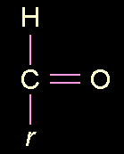

## Aldéhyde
### Aldéhyde, article du glossaire
 _Nom masculin,  
du latin scolastique_ al(cohol) dehyd(rogenatum)_,  
"[alcool](alcool.html) déshydrogéné"_

L'aldéhyde est un composé organique [insaturé](saturation.html) comprenant un groupement, une "fonction" -CHO.

Il est obtenu à partir d'un [alcool](alcool.html#fonctionsalcool) primaire ou secondaire par "retrait" d'un atome d'hydrogène. Dans le cas du vinaigre, cette opération est effectué par des microorganismes. Voir _[Vinaigre](vinaigre.html)_.

Exemples de formulations d'aldéhydes : CH3\-CHO, aldéhyde acétique, H-CHO, aldéhyde formique.

Certains aldéhydes peuvent, en association avec un alcool, constituer un [corps gras](gras.html#corpsgras).

Voir _[Le formol](formol.html)_, _[Amandes amères](amandeamere.html)_ et _[Formique](formique.html)_.

 [Communication](http://www.artrealite.com/annonceurs.htm) 

