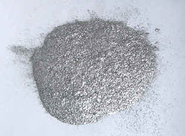

## Aluminium
### Aluminium, usage en arts plastiques
 **L'aluminium**

L'[aluminium](annexe1.html#al) en poudre est sûrement le pigment le plus léger qui soit.

Il faut absolument couvrir le flacon de poudre d'un linge ou d'un plastique avant de l'ouvrir, sans quoi l'aluminium pur s'évade dans l'air plus rapidement qu'un papillon affolé. Ce n'est pas une substance très toxique mais elle n'est, semble-t-il pas anodine (action inhibitrice possible sur la mémoire).

Assez peu coûteux, discret en mélange, c'est un pigment utile. Il modifie efficacement la teinte des autres poudres métalliques, se marie subtilement aux pigments non métalliques, s'emploie aussi pur, formant des surfaces très cohérentes et incroyablement lumineuses.

Sauf son aspect pulvérulent embarrassant à l'emploi, l'aluminium est un agent facile à contrôler. Son apport sur les plans chromatique et lumineux est remarquable.

Sa neutralité chimique et sa permanence sont tout spécialement notoires.

 [Communication](http://www.artrealite.com/annonceurs.htm) 

