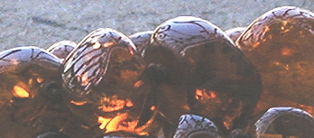
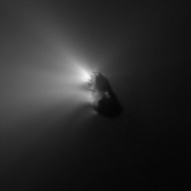

## Ambre - Chapitre XXVII des Dialogues de Dotapea
### Ambre et vieilles branches - Chapitre XXVII des Dialogues de Dotapea
 Navig. page/section

  
  

\_\_\_\_\_

**Pages soeurs**

[I, A propos des liants](chap01liants.html)  
[II, Bulles, siccativ., struct. élec.](chap02bullessiccativation.html)  
[III, Caséine, phosphore, dissociation](chap03caseine.html)  
[IV, Les orbitales](chap04orbitales.html)  
[V, L'aérogel](chap05aerogel.html)  
[VI, Polarisation de la lumière](chap06polaris.html)  
[VII, Sfumato et diffusion Rayleigh](chap07rayleigh.html)  
[VIII, Les interférentielles](chap08interferences.html)  
[IX, Dextrine, farine et chiralité](chap09dextrine.html)  
[X, L'ocre bleue](chap10ocrebleue.html)  
[XI, Les métamatériaux](chap11metamateriaux.html)  
[XII, Le jaunissement](chap12jaunissement.html)  
[XIII, Laser etc.](chap13laser.html)  
[XIV, L'holographie](chap14holographie.html)  
[XV, L'holographie numérique](chap15holographienum.html)  
[XVI, Extérieur, intérieur, chaux](chap16interieurexterieurchaux.html)  
[XVII, L'électrolyse et les ions](chap17electrolyseions.html)  
[XVIII, L'électricité, un peu plus loin](chap18electriciteplusloin.html)  
[XIX, Oxydation, métaux](chap19oxydationsmetaux.html)  
[XX, Les échelles](chap20echelles.html)  
[XXI, Nature et évolution des résines](chap21resines.html)  
[XXII, Le mouillage pigmentaire](chap22mouillage.html)  
[XXIII, La molette](chap23molette.html)  
[XXIV, Blanche neige](chap24blancheneige.html)  
[XXV, Lumière et matière](chap25lumiereetmatiere.html)  
[XXVI, Magnétisme](chap26magnetisme.html)  
XXVII, Ambre et vieilles branches  
[XXVIII, L'origami miroir](chap28origamimiroir.html)  
[XXIX, Le feu](chap29feu.html)  
[XXX, Peau du métal](chap30peaudumetal.html)  
[XXXI, La ville en un souffle](chap31bellastock.html)  
[XXXII, Oxyder des matériaux](chap32oxydermateriaux.html)  
[XXXIII, Ocre bleue, une solution](chap33ocrebleuesimulation.html)

\_\_\_\_\_

Copyright © www.dotapea.com

Tous droits réservés.  
[Précisions cliquer ici](droitscopie.html)

**Les dialogues sur la physique-chimie  
appliquée aux arts**

**Chapitre** **XXVII**

**Ambre  
et vieilles branches**

dial   dial   dial

Ce chapitre est une discussion entre Jean-Louis, physico-chimiste au CNRS, et Emmanuel, candide.

Il est souhaitable quoique non  
indispensable de lire en premier lieu  
l'article consacré à l'ambre. [Cliquer ici](resinessolach.html#lambre)

Emmanuel : Tout part du courrier d'un lecteur à lire [ici](courrierdeslecteurs2010b160.html#20100603br).

Pour résumer, une entreprise de lutherie vend des produits à l'ambre et dans sa documentation, assimile l'ambre jaune à une substance terpénique.

Comme indiqué dans la réponse déjà publiée, elle l'est au départ car il s'agit bien sûr de sève, mais la longue transformation de cette substance la fossilise et les auteurs "Beaux-arts" (citons [Delcroix et Havel](livres.html#delcroix) et [Perego](livres.html#perego)) ne classent pas la résine obtenue parmi les produits terpéniques.

On pourrait aussi ajouter à titre informatif le fait que François Perego note dans l'ambre la présence de soufre. Au-delà, évitons les polémiques sur les classifications car elles deviendraient vite sibyllines. Le texte qui est à la source de notre intérêt renouvelé pour l'ambre (désolé amis lecteurs, nous ne pouvons pas le publier mais c'est sans importance ici) pose des questions d'un intérêt plus général

> \* sur le rapport possible entre oxygénation et évaporation d'une part. En effet si l'on suit le raisonnement de l'auteur, les deux phénomènes interviendraient dans la genèse de l'ambre,
> 
> \* et entre oxygénation et polymérisation d'autre part,

tout cela dans un univers issu du vivant.

Donc quelques questions au risque de paraître un peu technique : sais-tu, Jean-Louis, si le C10H16 (le terpène) a besoin d'incorporer O pour s'évaporer ? Et par ailleurs, crois-tu que l'oxygène joue un rôle dans la polymérisation terpénique qui, soit dit en passant, semble un phénomène fascinant à en croire Delcroix et Havel : « _(...) tous les composés terpéniques se présentent structuralement comme des polymères de l'isoprène (...) qui n'est cependant pas leur véritable précurseur dans la synthèse qu'en effectue la nature. Celle-ci se permet en effet de "découper" la formule développée d'un terpène en "motifs isoprènes"._ »

"Sang des plantes", ou plutôt assemblages moléculaires un peu inhabituels, les terpènes semblent propres à un monde particulier et foisonnant.

Jean-Louis : Quasiment par définition, la composition des produits végétaux est TRÈS complexe. Des milliers de molécules rien que dans un jus de truffe ou la sève d'une plante.

Dans la plupart des cas, ce sont des petites molécules. Sinon ça ne coulerait pas et ça ne servirait à rien biologiquement. Ensuite l'oxydation, la perte de fractions volatiles, les UV, tout ça, fait que les molécules se transforment et qu'éventuellement les poids moléculaires grimpent, et l'on obtient des huiles, des gommes, des résines. 

\--> à ce sujet lire l'article consacré au [terpène](terpene.html), cette base moléculaire qui est essentielle au monde végétal puisque constitutive des sèves, des latex et d'un nombre imposant de substances.

L'évaporation c'est juste le passage de molécules liées (liquides ou solides) à des molécules non liées (gaz). C'est purement physique. D'ailleurs ça marche dans le vide. Les comètes s'évaporent, d'où leur queue. Sous vide on peut même évaporer des métaux.

Il existe des dizaines de sortes de polymérisations et l'oxygène peut aussi bien en catalyser une et en inhiber une autre. Les substances du genre terpènes n'ont pas besoin d'oxygène pour réticuler. Lumière ou chaleur suffisent. Aucun produit n'a besoin d'oxygène pour s'évaporer. L'évaporation est un phénomène physique, pas chimique. 

  
Au risque de choquer, je dirais que savoir d'où ça vient et comment c'est formé n'a pas grand intérêt. C'est comme la formation du charbon ou du pétrole. On sait que c'est d'origine organique, que ça prend longtemps, et puis après ? On ne va pas en refaire...

Tu as déjà vu les boules de résine qui se forment sur les résineux ou sur les cerisiers ? C'est pareil, juste quelques milliers d'années par dessus. Ce qui peut s'évaporer s'évapore (ex. essence de térébenthine), ce qui peut réticuler réticule, et voilà. On trouve des fourmis et des abeilles dedans, et comme c'est gluant au départ il y a une croûte terreuse autour \[[lien](resinessolach.html#sediments)\].

On en fait un fromage à cause de l'origine préhistorique, mais c'est pas différent d'une colle [époxy](epoxy.html) ou d'un mastic [styrène](styrene.html). Tu prends un pot d'huile de lin, tu attends quelques milliers d'années (même moins) et tu auras un bloc de résine....

Emmanuel : Oui, on fait tout un fromage, dirait-on, à partir de vieilles branches qui n'ont rien demandé.

Joli détour par les comètes, merci :)

Halley photographiée par la sonde Giotto le 14/3/1986

Source CNES - Crédits : ESA/MPAE, 1986

 

Au sujet du caractère non liant des gaz, lire un [passage](gazliquidessolides.html#liaisons) de l'article consacré aux phases de la matière.

[Chapitre suivant](chap28origamimiroir.html)

 

  [Communication](http://www.artrealite.com/annonceurs.htm)