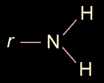

## Amine
### Amine, article du glossaire
 _n.f., de ammoniac._



Fonction amine : -NH2, soit la composition de l'ammoniac moins un atome d'hydrogène.

Dans la formation d'une amine, l'un des atomes d'hydrogène de l'[ammoniac](ammoniac.html) (NH3) initial est remplacé par un ou plusieurs radicaux [univalents](valence.html) d'un type précis, les [alcanes](alcane.html) (CnH2n+2) privés eux aussi d'un atome d'hydrogène (en général d'un couple OH), et nommés _[alcoyles](alcoyle.html)_.

Une amine présente donc une formule type (CnH2n+1)xNH2.

Exemple : CH3OH (méthanol) + NH3 donnent CH3NH2 + H2O, amine méthylique.

Une _vitamine_ est normalement pourvue d'un fonction amine. Ainsi, les vitamines "F", qui en sont dépourvues,  ne sont plus reconnues par tous les biologistes en tant que vitamines. A ce sujet, lire _[L'acide linoléique, l'acide linolénique, les ALC.](linoleiquelinoleniquealc.html)_

Voir [acides aminés](acides.html#acidesamines), [polyamines](polyamine.html) et [amides](amide.html).


 [Communication](http://www.artrealite.com/annonceurs.htm) 

[](index-2.html#20131014)


```
title: Amine
date: Fri Dec 22 2023 11:26:01 GMT+0100 (Central European Standard Time)
author: postite
```
