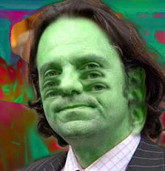
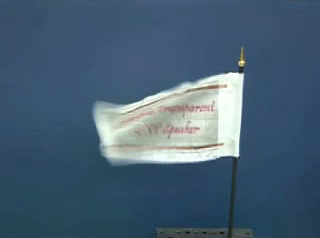
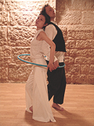
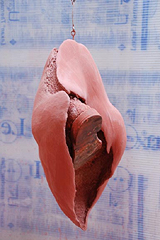

## Archives 2008-2 - Actus/blog du réseau ArtRéalité
### Archives 2008-2 - actus/blog du réseau ArtRéalité
 Archives 2008-2  
**Actualités / blog des sites**

23/12/2008

> **La mafia vous souhaite de Joyeuses Fêtes :)**
> 
> **Edito de fin d'année**

« _La mafia s'est toujours développée là ou l'État était absent ; de même, les trafiquants d'armes, de médicaments ou d'objets volés et les proxénètes ont trouvé refuge sur Internet, et les psychopathes, les violeurs, les racistes et les voleurs y ont fait leur nid. » (...)_

_« Combien faudra-t-il de jeunes filles violées pour que les autorités réagissent ? Combien faudra-t-il de morts suite à l'absorption de faux médicaments ? Combien faudra-t-il d'adolescents manipulés ? Combien faudra-t-il de bombes artisanales explosant aux quatre coins du monde ?_ »

Ces « brillants propos » sont de M. Frédéric Lefebvre, un député qui n'est heureusement pas suivi par son propre parti dans sa croisade parlementaire aveuglément anti-web ni dans sa demande de prise de contrôle de l'internet français par le CSA (Conseil supérieur de l'audiovisuel), un peu comme en Chine. Ce monsieur, lobbyiste réputé, oublie le rôle dynamisant des acteurs web et des entités qu'ils mettent à disposition pour que les citoyens s'instruisent, se divertissent et dialoguent.

Là où la télévision diffuse à discrétion, depuis des décennies, des images violentes - avec l'accord du CSA -, n'oublie-t-on pas de compter combien de personnes en difficulté ont été sauvées par quelques mots chaleureux ou un avertissement utile sur un forum ? La diabolisation du web en France est maladive.

Les chiens aboient, la caravane passe, mais l'ingratitude, le manque de discernement et les mots qui blessent fâchent.

Emmanuel Luc

Éditeur

Le Réseau ArtRéalité se porte bien en cette fin d'année en termes d'audience. Nous vous remercions de votre intérêt et de votre fidélité.

Bilan. Nous avons accompli en 2008 des avancées significatives, notamment avec l'ouverture de la galerie [Walesgal](http://www.walesgal.com/) et la première « Nuit » associée, événement réel qui a eu lieu le 11/10 dernier (de gros chantiers qui vont se prolonger ces prochaines années), la poursuite des [Dialogues de Dotapea](dialoguesdotapea.html) avec un [nouvel intervenant scientifique spécialisé](chap22mouillage.html), l'émergence d'un nouveau regard sur l'art tenant compte de la [perception humaine](perception.html) et la première [publication d'une oeuvre littéraire](http://www.artrealite.com/babel.htm) sur ArtRéalité, tandis que se poursuivent le travail de traduction des sites et la mise à jour des données.

Perspectives. L'arrivée en cette fin d'année d'une toute nouvelle équipe d'informaticiens nous permet de vous annoncer que nous vous réservons quelques surprises de taille pour 2009.

**Joyeuses Fêtes !**

20/12/2008

> **Retour sur la Nuit de Walesgal** 

Quand vidéastes et comédiens travaillent ensemble, cela donne ce genre de créations : [cliquer ici.](http://www.walesgal.com/autour/index.html#cosmosilicates)

28/11/2008

> **Un haut-parleur qui (se) déchire** 

C'est beaucoup plus qu'une curiosité. Notre très sélective section Hi-tech présente une nouveauté révolutionnaire. Elle concerne le son mais les plasticiens en saisiront tout de suite la portée.

[Lien](hitech.html#hautparleurssouples)

14/11/2008

> **A quoi sert vraiment la molette pigmentaire ?** 

Cette question est abordée dans le tout nouveau [chapitre XXIII](chap23molette.html) des Dialogues de Dotapea.

8/11/2008

> **Problèmes de diffusion vidéo : suite et fin** 

A part un dernier petit récalcitrant, ils sont réglés à ce jour.

La navigation vidéo sur le réseau ArtRéalité est rétablie.

Toutes nos excuses pour l'inconfort subi durant cette période de transfert.

> **Oleg Kulik : le monde artistique français devant une absurde dérive policière** 

Lors de la récente édition 2008 de la FIAC (Paris), la police, saisie d'une plainte émise par des inconnus a décroché des oeuvres du plasticien Oleg Kulik dont les galeristes parisiens ont été placés en garde à vue plusieurs heures avant d'être libérés avec l'interdiction de raccrocher les oeuvres incriminées.

Implantés et bien connus à Paris depuis dix ans, ces intervenants ont été accusés de diffuser des images dégradantes, on ne sait trop pourquoi dans la mesure où le travail de Kulik sur les relations entre humains et animaux a évidemment et notoirement une dimension conceptuelle et les pratiques suggérées, bien sûr simulées, ne sont pas ce que l'on appelle des oeuvres pornographiques. Et quand bien même, il faudrait alors à ce titre incarcérer nombre de grands maîtres qui depuis la Renaissance se sont intéressés au corps.

Une affaire où les autorités ne semblent pas avoir fait preuve non de tolérance - ce n'est pas la question car le sujet a suscité dépassement et sublimation dans l'art depuis des siècles là où la pornographie la plus brute est devenue aisément accessible - mais bien d'une clairvoyance élémentaire.

Une telle attitude porte grief à des intervenants sérieux dans un lieu d'exposition sérieux et même emblématique des capacités de la France à conserver une place de choix dans l'univers de l'art contemporain mondial, et pourrait paraître le reflet d'un infantilisme déplacé ou d'une certaine confusion mentale de l'ordre du ridicule et du risible. Un ridicule risible malheureusement nuisible pour toute la communauté nationale car nous ne vivons pas dans un village mais sur une planète où tout se sait et se voit, y compris notre aptitude à rester crédibles.

29/10/2008

> **Nuit de Walesgal : le film** 

Première session, premier événement, premiers applaudissements, premières ventes... et premier regard, celui du cinéaste Pascal Aubier.

Retrouvez Bernadette Mercier, Hans Bouman, les Cosmopolite PL, les Silicate, les plasticiens de la session, et tant d'autres.

[Cliquer ici](http://www.walesgal.com/)

22/10/2008

> **La place de la vidéo dans une foire d'art contemporain**
> 
> **Table ronde organisée par LaCritique.org dans le cadre de Show-off**
> 
> **24/10 - Espace Pierre Cardin - Paris** 

Il sera question d'un sujet qui auquel nous sommes plus que sensibles sur ArtRéalité : si la vidéo est présente dans les manifestations d'art contemporain, elle ne l'est pas dans les foires. Dit autrement, il est bien difficile de les vendre. Et au fond pourquoi ?

[Lire le flyer](documents/showoffflyer2008.html)

17/10/2008

> **Les Cosmopolites PL en scène  
> jusqu'au 26**

Vous avez apprécié la Nuit de Walesgal ? Pour prolonger le plaisir dans le registre théâtral, il suffit de venir voir les comédiens en scène

les 17 et 18 octobre 2008 à 20h30 au

Centre Culturel Franco-Japonais Tenri  
8-12 rue Bertin Poirée Métro Châtelet

Réservations : 01 44 76 06 06  
ecbp at tenri-paris.com  
Plein tarif : 12 euros/ tarif réduit 10 euros / enfants 5 euros

Une présentation du spectacle - déjà joué au printemps - est disponible [ici](http://www.artrealite.com/etrela.htm). 

12/10/2008

> **Walesgal est en mode réel  
> jusqu'au 26**

Vous étiez quelques centaines hier lors de notre événement-spectacle d'art contemporain. MERCI !

Vos applaudissements très chaleureux, vos rires aussi, votre attention soutenue, ont enchanté les quatorze artistes (plasticiens, cantatrice, comédiens, vidéastes et musiciens) comme l'ensemble des trente-six intervenants de la Nuit. Merci encore.

Nous voici donc dans une période de quinze jours où vous pouvez venir voir les oeuvre des quatre exposants de Walesgal.com et de notre invité spécial, Hans Bouman.

Toutes informations sur [Walesgal.com](http://www.walesgal.com/).

11/10/2008

> **La Nuit de Walesgal jour J**

Chers amis lecteurs ce soir est l'émergence dans le réel du Réseau ArtRéalité.

Toutes informations sur notre Walpurgis tout contemporain (adresse, intervenants, thèmes, ...) -> [cliquer ici](http://www.walesgal.com/autour/index.html)

3/10/2008

> **La Nuit de Walesgal à j-8**

Nous sommes dans une période de répétitions et de mises au point.

Une évidence à ce stade du projet : le mot "transversalité" n'est pas usurpé.

Hans Bouman et notre Reine de la Nuit, la cantatrice Bernadette Mercier, ont su travailler ensemble. Le résultat sera une oeuvre vidéo, _Les lauriers d'Eros_.

Et de même, les Cosmopolites PL (comédiens) jouent en totale intelligence dans le rayon du vidéoprojecteur des Silicate (vidéastes-musiciens).

En 2008, le multimédia est une réalité.

Rendez-vous le 11, Paris XIème. Informations -> cliquer sur l'image.

13/09/2008

> **La première session de [Walesgal.com](http://www.walesgal.com/) est en place**
> 
> **et la Nuit de Walesgal est confirmée le 11 octobre Paris XIème**
> 
> **Invité spécial : Hans Bouman**

**\-> [toutes informations](http://www.walesgal.com/autour/index.html)**

**L'exposition Sophie Sainrapt,** c'est 72 pages web, une vidéo de 21 minutes, trois autres en imagerie de synthèse et une présentation écrite par l'écrivaine et critique d'art Ileana Cornea. [Cliquer ici.](http://www.walesgal.com/espacesexpo/expoactuelle4/introduction.html)

**La Nuit de Walesgal** est le moment où les intervenant **ArtRéalité** passent du virtuel au réel à l'occasion d'un spectacle d'art contemporain et d'une exposition sur trois week-ends.

Notre invité spécial le plasticien multimédia Hans Bouman, réalisera une vidéo et mettra en scène la cantatrice Bernadette Mercier - Reine de la Nuit - qu'il dirigera également lors d'une intervention dans la soirée du 11.

Citons quelques autres intervenants de cette **Nuit inaugurale et transdisciplinaire** aux accents de Walpurgis : le cinéaste Pascal Aubier, le réalisateur André Gaultier, la Compagnie Cosmopolite PL (dir. Sylvaine Hinglais), les jeunes vidéastes-musiciens Silicate ([www.silicate.fr](http://www.silicate.fr/)) de l'École nationale d'Art de Cergy, etc...

Parlons de cette première session, sorte de phrase d'introduction, de liminaire, qui pourrait se nommer ainsi :

**Et tout cela donne des petits poissons,**

**autour d'un rappel de l'origine du monde**

Des souffles capturés d'Évelyne Coutas aux brouillages et aux piratages complices d'Erick Derac, de la célébration de Vénus et du vivant, patiemment élaborée par Konrad Loder, aux rappels que Sophie Sainrapt nous adresse au sujet du lien entre érotisme et maternité, il s'agit ici de parler, de façon contemporaine, de _l'origine du monde_.  
A exposition inaugurale, sujet existentiel. L'intervention du plasticien multimédia Hans Bouman et de la cantatrice Stefanie Raffaello rappellera combien nos souffles vitaux donnent des "petits poissons" et sont au-delà moteurs d'une évolution. 

En 2008, Walesgal a été créé au cours du printemps. C'est aujourd'hui 600 pages web et des dizaines de vidéos pour seulement quatre artistes exposants, et une présence réelle réfléchie.

3/08/2008

\[révision le 5\]

**Nouvelle exposition sur [Walesgal.com](http://www.walesgal.com/) : Evelyne Coutas**

212 pages web, une vidéo de 24 minutes, 8 autres en imagerie de synthèse, une présentation spécialement écrite par Christian Gattinoni : cette exposition s'inscrit parfaitement dans la ligne des engagements de la "galerie-sans-murs".

Regards transversaux, lectures subjectives des oeuvres et larges espaces d'exposition pour un travail artistique qui est lui-même emblématique d'une démarche de plasticienne contemporaine. Un peu comme Jean-Pierre Brazs, Evelyne ne rechigne pas, c'est le moins que l'on puisse dire, à employer les techniques du passé et du présent. Elle s'en fait l'alliée pour nous faire suivre la trace d'êtres de nature insaisissable, ineffable, fantomatique.

[Cliquer ici](http://www.walesgal.com/espacesexpo/expoactuelle2/introduction.html)

Courant Août, Sophie Sainrapt sera présentée par Ileana Cornea, puis suivront un ou plusieurs invités d'honneur.

Tout cela en attendant notre [Nuit](blog20082.html#nuit).

**Liquidation de Deserres France**

Triste nouvelle qui surprend tout le monde. C'est pourtant officiel : contre toute attente, au coeur de l'été, le Canadien Omer Deserres lâche l'affaire, celle-ci s'écroule et 163 salariés se trouvent "sur le carreau".

Artacrea (marques Graphigro, Rougier et Plé, Crea), en difficulté depuis quelques années - 2001 semble avoir été une charnière - avait été repris courant 2007 pour devenir Deserres France. Une société qui, selon ses salariés, marchait bien.

Elle ne marchait en fait sûrement pas si bien et comment l'aurait-elle pu alors que l'ancienne direction (menée par M. Eddy Scarfoglio) s'était séparée en 2004, pour des raisons obscures non élucidées à ce jour, de l'un des deux piliers de l'entreprise, à savoir le magasin Graphigro de la rue de Rennes (Paris) dont le chiffre d'affaire avait fait de ce lieu fréquenté par des milliers d'étudiants une véritable "success story" dans les années 90.

Depuis 2007, l'entreprise donnait l'illusion de la stabilité. En juin encore, un simple salarié nous donnait témoignage en toute bonne foi de ce qu'il croyait être la bonne santé de la société, qu'il mesurait notamment au réassort, efficace. Le 17/7/2008, la liquidation est prononcée à la surprise de tous (y compris du CE selon un témoignage direct et même de la DRH - autre témoignage direct). Ultime recours, Deserres France a alors jusqu'au 31/7 pour trouver un repreneur et échoue. Le 31, les juristes mandataires (cabinet MJA) envoient donc aux salariés leur lettre de licenciement accompagnée d'un formulaire ASSEDIC à la présentation très "cosy". L'affaire est pourtant close d'une manière particulièrement brutale. Certains salariés partis sereinement en vacances auront une très mauvaise surprise à leur retour.

Si l'on comprend qu'une entreprise connaisse des difficultés, on a du mal à excuser la brutalité de l'annonce. Rien n'aura été épargné aux salariés - ni aux clients - de cette désormais défunte entreprise au cours de ce début de IIIème millénaire.

Une importante niche économique est désormais vacante.

Situation d'autant plus baroque que les concurrents ne pourront pas absorber la demande. Où vont se fournir les étudiants et les artistes ?

La France, à force, peut-être, de s'enfoncer toujours plus dans une économie devenue foncière (plus de 50% des investissements sont immobiliers dans ce pays), ne saurait-elle plus répondre à une demande commerciale (mobilière) d'une nature aussi basique, aussi élémentaire ? Eh bien oui. Même si cela surprend, on ne peut qu'en faire le constat en comptables, au moins pour ce secteur où il y a demande.

Les 163 licenciés de Deserres France, la surprise passée, vont avoir le loisir de le faire.

Encore bravo, Monsieur Omer Deserres. Ca, c'est de la gestion !

Et chapeau bas pour cette liquidation-surprise estivale dont chacun mesurera "l'élégance".

ArtRéalité partage profondément le désarroi des salariés licenciés, en particulier celles et ceux qui pendant des décennies ont délivré un savoir utile à l'art contemporain, aux artistes, aux enseignants, aux amateurs, à vous tous qui nous lisez.

Merci, très chers confrères, pour votre travail, courage pour votre avenir.

Emmanuel Luc

Éditeur

**Accès vidéo : quelques problèmes transitoires**

Fin juillet-début août, l'opérateur Free nous a posé quelques problèmes imprévus concernant les "players" de nos plus anciennes vidéos. Alors que nous avions déjà largement entamé un processus de déménagement massif (pas tout à fait fini à ce jour) vers notre serveur dédié, était-il élégant de faire subir à nos visiteurs une pression inutile au dernier moment d'une période transitoire ? Les premières victimes de cette précipitation inutile et peu élégante sont les usagers du Réseau ArtRéalité. Ils jugeront l'opérateur Free en conséquence.  
Le moins que l'on puisse dire est que le moment était mal choisi.

22/07/2008

**Nouveau chapitre pour un nouvel intervenant dans les Dialogues de Dotapea**

Jean-Claude, physico-chimiste spécialiste des propriétés optiques des matériaux hétérogènes, fait son entrée dans le chapitre XXII des Dialogues.

Celui-ci aborde le thème très important dans notre domaine du mouillage des pigments (et autres substances). L'occasion d'aborder au-delà différents concepts scientifiques comme la polarité, la tensioactivité ou encore la notion de moment, sans oublier des implications concrètes, notamment pour les industriels de la peinture.

A lire donc, les interventions de Jean-Claude et de Jean-Louis dans

le chapitre XXII, [Le mouillage pigmentaire](chap22mouillage.html)

et son annexe, [Le moment, les pôles](chap22momentpoles.html)

8/7/2008

**Konrad Loder sur Walesgal**

Ce 8 juillet s'ouvre la seconde exposition de la "galerie sans murs" du Réseau ArtRéalité. Histoire de démontrer qu'à être virtuel on n'en est pas moins sérieux et que l'on aime tirer parti de notre média, nous exposons ce que l'on pourrait nommer un dispositif informatique mis au point par l'exposant lui-même. Une première sans doute pour une galerie web.

Autre première, Konrad Loder actualisera lui-même à volonté son espace d'exposition.

Celui-ci est agrémenté d'une visite d'atelier et des présentations de [Jacques Py](http://www.walesgal.com/espacesexpo/intervenants/jacquespy.html), de [Claude Spielmann](http://www.walesgal.com/espacesexpo/intervenants/claudespielmann.html) et de [votre serviteur](http://www.walesgal.com/espacesexpo/intervenants/emmanuelluc.html).

Une expo en accès libre sur [Walesgal.com](http://www.walesgal.com/)

**La Nuit se précise**

Préparez-vous : c'est pour le 11/10/2008 (Paris XIème) et nous vous préparons quelque chose de tout à fait exceptionnel pour ce passage annuel du virtuel au réel qui fait partie du projet Walesgal ([lien](http://www.walesgal.com/autour/index.html)).

Au programme,

\* une exposition du 11 au 25.

Vous y retrouverez les oeuvres des exposants de Walesgal ainsi qu'un invité spécial.

\* une soirée inaugurale, en fait un spectacle d'art contemporain inhabituel qui est d'ores et déjà en préparation. Plus de détails un peu plus tard.

_Emmanuel Luc_

 [Communication](http://www.artrealite.com/annonceurs.htm)