## Archives 2010 - Actus/blog du réseau ArtRéalité
### Archives 2010 - actus/blog du réseau ArtRéalité
 23/12/2010

> Rien de très particulier aujourd'hui sinon que le Réseau ArtRéalité vous souhaite, amis lecteurs, de bonnes fêtes de fin d'année.
> 
> Une brève annonce cependant : Dotapea s'ouvrira prochainement à l'architecture par le biais de sa section « Hi-tech ». C'est pour bientôt.

12/12/2010

mis à jour le 13

> **Courrier des lecteurs : nouvelles entrées**
> 
> \* [Térébenthines sans terpènes et essences d'agrumes](courrierdeslecteurs2010c300.html#20101212ll)
> 
> De l'intérêt discutable de térébenthines sans terpènes.
> 
> Un sujet riche et très actuel.
> 
> \* [Transparence : des supports de grande dimension](courrierdeslecteurs2010c290.html#20101205ab)
> 
> Trouver un substitut au plexiglas pour un support plus léger et plus grand n'est pas une évidence.
> 
> \* [Jute : une enduction à haut risque](courrierdeslecteurs2010c280.html#20101126da)
> 
> Zoom sur la difficile question de l'encollage de la toile de jute.
> 
> Mise à jour du 13 : [« la toile était donc teinte »](courrierdeslecteurs2010c280.html#20101126dasuite)
> 
> \* [Cire saponifiée et lait de cire](courrierdeslecteurs2010c270.html#20101123jn)
> 
> De l'utilisation d'une cire saponifiée "Beaux-arts" en décoration.
> 
> \* [Charges modernes et tradition](courrierdeslecteurs2010c260.html#20101122hb)
> 
> Silice colloïdale ou recettes anciennes : a-t-on vraiment un choix ?
> 
> \* [Sécurité : alerter plus ? --> suite](courrierdeslecteurs2010c190.html#20101116wpsuite)
> 
> Accidents, imprévision, manque d'encadrement. La solitude nuit !

1/12/2010

> **Courrier des lecteurs : beaucoup de lecture !**
> 
> ... avec pas moins de dix nouveaux articles.

> \* [Totin : retour rétro sur cette colle de peau](courrierdeslecteurs2010c250.html#20101121abc)
> 
> Ce que naïvement l'on aurait pu croire une production artisanale était une industrie aux multiples applications.

[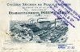](courrierdeslecteurs2010c250.html#20101121abc)

> \* [l'Adragante et le papier marbré](courrierdeslecteurs2010c240.html#20101119npy)
> 
> Un courrier de Smyrne nous instruit sur la gomme adragante, son lien avec cette cité, et nous amène au passage à introduire de nouveaux concepts dans le glossaire (mucilage, peptides). Ne restons donc pas de marbre.

[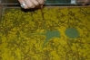](courrierdeslecteurs2010c240.html#20101119npy)

> \* [Marouflage géant sur bois](courrierdeslecteurs2010c230.html#20101118dt)
> 
> A partir de certaines dimensions, un marouflage sur bois pose de réels problèmes, y compris environnementaux. Nous sommes ici devant ce que l'on pourrait nommer un cas limite.

[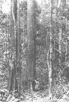](courrierdeslecteurs2010c230.html#20101118dt)

> \* [Réserves : piste "Rubber Cement"](courrierdeslecteurs2010c220.html#20101117ar)
> 
> A l'initiative d'une lectrice qui nous donne une nouvelle piste, nous revenons sur le thème des réserves de grande dimension et celui des solvants à latex et colles.
> 
> \* [Marouflage délicat sur bois](courrierdeslecteurs2010c210.html#20101117lm)
> 
> Retour sur les points délicats du marouflage, notamment la chasse aux bulles et le poids du bois.

> \* [Bronzes : un intéressant lien externe](courrierdeslecteurs2010c200.html#20101117jlg)
> 
> Cette page écrite par un lecteur sculpteur nous permet de découvrir la réalité de la pratique sculpturale, tournage en fonderie inclus.
> 
> \* [Sécurité : alerter plus ?](courrierdeslecteurs2010c190.html#20101116wp)
> 
> Du lien entre métier, risque et société. Réflexions éditoriales.
> 
> \* [Bronze en pigment pictural](courrierdeslecteurs2010c180.html#20101116dj)
> 
> Quel liant pour le bronze à peindre sur une icône ?

> \* [Démaroufler un vieux marouflage à la colle de peau](courrierdeslecteurs2010c170.html#20101111lp)
> 
> ...ou quand un marouflage devient vraiment très délicat.

> \* [Hide glue, évocation par un facteur d'orgues](courrierdeslecteurs2010c160.html#20101104dr)
> 
> Une contribution sympathique et inattendue qui ouvre différentes piste dans l'utilisation des colles animales. Point d'orgue de cette série de publications.

8/11/2010

> **Dialogues de Dotapea : deux nouveaux chapitres**

> Chapitre XXIX : [LE FEU](chap29feu.html)
> 
> De Yves Klein à Bill Viola, l'art contemporain utilise le feu. Ne faisons donc pas l'impasse.

[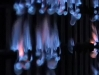](chap29feu.html)

> Chapitre XXX : [La peau du métal](chap30peaudumetal.html)
> 
> Nous aurions pu appeler ce chapitre "le photon et le métal". C'est une mise au point importante sur différents sujets abordés précédemment dans les Dialogues.

> **Section « Hi-tech » :**
> 
> **[Un nouveau cap franchi dans l'animation holographique](hitechhologanimee2.html)**
> 
> Après une longue stagnation malgré une véritable "bataille de l'hologramme en mouvement", une innovation importante offre à l'holographie une première application animée d'une portée aussi concrète que prometteuse.
> 
> [Cliquer ici.](hitechhologanimee2.html)

31/10/2010

> **Courrier des Lecteurs**
> 
> Les entrées récentes :
> 
> > \* [Appellation Coromandel (laque)](courrierdeslecteurs2010c150.html#20101026nb)
> > 
> > Un appellation qui rend nécessaire un petit détour par l'Inde des comptoirs européens et l'Inde antique.
> > 
> > \* [Amidon : un encollage discutable des supports](courrierdeslecteurs2010c140.html#20101020abc)
> > 
> > Une occasion de revenir sur la fermeture du Musée National des Arts et Traditions Populaires.
> > 
> > \* [Marouflage d'un papier photo (incident)](courrierdeslecteurs2010c150.html#20101026nb)
> > 
> > Un incident de marouflage est assez pénible car il peut impliquer un travail de récupération compliqué. La règle d'or demeure de tester avec des échantillons afin de mettre au point un processus qui devient ensuite banal.

18/10/2010

> **Courrier des Lecteurs**
> 
> Les entrées récentes :
> 
> > \* [Tension des toiles, gondolage](courrierdeslecteurs2010c130.html#20101017ag)
> > 
> > \* [Gesso : conflit avec les corps gras, utilisation du relief de la toile](courrierdeslecteurs2010c120.html#20101009mlp)
> > 
> > \* [Réserves : quels produits pour des surfaces plus grandes ?](courrierdeslecteurs2010c100.html#20100923cg)
> > 
> > \* [Eau osmosée : une "eau Beaux-arts" ?](courrierdeslecteurs2010c.html#20100921nm)

13/10/2010

> **Une expérimentation**
> 
> Aujourd'hui est le début d'un essai inédit. Il s'agit de diffuser en régie (dans la marge grise à droite) un visuel qui vous emmène non vers un site destiné à la vente de matériel ou évoquant une exposition, mais vers une "télé" YouTube contenant d'exceptionnels documents vidéo sur Yves Klein, Soulages, Opalka, Buren, Rebeyrolles, Dubuffet, Vlaminck, Bacon, Varini, Hantai, Nemours, Barrot, Volo, Balthus, Swizgebel, Mathieu, Appel, etc., etc., etc., etc., etc......
> 
> Cette page hors de l'ordinaire est animée par une société, Adam Montmartre, fournisseur de matériel Beaux-arts, mais surtout - cela n'échappera à personne - par un passionné.
> 
> Les documents sont d'une réelle qualité et c'est sans ambages ni détours que ArtRéalité conseille à ses chers lecteurs de visiter ce petit trésor inattendu du web artistique francophone. [Cliquer ici.](http://www.youtube.com/user/guca3)

11/10/2010

> **No comment**
> 
> 
> 
> Cliquer sur l'image (attention, présence de pub possible).

30/9/2010

> **Deux nouveautés importantes :**

> **[1\. Un origami](chap28origamimiroir.html)** [**miroir**](chap28origamimiroir.html)
> 
> C'est le titre du tout nouveau chapitre XXVIII des Dialogues de Dotapea.
> 
> Ikaros, un voilier spatial japonais lancé cette année, donne une bonne occasion de revenir sur le thème de la réflexion de la lumière sans se priver de multiples digressions : miroirs sans tain, liquides animés, cristaux liquides, utilisation des ressources techniques dans les arts, etc.
> 
> [Lien.](chap28origamimiroir.html)

> **[2\. La marche des gouttes](hitechmarchedesgouttes.html)**
> 
> En section « Hi-tech », cet article est consacré non à une invention précise mais à tout un domaine de recherches très actif, la microfluidique, qui nous invite à nous interroger sur des applications éventuelles dans le domaine artistique.
> 
> A travers une vidéo (externe) et quelques citations permettant de situer le sujet, nous découvrons qu'il existe de nouveaux moyens d'animer des fluides. [Cliquer ici.](hitechmarchedesgouttes.html)

28/9/2010

> **Le "no comment"**
> 
> 
> 
> Cliquer sur l'image
> 
> **Prochainement**
> 
> Le chapitre XXVIII des Dialogues. On n'en dit pas plus pour le moment.

20/9/2010

> **Nouveautés**
> 
> Courrier des Lecteurs :
> 
> > \* [Vernis à bois détourné](courrierdeslecteurs2010c050.html#20100912pc)
> > 
> > \* [Tripoli et verre trempé](courrierdeslecteurs2010c060.html#20100913k)
> > 
> > \* [Galets émaillés](courrierdeslecteurs2010c.html#20100918cm)
> > 
> > \* et du côté pratique, [Imprimer des pages de Dotapea](courrierdeslecteurs2010c080.html#20100919pb)
> 
> ...et une nouvelle entrée dans la section « hi-tech » associée à la célébration en décembre du jubilée d'or du laser. [Cliquer ici.](hitechfontaineslaser.html)

[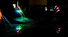](hitechfontaineslaser.html)

8/9/2010

> **Courrier des Lecteurs**

Trois ajouts à nouveau :

> \* [Bio, toxicité et peinture](courrierdeslecteurs2010c040.html#20100908cdh)
> 
> \* [Acrylique extra-fine sur béton](courrierdeslecteurs2010c030.html#20100906ads)
> 
> \* [Acrylique : détournement de peintures déco](courrierdeslecteurs2008b010.html#20081003jq)

4/9/2010

> **Courrier des Lecteurs**

Trois ajouts importants :

> \* Chaux cirée à base de craie ou caséine-chaux ? [Lien.](courrierdeslecteurs2010c020.html#20100827ir)
> 
> \* Pâte à modeler transparente. [Lien.](courrierdeslecteurs2010c010.html#20100826va)
> 
> \* Titane rétif au mouillage. [Lien.](courrierdeslecteurs2010b270.html#20100802cs)

L'un d'eux évoque la possibilité d'un concours. Nous ne sommes pas prêts mais on y pense...

> **Nouveau « no comment » d'actualité**

[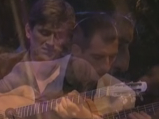](http://www.dailymotion.com/video/x627ey_prodige-guitare-manouche-29-swing-g_music?from=rss&hmz=706c61796572)

Cliquer sur l'image

26/8/2010

> **Refonte importante de l'article consacré aux acides**

Les non-métaux oxydés dits acides comme par exemple (parmi tant d'autres) le SO4, responsable des fameuses "pluies acides", sont-ils véritablement des acides alors qu'ils ne portent pas le petit proton H+ que l'on a l'habitude de considérer comme caractéristique de ces corps chimiques ?

Un questionnement loin d'être innocent quand on sait que le tableau des éléments, c'est-à-dire la quasi totalité de l'univers matériel, est coupé en deux par une distinction entre métaux et non-métaux, les premiers étant alcalins lorsqu'ils sont associés à l'oxygène, les seconds étant acides ou neutres dans la même association.

Retour également sur une autre question : qu'appelle-t-on exactement acides forts et acides faibles ?

Quelques éléments de réponses dans cette nouvelle mouture. [Cliquer ici.](acides.html)

25/8/2010

> **Le coprin, un mystérieux champignon encreur**

Suite au questionnement d'une lectrice, Dotapea lance un appel public afin d'obtenir des informations sur une encre naturelle étonnamment méconnue. Mycologues, toxicologues, historiens de l'art, archéologues, ethnologues et amateurs d'encres bienvenus.

Essayons donc de résoudre un mystère qui concerne aussi, eh oui... le capitaine Haddock. Comme quoi un divertissement inattendu ne nuit pas, même à des sujets aussi sérieux que celui-ci.

Cliquer [ici](courrierdeslecteurs2010b300.html#20100816ad) ou sur l'image ci-contre.

23/8/2010

> **Vivent les Roms et les Manouches**

No comment. Si : cliquer sur l'image.

20/8/2010

> **Essence de térébenthine et nocivité**

Un retour sur cette question dans le Courrier des Lecteurs.

[Cliquer ici.](courrierdeslecteurs2010b310.html#20100819st)

17/8/2010

> **Dialogues, chapitre XXVII :**
> 
> **Ambre et histoires de vieilles branches**

Ce nouveau chapitre des Dialogues évoque une légende des matériaux Beaux-arts, celle de l'ambre, trop utilisée sans doute même de nos jours. Un prétexte ici pour un petit voyage parmi différents concepts physiques.

C'est [ici.](chap27ambre.html)

23/7/2010

> **Phases et liaisons**

Signalons un ajout court mais de tout premier plan dans l'article consacré aux phases de la matière. Ce texte signé [Jean-Louis](quinoussommes.html) éclaire le rôle fondamental des liaisons - y compris mécaniques - dans ce qui distingue les liquides, les gaz et les solides, c'est-à-dire notre univers quotidien.

C'est [ici.](gazliquidessolides.html#liaisons)

18/7/2010 \[et ajouts le 19 et le 21\]

> **Nouveaux courriers**

[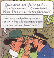](courrierdeslecteurs2010b300.html#20100816ad)

> \* [Ambre : mauvaises informations](courrierdeslecteurs2010b160.html#20100603br). Ce courrier devrait aboutir à la rédaction d'un complément sur l'ambre d'ici quelque temps
> 
> \* [Ovalit M et choix d'une colle à maroufler](courrierdeslecteurs2010b140.html#20100527te)
> 
> \* [Huile à ses débuts : Van Eyck et Lefranc](courrierdeslecteurs2010b120.html#20100518ac1). Lors des débuts du procédé à l'huile, on ne distribuait pas les rôles des différents produits de la même manière qu'aujourd'hui.
> 
> \* [Gras sur maigre, concept et application](courrierdeslecteurs2010b260.html#20100719td)
> 
> \* [Blanc de titane : précisions](courrierdeslecteurs2010b100.html#20100518ac3)
> 
> \* [Médium de Langlais : équivalent acryle](courrierdeslecteurs2010b250.html#20100718nd)
> 
> \* [Métaux : les apprêts](courrierdeslecteurs2010b210.html#20100627cc)
> 
> \* [Feutres, stylos : quelle protection ?](courrierdeslecteurs2010b240.html#20100715j)
> 
> \* [Citations d'auteurs](courrierdeslecteurs2010b110.html#20100518ac2)
> 
> \* [Sources](courrierdeslecteurs2010b130.html#20100521ym)
> 
> \* [Isorel : date de création](courrierdeslecteurs2010b220.html#20100705mm)
> 
> \* [Pi et le carré](courrierdeslecteurs2010b090.html#20100506mp)

9/7/2010

> **Nouveautés dans le courrier des lecteurs**
> 
> \* [Sur la question de la documentation des étudiants](courrierdeslecteurs2010b150.html#20100528jm)
> 
> \* [Sur les vernis acryliques](courrierdeslecteurs2010b190.html#20100616rd2)
> 
> \* [Rompre les couleurs, sur une reproduction du Jardin des délices](courrierdeslecteurs2010b200.html#20100616rd1)
> 
> \* [Sur les repentirs trop tardifs et le sens de l'opération du vernissage](courrierdeslecteurs2010b230.html#20100707vl)

24/6/2010

> **[Travaux en cours](http://www.artrealite.com/konradloder.htm)**

Pendant cette période silencieuse, nous préparons un nouveau chapitre des Dialogues qui, continuant le chapitre XXV dédié à la lumière, abordera le sujet plus vaste de l'énergie.

De nouvelles entrées du Courrier des Lecteurs seront publiées dans les prochains jours.

Par ailleurs la mise en ligne « en réel » du projet Wal est maintenu sur 2010.

L'activité générale ne s'interrompra pas durant l'été.

Enfin, rappelons ce que scande actuellement l'une de nos campagnes en régie : nous recherchons un (second) développeur Php. [Lien.](http://www.artrealite.com/developpement201006.htm)

Amis lecteurs, merci de votre patience.

8/6/2010

> **[Konrad Loder, nouvelle transcription d'une visite d'atelier](http://www.artrealite.com/konradloder.htm)**

Par écrit c'est différent, et on a ajouté quelques éléments, mais la visite d'atelier vidéo réalisée pour Walesgal 2008 est maintenant disponible sous une autre forme sur ArtRéalité.com.

L'occasion de redécouvrir une approche artistique pour nous tout à fait contemporaine et proche des questionnements qui sont posés sur Dotapea.com.

Une référence à nos yeux.

[Cliquer ici](http://www.artrealite.com/konradloder.htm)

6/5/2010

> **Renversez tout !**

Cela renverse tout : Ryan Hoagland a inventé Winscape, la fenêtre qui peut faire d'une oeuvre un extérieur. Une révolution qui n'est peut-être pas encore appréciée pour toutes ses potentialités.

[Cliquer ici](hitechwinscape.html)

3/5/2010

> **[L'avenir de l'aquarelle](courrierdeslecteurs2010b030.html#20100406lm)...**

... réside-t-il dans un vernis réellement fiable qui a manqué pendant des millénaires, dès les premiers travaux des peintres égyptiens ?

Réponse : sans doute, mais encore faudrait-il que les fabricants contemporains de prometteurs "vernis pour l'aquarelle" exposent avec sérieux des arguments qui pourraient nous en convaincre. Pour le moment... mais n'en disons pas plus. Nous vous laissons découvrir un nouveau "courrier des lecteurs" consacré à ce sujet. Cliquer sur le tableau de David Roberts ci-dessous.

[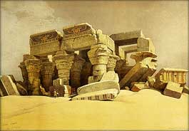](courrierdeslecteurs2010b030.html#20100406lm)

A découvrir également, le courrier d'un lecteur qui pose d'intéressantes questions sur l'anticipation des problèmes de dévernissage et l'emploi de la gomme dammar.

[Cliquer ici](courrierdeslecteurs2010b020.html#20100330ab)

27/4/2010

> **Courrier : fin de l'incident technique**
> 
> **Petit voyage sous le capot**

Chers lecteurs, la panne sans précédent qui nous a empêché durant plus d'une semaine de recevoir vos courriels est enfin résolue.

Il a été très difficile d'en identifier la cause, puis de trouver le remède grâce à notre hébergeur qui, finalement, a été victime des erreurs d'un sous-traitant. On ne citera pas de noms :) car tout le monde a fait son travail et les technologies sont nettement plus pointues ici que sur un hébergement classique.

Pour les initiés, il a fallu installer un patch plutôt consistant sur un serveur dédié en distribution Gentoo par un wget sous root par SSH. Pas si compliqué que cela mais moins simple que de décrocher un téléphone pour se plaindre.

Les pannes demeurent cependant extrêmement rares. Reconnaissons que celle-ci a compensé la rareté par l'ampleur. En échange, les sites Dotapea et ArtRéalité sont d'un accès parfaitement fluide et nous tenons à conserver nos solutions techniques, quitte a mettre l'accent désormais sur la vigilance dans certains domaines, dans la mesure où cette fluidité est l'une des clés du développement de nos futurs nouveaux sites.

En vous remerciant de votre patience et en réitérant nos excuses,

Emmanuel Luc,

éditeur

[25/4/2010](hitechliquidglass.html#addendum)

> **[Addendum sur le vernis parfait](hitechliquidglass.html#addendum)**
> 
> En écho à la [mise à jour du 16](blog2010.html#20100416)

[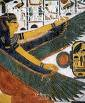](courrierdeslecteurs2010b030.html#20100406lm)

Un produit industriel est le plus souvent protégé par un ou plusieurs brevets. Ce secret suscite des questionnements naturels. Les voici en vrac et curieusement en prise avec l'actualité.

Un vernis fait de silice, même en couche nanométrique, peut-il véritablement être hydrophobe, la comparaison avec le polytétrafluoroéthylène (téflon, Téfal ®) évoquée sur le site du fabricant est-elle valable, une substance peut-elle être « auto-phobe », qu'en est-il des relations extrêmes entre hydrogène et fluor à l'heure où l'Eyjafjöll rejette autour de lui un fluorure d'hydrogène qui compte parmi les produits les plus terriblement corrosifs ?

Un vrac ouvert, sans réponses définitives.

[Cliquer ici](hitechliquidglass.html#addendum)

24/4/2010

> **ArtRéalité/Dotapea ne répond plus - incident technique**

Chers lecteurs, suite à de très complexes problèmes techniques sur lesquels nous travaillons actuellement, nos messageries ne reçoivent pas systématiquement vos courriers.

Nous vous demandons dans ce cas de prendre patience et de réitérer vos envois dans quelques jours, après avoir consulté ce blog qui signalera le retour à l'ordre dès qu'il aura lieu.

Nous vous remercions de bien vouloir accepter nos excuses pour cet « incident indépendant de notre volonté » pour reprendre une vieille formule.

16/4/2010

> **[Le vernis parfait ?](hitechliquidglass.html)**

Obsession de générations d'artistes, d'experts, de chercheurs, de commanditaires et d'acheteurs, le vernissage parfait, neutre, durable, ni destructif ni intrusif, est-il aujourd'hui possible grâce à une invention sensationnelle à base de silice ?

La question est réellement posée.

Eclairages sur cette nanotechnologie séduisante dans un nouvel article de la section « Hi-tech ».

[Cliquer ici](hitechliquidglass.html)

\[lire aussi [l'addendum](blog2010.html#20100425) du 25\]

4/4/2010

> **Profil de vos accès sur Dotapea**

Un chiffre qui surprend, mais un serveur web ne sait pas mentir : plus de 80% de vos accès sont directs ! Moins de 20% des visiteurs proviennent d'une recherche Google. Il y a cinq ans, c'était le contraire. Depuis, alors que les autres moteurs disparaissaient (aujourd'hui ils sont négligeables) et qu'une encyclopédie participative bien connue obtenait la première place pour la majorité des requêtes, l'audience de Dotapea a été multipliée par 7,8.

En conclusion, si le réseau ArtRéalité doit beaucoup à Google pour ses débuts, il ne lui doit pas son développement ni sa réussite actuelle. Il vous la doit à VOUS !

Merci à tous.

[3/4/2010](hitechcimentautonet.html)

> **[Dotapea « hi-tech » - Nano-ciments et peintures autonettoyants :](hitechcimentautonet.html)**
> 
> **[quoi et comment ?](hitechcimentautonet.html)**

A l'occasion de la publication d'un rapport - assez ardu - de l'AFSSET (Agence française de sécurité sanitaire et du travail), la presse généraliste a eu l'occasion d'évoquer la dangerosité de ces produits. Partant de ce coup de projecteur, en marchant à rebours, journalistes et public ont pu obtenir quelques informations sur lesdits produits, connus seulement jusque là d'un nombre restreint de professionnels. Voici donc l'occasion d'évoquer dans la section « Hi-tech » de Dotapea ces ciments et peintures aux propriétés fantastiques.

  
[Lien](hitechcimentautonet.html)

[29](hitechbleumnyin.html)[/3/2010](hitechbleumnyin.html)

> **[Précisions sur la liaison hydrogène](liaisons.html#hydrogene)**
> 
> (ajouts importants le 30 : l'encadré "Vue d'ensemble et précisions" et un schéma inédit)

A peine évoqué sur ce site, ce phénomène quasiment inconnu du grand public est l'objet d'un tout nouveau développement de l'article consacré aux liaisons entre atomes.

C'était le moins que l'on puisse faire pour cette liaison (et l'atome qui l'emmène) dans la mesure où elle est vitale au sens propre, c'est-à-dire indispensable à la vie, et permet de fournir quelques réponses à la question "qu'est-ce que l'eau" ?

"Chapitre ouvert", ce petit texte amènera sans doute des développements.

[Lien](liaisons.html#hydrogene)

[26](hitechbleumnyin.html)[/3/2010](hitechbleumnyin.html)

> **[Phosphorescence alimentaire et retour sur la photoluminescence](courrierdeslecteurs2010a130.html#20100319sl)**

[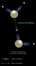](liaisons.html#hydrogene)

On ne mange pas des lanthanides mais on peut peut-être boire du plancton photoluminescent.

Voici un nouvel article du courrier des lecteurs sur un sujet qui ne cesse de fasciner. C'est l'occasion d'en explorer certains aspects inattendus. Qui eut cru par exemple que ces phénomènes sont en partie expliqués par la seule physique quantique ? Ou bien qu'une démarche artistique s'appuyant sur eux pourrait impliquer un travail avec le vivant ?

[Lien](courrierdeslecteurs2010a130.html#20100319sl)

[5/3/2010](hitechbleumnyin.html)

> **[Nouveau bleu de manganèse : interview exclusive de l'inventeur sur Dotapea.com](hitechbleumnyin.html)**

Le "bleu Mn-YIn" nous laissait sur notre faim car les informations disponibles étaient assez incomplètes. Alors Dotapea est allé en chercher d'autres directement auprès de son créateur, le chercheur américain Mas Subramanian...

[Lien](hitechbleumnyin.html)

[4/3/2010](hitechvertusplomb.html)

> **[Khôl : les vertus protectrices inattendues du plomb](hitechvertusplomb.html)**

La publication d'un travail de recherches interdisciplinaires dirigées par Philippe Walter, médaille d'argent 2009 du CNRS, pose de troublantes questions sur les vertus pharmacologique jusque là insoupçonnées d'un usage parcimonieux du plomb dans l'Antiquité.

[Lien](hitechvertusplomb.html)

[25/2/2010](http://wal.artrealite.com/)

> **[WAL](http://wal.artrealite.com/) - annonce**

La seconde vague de chemins de fer devrait voir le jour courant mars-avril avec six à huit nouveaux chemins et une intégration php plus évoluée pour le visiteur comme pour l'auteur.

Quelques noms en ordre alphabétique :

> \* Anne Clerget
> 
> \* Aurélien Bidaud (Biztek)
> 
> \* Jean-Pierre Brazs
> 
> \* Frédérique Charbonneau
> 
> \* Claude Yvans avec des interviews originales de
> 
> > \* Christian Boltanski
> > 
> > \* Daniel Buren
> > 
> > \* Gérard Fromanger
> > 
> > \* Peter Stämpfli
> > 
> > \* quelques autres grands artistes, à l'occasion du soixantenaire de Jeune Peinture/Jeune Création.
> 
> \* et le Audrey Express dont on vous laisse la surprise.

Ces publications seront annoncées au fur et à mesure sur ce blog et sur le fil RSS de ArtRéalité.com.  

[27/1/2010](http://wal.artrealite.com/)

> **[WAL](http://wal.artrealite.com/)**

Feuilleter un site web comme un magazine, c'est l'idée.

Un magazine tout sauf banal puisque c'est une nouvelle structure de site internet. [A découvrir ici.](http://wal.artrealite.com/)

Peu de contenu encore mais cela ne durera pas. En attendant que pensez-vous des premiers pas de ce nouveau bébé, de ce nouveau concept ?

N'hésitez pas à nous écrire pour nous donner votre opinion. [Cliquer ici.](ecrire.html)

20/1/2010

> **Berlue et Wal**

L'Italie se distingue en ce mois de janvier par le « décret Romani » qui assimile toute publication web à une diffusion télévisuelle ou radiophonique soumise à une autorisation ministérielle préalable. Comme le souligne le député démocrate Vincenzo Vita, « l'Italie rejoint le club des censeurs aux côtés de la Chine, de l'Iran et de la Corée du Nord ».

On peut à ce sujet rappeler une directive européenne qui stipule que « aucune disposition \[...\] ne devrait obliger ou encourager les États membres à imposer de nouveaux systèmes d'octroi de licences ou d'autorisations administratives pour aucun type de service de médias audiovisuels. »

Cette décision qui ne concerne que le web italien tombe à quelques jours de la mise en ligne de WAL, le nouvel outil de communication du réseau ArtRéalité. Aux alentours du 22 ou du 24 vous pourrez en effet découvrir un nouvel objet internet particulièrement ouvert au multimédia.

1/1/2010

> **Bonne année 2010 :)**

Elle commence par une bonne nouvelle puisque même les politiques français (pour ainsi dire tous) ont prix au sérieux l'Internet en y diffusant leurs voeux en vidéo. Une marque d'intérêt et une première prometteuse qui nous fera oublier, espérons-le, une année 2009 catastrophique pour le web artistique francophone avec une série de fermetures de sites tout à fait sérieux (lire [l'éditorial](http://www.artrealite.com/presseenligne.htm) du Portail presse). En revanche, on peut signaler un intérêt inédit des entreprises (à l'instar des politiques) pour nos moyens de communication.

Pour que cela se traduise en faits, c'est-à-dire en développement et en qualité de contenus, il nous reste encore beaucoup de travail afin d'installer une désintermédiation efficace reposant sur des solutions innovantes. C'est notre axe éditorial pour cette nouvelle année.

Au programme de 2010, donc, sur le Réseau ArtRéalité, annonçons la mise en ligne dès le 15 d'un important projet audiovisuel. Pas un mot de plus, nous vous laissons la surprise et en attendant nous vous souhaitons une année frimoussante, une année où le web sourit :)

[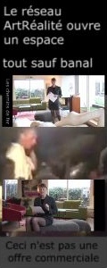](http://wal.artrealite.com/)