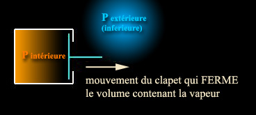

## Autoclave
### Autoclave, article du glossaire
 _Adjectif et nom masculin_

Selon l'Académie, est autoclave (au sens restreint de l'adjectif), un dispositif qui littéralement "se ferme à clé" (clavis=clé) sous l'effet de la vapeur. De même, le Robert donne pour l'adjectif la définition suivante : "qui se ferme de soi-même".

Comment l'autoclave se verrouille-t-il alors qu'étant en surpression, son couvercle devrait être repoussé, éjecté ?

Par un dispositif de clapet :



On peut se représenter un autoclave comme une cocotte-minute, mais pas de n'importe quel type. Certaines cocottes ont un système de verrouillage manuel classique, d'autres, équipées d'un système de "clapet" comparable au schéma ci-dessus, ne sont rien d'autre que des autoclaves.

Concernant les usages de ces appareils, on citera bien sûr la stérilisation, mais surtout la capacité de faire atteindre à certaines substances leur "[point critique](gazliquidessolides.html#pointtriplepointcritique)", où deux [phases de la matière](gazliquidessolides.html) se joignent et la [tensioactivité](tensioactivite.html) s'annule, mais aussi, plus couramment (cocotte-minute), d'augmenter sensiblement une température d'ébullition en accroissant la pression afin d'accélérer une cuisson à vocation alimentaire.


 [Communication](http://www.artrealite.com/annonceurs.htm) 

[](index-2.html#20131014)


```
title: Autoclave
date: Fri Dec 22 2023 11:26:07 GMT+0100 (Central European Standard Time)
author: postite
```
