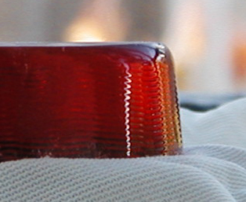

## Autres résines
### Autres résines, usage en arts plastiques
 **Les autres résines**

La **gomme** **adragante**, est également traitée dans un [article spécifique](adragante.html) de la section des liants.

_Les résines figurant dans cet article-ci sont les moins employées et les moins adaptées aux travaux artistiques habituels. Elles ne sont pas conseillées pour des emplois en peinture traditionnelle, mais ne doivent pas être boudées pour autant._

La colophane

On dit aussi arcanson, dérivé de Arcachon, lieu de production (selon [André Béguin](livres.html#beguin)). Le terme colophane proviendrait lui de la ville de Colophon (Ionie).

C'est en théorie le résidu _très acide et parfois très friable_ de la fabrication de l'essence de [térébenthine](terebenthine.html) (voir _[abiétate](abietates.html) et [brai](brai.html)_). En théorie, car comme le souligne [François Perego](livres.html#perego) (pp. 221-224), on ne sait pas toujours aujourd'hui distinguer une véritable origine végétale d'une origine minérale et les éventuelles essences végétales ne se limitent pas aux pins maritimes d'Arcachon. De plus il existe des produits dérivés, comme les [esters](ester.html) de colophane - des [corps gras](gras.html#corpsgras) -, mais ceux-ci semblent démontrer que l'on a bien affaire au départ à un produit certes résineux mais surtout très essentiellement acide.

Comme le montrent nos deux illustrations, la colophane peut sensiblement changer d'aspect selon la destination du produit. Ci-dessus, l'échantillon est destiné à l'ébénisterie "fine". Au-dessous, nous observons une massive et superbe colophane de musicien. Elle est quotidiennement utilisée pour l'entretien des archets. Il existe d'ailleurs plusieurs qualités de colophanes de lutherie. Le "grain" de la poudre créée par le frottement de l'archet est choisi en fonction de la taille des cordes de l'instrument.

Quelle que soit sa destination, il s'agit d'une résine tendre, diluable à froid dans l'essence ou l'alcool (préparation : voir _[Fabrication du médium maigre dammar](mediumdammar.html)_). Elle est brillante sauf, bien sûr, quand elle est mêlée à de la cire, ce qui n'est pas rare pour différents emplois.

Elle est d'ailleurs employée dans la [fabrication de cires à modeler](ciredebougie.html#cireamodeler).

Elle est utilisée dans la fabrication de vernis et médiums de mauvaise qualité.

Elle a servi dans [la fabrication de très mauvais papiers](papier.html#colophane).

Elle aurait connu une utilisation traditionnelle en peinture décorative.

Sur l'aspect odoriférant de ce produit, lire [passage](courrierdeslecteurs2009c010.html#20090820hf) in Courrier des Lecteurs.

La gomme sandaraque

Ce terme provient du grec _sandarakê_, signifiant _[réalgar](realgar.html)_ (mort-aux-rats). Une étymologie qui demeure pour nous très mystérieuse ([merci de nous communiquer toute information à ce sujet](ecrire.html)).

Il s'agit d'une très ancienne [résine](resine.html) pour vernis, à l'origine même du mot [vernis](vernis.html). De nos jours, elle est récoltée sur certain thuyas au Maroc et en Algérie.

Assez insoluble, elle donne des résultats inférieurs aux résines [mastic](resinemastic.html) et [dammar](resinedammar.html) malgré sa transparence. Parmi ses défauts, on signale qu'elle est très cassante.

Elle se présente sous forme de larmes d'un jaune très pâle, comme le mastic. Naturellement, elle est brune.

Elle est tombée en désuétude mais on la trouve encore dans les catalogues de fournisseurs de très haut niveau.

_Soluble dans [l'alcool](alcools.html) et [l'essence.](essences.html)_

Le sang-dragon ou sang-de-dragon

Résine exsudant de la tige du dragonnier (arbre tropical de la famille des liliacées ayant une longévité des plus notables). Le nom de l'arbre pourrait provenir de sang-dragon et non le contraire. L'origine du vocable est donc mystérieuse. S'agit-il d'une altération poétique de _[sandaraque](autresresines.html#gommesandaraque)_ ?

Utilisé autrefois comme colorant [rouge](rouges.html) - notamment comme colorant à vernis ou comme laque - plutôt fugace, le sang-dragon fut aussi employé autrefois comme astringent et hémostatique. Il n'est pratiquement pas utilisé pour la peinture.

Il serait employé depuis des temps très reculés.

Il est soluble dans les solvants classiques.

_Le sang-dragon est aussi une fleur._

L'élemi ou élémis

C'est un adjuvant plus qu'une résine à médium, à vernis ou à laque à part entière. Employé dans les vernis durs, il agit comme assouplissant léger car il s'agit quand même d'une résine assez dure.

Comme la [gomme laque](gommelaque.html), l'élémis est soluble dans l'alcool.

La gomme gutte

Ce n'est pas une résine destinée aux médiums et vernis.

[Elle est traitée dans l'article sur les pigments jaunes](jaunes.html#lagommegutteoujauneducambodge).

On mentionnera juste dans cet article le fait qu'elle est soluble dans l'alcool, comme la [gomme laque](gommelaque.html).

Gomme dite de Xanthan ou de Botany Bay

Originaire d'Australie, elle aurait un comportement proche de celui de la [gomme laque de Coromandel](gommelaque.html#presentationdelalaquedecoromandel). Nous manquons d'information à son sujet.

Autres résines

La gomme _kauri_, la gomme _Manille_, la gomme _Pontianak_. Nous manquons d'informations à leur sujet.

 [Communication](http://www.artrealite.com/annonceurs.htm) 

