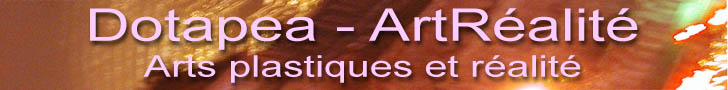
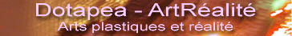

## Bannières
### Bannières pour liens - ArtRéalité
 **Bannières  
Attention : cette page nécessite un affichage large**

_Chers confrères webmasters et éditeurs,_

Tout d'abord, il nous a été demandé de créer un espace contenant les bannières de notre réseau et le voici. Vous trouverez ces images [ci-dessous,](bannieres.html#bannieres) sous différents formats. Merci de bien vouloir copier l'image sur votre site, de préférence, afin de diminuer les risques d'anomalies serveur par surcharge de bande passante, dans l'intérêt de tous.

Votre lien peut diriger vers Dotapea ou ArtRéalité, vers une page précise ou non, tout à votre choix.

**Attention :** ces visuels peuvent être modifiés.

**Croisements**

Comme nous le disions ci-dessus, il nous a d'abord été demandé des bannières de notre réseau. Lorsque nous les avons mises en ligne, nous nous attendions à des demandes de croisements, pas seulement à des demandes unilatérales, et nous avons mis en place ce qu'il fallait pour y répondre. Or, le contraire s'est produit. Une évaluation a eu lieu durant près d'un an mais les internautes demandant un croisement ont été si rares que nous avons renoncé à la publication d'une "page des bannières croisées" qui aurait fait très pâle figure.

Il est difficile d'expliquer pourquoi il y a plus de demandes de nos bannières que de demandes en réciprocité alors que l'intérêt des éditeurs est la réciprocité. Cela semble vraiment "le monde à l'envers", mais c'est un fait. Nous n'en tirons pas de conclusions définitives. L'expérience sera tentée à nouveau lorsque nous sentirons que la demande se manifestera de manière plus probante.

**Bannières**

**Avertissement**

Nos bannières étant en accès libre comme le veut l'usage, nous déclinons toute responsabilité concernant la présence d'une bannière à nos couleurs sur un site extérieur. La présence de nos signalétiques - qu'il y ait croisement ou non - sur d'autres sites ne représente donc _**aucune forme de caution de notre part.**_

728x90 pixels :

546x68 :

364x45 :

En taille réduite,

   pour les fonds foncés ou moyens

      pour les fonds clairs.

 [Communication](http://www.artrealite.com/annonceurs.htm)