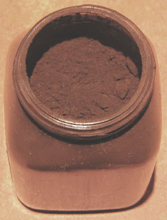

## Bitume
### Bitume de Judée, article du glossaire
 [Lire passage important](noirs.html#lebitume) dans l'article consacré aux noirs.



Le _bitume de Judée_, résine fossile, a aujourd'hui deux emplois :

> \- résistant à l'acide nitrique, il entre dans la composition de vernis pour la gravure (voir _[Eau-forte](e.html#eauforte)_). Pour cet emploi, il suffit de le diluer dans de l'[essence de pétrole](essences.html#lessencedepetrole) ou du [white spirit](essences.html#whitespirit) (40% - en poids - de bitume).
> 
> \- il sert aussi à colorer les bois d'ameublement et décorations et constitue une patine de bonne réputation. Pour cet usage, il faut l'adjoindre à une encaustique à base de cire d'abeille et de térébenthine telle qu'une banale encaustique destinée aux meubles ou bien une "encaustique maison" fabriquée en atelier avec les mêmes ingrédients - voir [cires](cires.html#peinturealencaustique). D'autres composants peuvent être incorporés.  


 

 

 [Communication](http://www.artrealite.com/annonceurs.htm) 

[](index-2.html#20131014)


```
title: Bitume
date: Fri Dec 22 2023 11:26:15 GMT+0100 (Central European Standard Time)
author: postite
```
