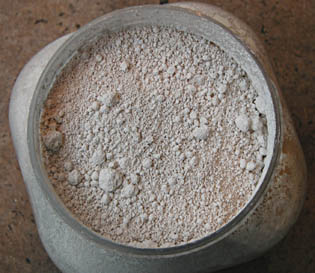

## Blancs
### Blancs, utilisation en arts plastiques
 **Les blancs**

_[English version](english/whites.html) _ 

_Blancs naturels : voir [Terres blanches](terresblanches.html)_  
_Blancheur de la neige : voir_ _[Chapitre XXIV](chap24blancheneige.html)_

\[Lectures conseillées :  
[Le blanc dans la langue française, Pourpre.com](http://www.pourpre.com/langue/expressions.php#blanc)  
[La couleur blanche, Pourpre.com](http://pourpre.com/chroma/dico.php?typ=fiche&&ent=blanc)\]

> _Bien avant que nous utilisions des pigments blancs bien identifiés et correspondant à des normes précises, l'humanité mettait à profit d'innombrables produits. Différents types de recherches se dessinèrent au fil des siècles : celle d'un blanc [couvrant](pigments.html#1facteurcouvrantopposetransparence) et celle d'un véritable blanc lumineux._
> 
> _Aucune de ces_ _quêtes n'est allé sans d'importantes difficultés. Les solutions véritablement satisfaisantes sont fort récentes.__  
> L'être humain des temps anciens partait d'un matériau imparfaitement blanc et tentait de le décolorer. Les procédés utilisés déterminaient des enjeux commerciaux. L'Antiquité méditerranéenne recourait à l'_argile sarde _ainsi qu'à la_ saponaire _gauloise (voir [glucosides](glucoside.html)). Ce type de procédés a été mis en oeuvre, de manière massive, jusqu'à la Renaissance. Le travail de grattage ou d'étirement des cuirs est encore pratiqué en différents points de la planète pour faire émerger un "blanc" relevant en fait du domaine chromatique de l'écru._
> 
> _Le premier blanc véritablement couvrant découvert dans l'histoire humaine est le [blanc de plomb](ceruse.html) (Antiquité), malheureusement toxique. Puis, beaucoup, beaucoup plus tard, est venu le [titane](titanes.html) (photo ci-dessus), qui a résolu un problème millénaire, combinant opacité, innocuité et stabilité en mélange. Depuis, la transparence ne peut plus être prise comme un défaut mais comme une spécificité.  
> Les recours anciens (parfois préhistoriques) à des matériaux comme la laine des moutons blancs ou d'autres animaux, les coquillages, le cuir de buffle blanc ou d'autres animaux, la soie traitée japonaise, la sulfuration des étoffes en Europe celtique ou médiévale, le blanchissement par l'action du soleil en Amérique centrale ou par l'action de la rosée en Europe (jusqu'au XVIIIème siècle), etc., ont donc pris une autre valeur._
> 
> _Quant au [blanc de zinc](blancssynthetiques.html#leblancdezinc), si l'on ne peut pas le considérer comme couvrant, il a permis, avant le blanc de titane, d'obtenir quand même de fort belles surfaces bien blanches et de somptueuses [vélatures](velature.html)._
> 
>     Voir [Gesso](fabriquerungesso.html).

Le blanc est une abstraction. Il a été défini par Newton comme l'addition de spectres d'égale intensité (lire [passage _in_ Le corps noir](corpsnoir.html#leblanc)). Dans les faits matériels, il n'y a pas un blanc mais beaucoup de matières relativement peu sélectives quant au spectre. Chacune a une personnalité liée à ses composants.

Depuis longtemps, le recours à des éléments violacés ou bleutés permet d'accentuer l'impression de clarté pour les blancs tirant naturellement sur le jaune. On compense une sélectivité naturelle trop manifeste par une autre sélectivité. Cela donne une illusion efficace. L'oeil croit voir un blanc alors qu'il s'agit finalement d'un véritable gris obtenu par synthèse de couleurs !

Il existe actuellement, principalement, deux catégories de blancs usuellement reconnues :

> **\*** _les blancs dits naturels_ (voir photo : blanc de Meudon). Voir _[Terres blanches](terresblanches.html)_.
> 
> **\*** _les [blancs de synthèse](blancssynthetiques.html)_, dits curieusement "blancs minéraux" (voir aussi [céruse](ceruse.html)).

plus une exception :

> **\*** _le_ _[blanc de lithopone](lithopone.html)_, composé à la fois d'un blanc plus ou moins naturel dans le sens où il dérive en principe directement des terres blanches, le blanc de baryum (barytine), et d'un blanc synthétique, le blanc de zinc.

Tous sont "d'origine minérale". Le terme de "blanc minéral", par sa relative redondance, n'a donc peut-être pas lieu d'être tant que l'on n'évoque pas le blanc des dents, des yeux, celui du santal, du lys, etc., certes organiques mais peu utilisables picturalement.

 [Communication](http://www.artrealite.com/annonceurs.htm) 

