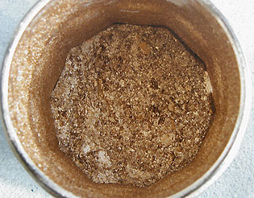

## Le bronze comme pigment
### Le
bronze comme pigment
 **Le bronze comme pigment**



_Le [bronze](bronze2.html) véritable (voir photo) est en fait très doré._

_Nous avons l'habitude de voir un peu partout des bronzes oxydés verdâtre ou parfois rougeâtre, plutôt ternes. En fait, maintenu à l'écart de l'humidité, ce métal est d'aspect très vif et extrêmement différent des imitations rougeâtres que l'on trouve dans certains magasins, qui en sont en fait la caricature authentique._

_Le Musée de Saint-Germain-en-Laye (Île de France) expose des imitations - en vrai bronze - d'objets de l'âge du bronze semblables à ce à quoi les originaux ressemblaient vraisemblablement peu après leur fabrication. Avec un superbe casque par exemple, la démonstration est éblouissante. Les combattants des temps anciens avaient réellement fière allure._

_Face à la vraie poudre de bronze dénuée de traces d'oxydation, le peintre a la même sensation de découverte d'un métal magnifique, à l'égal de l'or._

Le [caractère couvrant](pigments.html#1facteurcouvrantopposetransparence) du pigment bronze est important mais très légèrement inférieur à celui de l'or.

Isoler le bronze véritable en sandwich entre deux couches de glacis bien sèches semble une précaution salutaire contre toute oxydation intempestive. Éviter tout apport d'oxygène et d'oxydants est important (éviter les siccatifs pour peinture à l'huile, les substances acides).

A l'inverse, une oxydation provoquée peut être effectuée à l'aide d'acide chlorhydrique. Il faut laisser ce dernier agir pendant quelques temps.

Certaines poudres de bronze employées en inclusion dans les résines de moulage sont des "charges" qui ne peuvent pas être aisément être détournées de leur vocation première. Elles ne trouvent pas d'usage direct en peinture. On nomme parfois les sculptures obtenues "résines-bronzes". L'aspect des produits finis est assez convaincant.

En peinture décorative, des imitations correctes à base de laiton permettent de réaliser les "faux-bronzes", techniques remarquables pouvant atteindre un haut niveau de complexité et de raffinement.

Dangerosité : certains auteurs mettent en garde les utilisateurs de la poudre de laiton contre la présence éventuelle dans ce produit d'éléments comme le plomb et l'arsenic.

Lecture conseillée : [Le bronze sur Pourpre.com](http://pourpre.com/chroma/dico.php?typ=fiche&&ent=bronze)

santé

Il faut rappeler que les produits contenant du cuivre ne sont pas toujours anodins. Voir notamment _[Vert-de-gris](verts.html#vertdegris)_.

Le port d'un masque n'est pas forcément nécessaire, sauf pour une personne manipulant régulièrement ces produits sous forme pulvérulente ou bien en raison d'une allergie.

Il faut aussi noter que parmi les opérations destinées à oxyder le cuivre, certaines peuvent présenter un caractère nocif ou dangereux.


```
title: Le bronze comme pigment
date: Fri Dec 22 2023 11:26:21 GMT+0100 (Central European Standard Time)
author: postite
```
