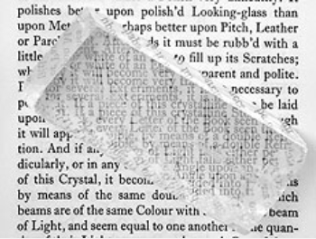

## Calcite
### Calcite, article du glossaire
 Possiblement du grec _chalix_, _chalx_, chaux

Formule : CaCO3, carbonate de calcium [cristallin](cristal.html)

La calcite est [la pierre à chaux](chaux.html#pierresachaux) par excellence. Banale, elle est présente en quantités variables dans de nombreuses roches (notamment les [calcaires](calcaires.html) et les [marbres](marbres.html)) et les formes auxquelles elles donnent lieu sont extrêmement diverses, au point que certains spécimens ont une valeur marchande élevée.

Quelques informations :

> \- selon une source faisant référence, une roche contenant au moins 75% de CaCO3 pourrait être appelée "calcite". Nous ne sommes pas en mesure de confirmer cette information pour le moment. En supposant qu'elle soit pleinement valable, nous pourrions dessiner le petit tableau suivant :
> 
> **Pourcentage de CaCO3**
> 
> **Appellation**
> 
> ≥ 50%
> 
> [calcaire](calcaire.html)
> 
> ≥ 75%
> 
> calcite
> 
> ≥ 90%
> 
> [craie](craie.html)
> 
> \- A l'état pur, la calcite est [biréfringente](b.html#birefringent).
> 
> 
> 
> Lire absolument un [passage](chap06polaris.html#cristalbirefringence) des Dialogues de Dotapea chap. VI.
> 
> \- la calcite représenterait 4% de la masse de la croûte terrestre ([Voir référence externe in Mineral.Galleries.com](http://mineral.galleries.com/minerals/carbonat/calcite/calcite.htm)) ;
> 
> \- la [chaux](chaux.html) devient naturellement une calcite en captant plus ou moins rapidement le carbone atmosphérique, processus pouvant être très lent ;
> 
> \- la calcite est un solide se présentant sous la forme d'une poudre ou de cristaux. Elle se décompose aux alentours de 900°C, ce qui, dans le domaine des arts du feu, peut rendre cette terre difficilement utilisable, voire inutilisable.
> 
> \- les grottes pourvues de stalactites sont situées dans des masses faites de fortes proportions de calcite où des eaux généralement acides s'infiltrent naturellement, creusant ces cavités ;
> 
> \- sa structure moléculaire est théoriquement [cristaline](cristal.html), ce qui expliquerait sa relative transparence (voir [badigeon](badigeon.html)) ;
> 
> \- quoi que de structure profondément différente, elle a sensiblement la composition d'une [craie](craie.html) comme un [blanc de Meudon](terresblanches.html#craiemarbre) par exemple ;
> 
> \- elle est instable (effervescente) en présence d'acides ou de fluor (possiblement d'autres [non-métaux halogènes](annexe1.html#halogene)) ;
> 
> \- elle ne présenterait pas de caractère particulier de toxicité sauf concentration dans l'air >= 10mg/m3 (chiffre du [RepTox](liensutiles.html#csst), 02/2003 - voir [Art, sécurité et pollution in Références](liensutiles.html#artetsecurite)), ce qui n'est pas un chiffre négligeable ;
> 
> \- elle est utilisée comme charge en peinture décorative. Certains artistes l'auraient employée de cette manière également ;
> 
> \- elle serait employée dans la fabrication de certains papiers et plastiques ;
> 
> \- elle peut s'associer notamment à la dolomite. Elle devient alors une [dolomie](dolomite.html), substance minérale naturelle hybride utilisée dans les domaines de la sculpture et des arts du feu. Voir [Oxyde de magnésium](magnesium.html).

Voir [Spath](spath.html).

 [Communication](http://www.artrealite.com/annonceurs.htm) 

