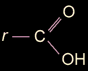

## Carboxyle
### Carboxyle, article du glossaire
 Navig. page/section

[](c.html)

\_\_\_\_\_

**Sous cette page**

\_\_\_\_\_

**Pages soeurs**

\_\_\_\_\_

Copyright © www.dotapea.com

Tous droits réservés.  
[Précisions cliquer ici](droitscopie.html)

**Accès direct glossaire**

**[A](a.html)  [B](b.html)  [C](c.html)  [D](d.html)  [E](e.html)  [F](f.html)  [G](g.html)  
[H](h.html)  [IJK](ijk.html)  [L](l.html)  [M](m.html)  [NO](no.html)  [P](p.html)  
[QR](qr.html)  [S](s.html)  [T](t.html)  [UV](uv.html)  [WXYZ](wxyz.html)**

**Le carboxyle  
Article du [glossaire](glossaire.html)**



Groupement COOH courant dans les acides organique (ex. : [acide acétique](acetate.html#acetiqueacide), [acide carbamique](carbamique.html), [acide oléique](oleine.html#oleique.htm), voir illustration ci-contre).

Dérivé le plus proche de ce radical, l'acide [formique](formique.html) est un carboxyle lié à un atome d'hydrogène.


 

 

 [Communication](http://www.artrealite.com/annonceurs.htm) 

[](index-2.html#20131014)


```
title: Carboxyle
date: Fri Dec 22 2023 11:26:25 GMT+0100 (Central European Standard Time)
author: postite
```
