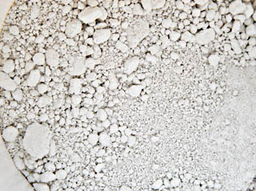
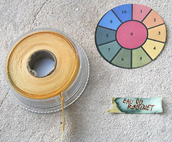
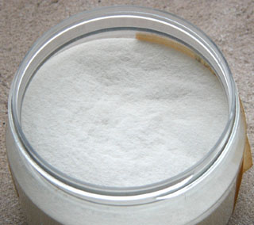

## La caséine
### La caséine, usage en arts plastiques
 **La caséine**  _Ce produit est apprécié car son comportement fiable est bien connu depuis des millénaires. Il faut cependant bien veiller à l'employer à bonne escient, respecter ses spécificités. Ce n'est pas une colle-liant ultramoderne, multi-usages et multi-supports !_

Pour plus d'informations sur la chimie de la caséine,  
[lire le chapitre III des Dialogues de Dotapea, _Caséine, phosphore et dissociation_.](chap03caseine.html)

Caractéristiques

Diluant, solvant, dissolvant de la caséine : nous avons l'habitude de placer cette rubrique dans tous les articles concernant les liants. Cependant le terme de solvant a un sens particulier en ce qui concerne ce produit. La caséine "brute" nécessite en effet l'adjonction d'une substance - appelé "solvant" à tort ou imprécisément - pour pouvoir être diluée par la suite par [l'eau](eau.html). Lire [passage ci-dessous](caseine.html#avertissement).

[L'acétone](acetone.html) utilisée massivement peut, comme [l'alcool à brûler](methanol.html#lalcoolabruler), être considérée comme un dissolvant. [L'ammoniaque](ammoniac.html) est un solvant, au sens où il met en solution la caséine brute, ni plus, ni moins.

Seuls le calcium et le baryum (les deux éléments [alcalinoterreux](alcalinoterreux.html) les moins inutilisables) "fixent" la caséine et ils doivent être utilisés en quantités importantes. Une caséine demeurant soluble après plusieurs semaines ou mois pourrait en quelque sorte "manquer d'alcalinoterreux". 

_Note : La caséine mêlée au [formol](formol.html) produit une substance peu commune et très dure, la [galalithe](galalithe.html). Le formol, en tant qu'élément de différentes procédés de fabrication, est un durcissant._

_La caséine donne une touche bien précise et un film généralement très solide, dur._ Elle convient idéalement aux supports eux-mêmes durs, solides, présentant un peu ou beaucoup de porosité tels que le [plâtre](platresupport.html) ou surtout le [bois](bois.html) car elle est _**inattaquable par les vers**_. Pure ou [mélangée à la chaux](caseine.html#melangedetypecaseinechaux), elle laisse respirer des supports tels que les vieux murs, qui en ont besoin. Pourtant elle est assez "imperméable" pour résister (bien sèche) au lavage à l'éponge.

Grâce à sa solidité, elle peut être poncée. Des enduits et gessos très fins peuvent donc être réalisés.

**_Sa dureté en fait en même temps un produit fragile, cassant_** _(-> craquelures, cassures). Il faut à tout prix éviter de l'employer sur des supports souples SAUF adjonction de [glycérine](glycerine.html) ou autre agent assouplissant ([voir ci-dessous](caseine.html#assouplissant)). Cette adjonction est à conseiller de toute manière, mais seulement en petite quantité si le support ne pose pas de problème précis et si l'environnement est non acide._

_La caséine est constituée de [protéines](proteine.html) plus complètes que celles des [gélatines](colles.html#originesdescolles) et présente pour cette raison des caractéristiques différentes bien que son origine soit également animale._

_Elle est plus dure et après quelques semaines, elle devient [irréversible](liants.html#reversibilite)._

_Il est déconseillé de trop la diluer car l'assemblage des protéines risque de ne pas se faire lors du durcissement._



Mélanges

**Mélanges de type caséine-chaux**

_Un intérêt majeur de l'adjonction de [chaux](chaux.html) dans la caséine est la diminution des coûts. La chaux, moins coûteuse, autorise le traitement de surfaces importantes. Ce mélange est donc employé depuis très longtemps en peinture décorative - où elle a des détracteurs, lire un [passage](chap16interieurexterieurchaux.html#caseinechaux) du chapitre XVI des Dialogues de Dotapea -, mais là n'est pas sa seule application. Par ailleurs, il faut mentionner son aspect pratique et sans grand danger, par opposition aux traitements nécessitant un recours à des produits alcalins dangereux comme l'ammoniac par exemple._

_Certains fabricants proposent des mélanges du type Casé-Arti ®  - voir photo ci-dessus -, fort épais et probablement non dépourvu de chaux, dont la composition précise n'est malheureusement pas annoncée. Ces produits sont couramment destiné à l'enduction ou à la peinture décorative. Certains sont teintés en blanc._

_Il est aisé de réaliser soi-même ce genre de mélanges (lire par exemple la recette "le badigeon caséine-chaux et ses variations" [ci-dessous](caseine.html#badigeoncaseinechaux)). La chaux est utilisée en amont, comme "pré-solvant" des variétés brutes de caséine ([voir ci-dessous](caseine.html#presolvants)), donc introduite lors de la fabrication de la caséine soluble. Exemple : [Recette de caséine à la chaux à partir de fromage blanc](caseine.html#recettedecaseinealachaux). Mais il est possible de forcer la dose de chaux, même au moment de peindre, pour différentes raisons : coût, aspect, charge électrochimique, etc._

_ATTENTION : dans tous les cas, le mélange caséine-chaux est très cassant sans adjonction d'un agent assouplissant comme la [glycérine](glycerine.html) ou un liant [vinylique](vinyle.html) (voir [Assouplissant](caseine.html#assouplissant))._

_La caséine à la chaux est un très beau mariage qui a d'autres avantages que le seul coût, assez faible : la chaux est [imputrescible](imputrescible.html) et la caséine est vermifuge._

_La caséine est transparente, mais la chaux quant à elle peut être tantôt assez transparente, tantôt un peu blanchâtre selon qu'elle est plutôt grasse ou plutôt maigre, sans compter les adjuvants éventuels._

_Certaines sources évoquent l'enduction de papier ou de toile par le mélange caséine-chaux. Ce choix est véritablement douteux car la toile et surtout le papier sont très souples alors que le mélange est extrêmement cassant. Il faudrait [maroufler](maroufler.html) ces supports en premier lieu ou bien adjoindre un puissant assouplissant à l'enduit. Sans cette opération, nous avons constaté qu'une caséine mêlée d'ingrédients comme la chaux craquelle au moindre mouvement appliqué aux supports souples. La caséine pure est à peine plus souple. On peut donc conclure sur ce point en suggérant aux fabricants de ce type de produits de communiquer au sujet de l'agent assouplissant qu'ils utilisent éventuellement._

**Émulsion huile-caséine, saponification**

\--> Voir [_émulsions à la caséine_ dans l'article _liants émulsions_](liantsemulsions.html#emulsionsalacaseine).

Peindre avec de la caséine

_Comme nous l'avons dit, la caséine sert à enduire les support, mais aussi à peindre. On parle alors de [tempera](tempera.html) à la caséine, puisqu'il s'agit pleinement d'une [détrempe](detrempe.html)._

_Bien que tombée en désuétude, c'est une peinture à part entière qui a largement fait ses preuves et ne doit pas être négligée. Elle offre de splendides veloutés, mais aussi des transparences remarquables et inattendues._

_Les empâtements ne produisent pas de craquelures mais de minuscules cratères et des sortes de paillettes._

_Pour qui veut essayer ce procédé de peinture pour la première fois, une caséine soluble en poudre et une simple planche de bois modérément épais suffisent. Un papier épais ou de la toile peuvent même être employés, pour autant que la peinture contienne un assouplissant. Mais on peut aller beaucoup plus loin : travailler sur des murs entiers, mélanger les liants et effleurer des techniques telles que la fresque, exploiter tout au contraire la finesse de la caséine pour fabriquer une [encre](encredechine.html#fabricationdimitations), etc._

_Pour les travaux sur de grandes surfaces, il est conseillé pour des raisons de coût de [fabriquer soi-même](caseine.html#manipulationrecettes) le produit et d'utiliser, si possible, des mélanges ([voir ci-dessus](caseine.html#melanges))._

Pâte caséine-bois

_C'est un cas particulier. Elle est employée non comme peinture, mais comme sorte de "pâte à bois". Elle est utilisé par des sculpteurs et des décorateurs._

_Pour créer cette pâte, on mélange la caséine à de la sciure de bois, fine de préférence._

_Cela permet non seulement d'effectuer des réparations très fines sur des meubles (un emploi subalterne), mais aussi de travailler la pâte sèche exactement comme s'il s'agissait de bois. On la scie, on la lime, on la travaille au ciseau et à la gouge !_

_Nous attirons donc l'attention de tous les plasticiens sur les ressources de ce produit très facile à fabriquer et garantissant une longue conservation._

Manipulation, recettes

Avertissements

Nous avons tous lu, ici et là, différentes recettes bourrées d'imprécisions. Nous ne voulons pas en être le relais. Par exemple, il est particulièrement essentiel de spécifier de quelle forme de caséine on parle, car, comme nous allons le voir ci-dessous, il en existe plusieurs.

Comme entrée en matière, nous indiquerons quelques informations essentielles :

> **\*** IMPORTANT  
> De nos jours, les produits à la caséine sont le plus souvent vendus sous forme soluble et ne nécessitent aucun recours à des " produits chimiques". Ils se présentent généralement sous la forme de poudres qu'il faut mettre en solution par adjonction d'une eau chimiquement neutre ([eau distillée](eau.html#eaudistillee), testée au [papier tournesol](papiertournesol.html) - voir photo ci-contre).  
> Ces solution sont généralement très alcalines, mais pas toujours. Il est donc conseillé dans tous les cas de tester le [pH](ph.html) du produit final avant d'y incorporer du pigment, et de choisir celui-ci en conséquence. Lorsque la solution est fortement alcaline, la palette doit le plus souvent être restreinte à celle de la peinture à [fresque](fresque.html) ([pour consulter une liste de ces pigments, cliquer ici](pourlafresque.html)). Nous préconisons une attitude précautionneuse afin d'éviter les catastrophes picturales.

> **\* "Pré-solvants"**  
> L'ammoniaque, le [carbonate d'ammonium](carboammonium.html), le [borax](borax.html), la potasse ou plus simplement _la [chaux éteinte](chaux.html#viveoueteinte)_ et, à l'opposé, différents acides purs sont en quelque sorte des "pré-solvants" : ils servent à permettre ultérieurement la mise en solution de la caséine en partant des _variétés brutes_ : caséine "chimique" insoluble et caséine "faite maison" avec du petit lait ou du fromage blanc. La particularité de la chaux est de jouer simultanément un véritable rôle plastique en tant que [liant](liants.html). Elle a probablement été le premier "pré-solvant" de la caséine.  
> [Xavier de Langlais](livres.html#langlais) mentionne l'emploi d'acide acétique pur, c'est-à-dire vraiment non dilué. Nous ne sommes pas sûrs qu'ajouter un acide à une substance qui l'est déjà donne en fin de traitement un produit très fiable et facile d'emploi, mais tout est possible à condition d'expérimenter préalablement.
> 
> **\* L'eau  
> **L'eau employée avec la caséine ne doit jamais être acide, sans quoi des sels risquent de se former ([lire article](formationdesels.html)). Pour des travaux "précieux", l'idéal est l'eau distillée.
> 
> **\* L'assouplissant  
> **Avec la cassante caséine, un assouplissant est nécessaire dans la plupart des cas : le bois et même les murs bougent, et que dire du papier ou de la toile ?  
> La [glycérine](glycerine.html) est employée le plus souvent. Ne réagissant qu'en présence d'acide, elle est bien adaptée à cette peinture qui est fréquemment alcaline. Les esters, eux, peuvent réagir en présence de bases (voir [Saponification](saponification.html)), aussi les liants à peindre traditionnels ou synthétiques sont ils moins conseillés.
> 
> **\* Précisions**_  
> Selon diverses sources, toute préparation à base de caséine exclurait l'emploi d'**outils ou de récipients métalliques** pour des raisons de compatibilité chimique. Ces précautions pourraient en fait s'appliquer seulement aux caséines dites "insolubles", c'est à dire toutes celles qui n'ont pas encore été traitées avec des éléments alcalins. Naturellement [acides](acides.html) (avant traitement, répétons-le), elles peuvent en effet réagir en présence de métaux et d'oxygène._
> 
> _Certains fabricants de produits à la caséine rendus solubles en atelier conseillent d'attendre une heure pour les appliquer après mise en solution dans l'eau._
> 
> **\* Sécurité  
> **La manipulation de certains des produits évoqués ci-dessous nécessite des précautions rigoureuses et bien adaptées.  
> Concernant les produits les plus usuellement employés comme la caséine soluble et la chaux éteinte, il ne s'agit pas de substances particulièrement dangereuses, mais il est préférable d'éviter les contacts cutanés répétés ainsi que l'ingestion ou l'inhalation. Ils ne doivent pas être stockés en des lieux accessibles aux enfants et aux animaux.

Recette de caséine à la chaux à partir de fromage blanc

> **\*** voir _[Avertissements](caseine.html#avertissement) (ceci n'est pas une précaution juridique : des informations très utiles y figurent, notamment sur les pigments à employer et la qualité de l'eau)_
> 
> **\*** égoutter un fromage blanc frais de taille moyenne (environ 200 ml [1](caseine.html#note1)) - certaines recettes spécifient qu'il ne doit pas contenir de matières grasses. En effet, plus le fromage est gras, plus il y a de probabilités de [saponification](saponification.html) de [stéarine](stearine.html) au détriment de la [formation de sels](formationdesels.html) lors de l'ajout de [l'alcali](alcali.html). De plus, le savon stéarique (utilisé en savonnerie) offre un réel risque [d'hygroscopie](hygroscopique.html) excessive.
> 
> **\*** bien l'écraser en mélange avec 10 g (environ) de [chaux](chaux.html) éteinte en pâte ayant la consistance d'un plâtre frais
> 
> **\*** ajouter de 0 (rare) à 2 ou 3 volumes d'eau selon la consistance désirée. Il est en théorie possible de faire sécher intégralement le mélange et de l'hydrater par la suite, mais nous ne disposons pas de témoignages de ce procédé (n'hésitez pas à [nous écrire](ecrire.html) si vous avez pratiqué une telle expérience).

Les proportions caséine/chaux sont données à titre indicatif, sachant qu'une importante quantité de chaux prête plutôt à un emploi comme enduit. Il faut noter aussi que le degré d'égouttement et de séchage avant (rare) et/ou après (souvent de l'ordre de quelques jours au réfrigérateur) l'opération peut varier selon les recettes et les usages. Chacun peut préférer une caséine/chaux plus gélatineuse que poudreuse et l'utilisent telle quelle. Il faut cependant rappeler que la caséine a un comportement particulier en empâtement ([description cliquer ici](caseine.html#empatement)), surtout sans charges.

L'aspect "fresque" peut être exploité et renforcé par l'ajout d'un peu de [sable](sable.html) fin (chimiquement neutre ou légèrement alcalin, surtout si vous incorporez de la glycérine) voire d'un peu de [blanc de Meudon](terresblanches.html#meudon) ou une autre [marne](terresblanches.html#marnes). _Vous pouvez même directement substituer à la chaux éteinte un [mortier](mortier.html) pour peinture [à fresque](fresque.html) (encore plus solide et plus épais, mais un peu moins fin)_ si celui-ci est suffisamment alcalin_._

La chaux étant une [base](base.html) assez forte, c'est elle qui permet la mise en solution, ce qui rend inutile l'apport d'ammoniac et autres produits fortement basiques, courant dans les recettes de caséines.

Notons l'existences de recettes très diverses sur cette base. Les adjuvants recommandés sont innombrables et pas forcément utiles.

Recette à la caséine "chimique"

_Emplois : colle, enduit, liant à peindre_

La caséine est parfois vendue sous une forme dite "insoluble" ou "chimique" qu'il faut rendre soluble pour l'utiliser comme liant ou colle.

> **\*** voir _[Avertissements](caseine.html#avertissement) (ceci n'est pas une précaution juridique : des informations très utiles y figurent, notamment sur les pigments à employer et la qualité de l'eau)_
> 
> **\*** une part de caséine "chimique" servira d'étalon en poids
> 
> **\*** laisser imbiber pendant une heure dans 3 parts d'eau environ (à température ambiante) en remuant de temps en temps
> 
> **\*** pendant ce temps, diluer 1/5è de part d'ammoniac dans 2 parts d'eau (**attention aux émanations toxiques : ouvrez les fenêtres, protégez-vous, tenez les produits à distance du visage, opérez en milieu calme**)
> 
> **\*** verser l'ammoniac dilué dans la caséine diluée en remuant (éviter les grumeaux). Le mélange peut mousser
> 
> **\*** ajouter 2 parts d'eau sans cesser de mélanger
> 
> **\*** laisser reposer.

Avant d'employer cette préparation, lui adjoindre de l'eau. Pour en déterminer la quantité, se souvenir simplement que lorsque la substance devient sirupeuse (selon [Xavier de Langlais](livres.html#langlais), elle "_doit être de la consistance d'un miel clair, sans aucun grumeau_"), le produit est pratiquement prêt. Une adjonction de [glycérine](glycerine.html) (5% du poids total au maximum) et/ou de nombreux autres produits est faisable.

On trouve des recettes où le [carbonate d'ammonium](carboammonium.html) joue le rôle solvant rempli ci-dessus par l'ammoniaque. Les quantités sont très différentes. Exemple : deux parts de caséine pour une de carbonate d'ammonium, 16 parts d'eau à verser en deux fois à quantité égale à douze heures d'intervalle.

Le badigeon caséine-chaux et ses variations

_Voir absolument_ _[Badigeon](badigeon.html)_  
_A propos du mélange caséine-chaux, [Voir ci-dessus](caseine.html#melangedetypecaseinechaux)_

> **\***  Voir _[Avertissements](caseine.html#avertissement) (ceci n'est pas une précaution juridique : des informations très utiles y figurent, notamment sur les pigments à employer et la qualité de l'eau)_
> 
> **\*** Il faut préparer séparément la caséine _soluble_ et la chaux ([aérienne](chaux.html#chauxaerienne) en principe, [hydraulique](chaux.html#maigrehydrau) seulement si l'on prévoit beaucoup d'humidité lors du séchage). Leurs consistances doivent être sensiblement identique, entre miel et plâtre.
> 
> Compter au moins 1/2 litre de pâte de caséine par seau de chaux. Prévoyez beaucoup plus de caséine si vous voulez réaliser un travail plus typiquement artistique. La proportion peut alors atteindre 30, 50% ou plus si l'on souhaite obtenir une peinture plus "fixe", bien solide et permettant aussi un travail relativement fin.
> 
> _RAPPEL_ _: le mélange caséine-chaux est très cassant sans adjonction d'un agent assouplissant comme la [glycérine](glycerine.html) ou un liant comme le [vinyle](vinyle.html) ou [l'acrylique](acrylique.html) (voir [Assouplissant](caseine.html#assouplissant))._
> 
> **\*** Bien mélanger. Vous obtenez un produit qu'il faudra utiliser bien dilué si la destination est décorative et la quantité de caséine, faible. Tout travail en empâtement nécessiterait l'adjonction d'un produit tel que le plâtre, un ciment fin ou un liant synthétique adapté.
> 
> Dans le cas contraire, donc si la destination du produit est "plus artistique" et le produit bien chargé de caséine, on peut appliquer la peinture de manière habituelle, sans diluer particulièrement et sans empâter outre mesure. De plus, il n'est pas exclu de travailler [à fresque](fresque.html).

Il ne faut pas non plus exclure le badigeon caséine-chaux dilué, traditionnel, de toute démarche artistique car les vertus de cette très ancienne mixture lui ont apporté des lettres de noblesse et méritent d'être exploitées à bon escient - c'est-à-dire moyennant quelques expérimentations préalables.

_Ce produit que l'on peut aisément transformer, n'est pas dépourvu d'intérêt sur le plan pédagogique._

Une recette "standard" sans chaux avec une caséine soluble

La recette ci-dessous est presque un simple mode d'emploi.

Ce procédé est principalement destiné à la peinture [a tempera](tempera.html) mais rien n'empêche de s'en servir pour des collages (bois) et enductions.

Il suppose que l'on dispose d'une caséine "soluble". Il est facile de se procurer ce produit dans le commerce (détaillants spécialisés dans les arts plastiques), mais on peut aussi le fabriquer (voir les deux recettes ci-dessus).

> **\*** voir _[Avertissements](caseine.html#avertissement) (ceci n'est pas une précaution juridique : des informations très utiles y figurent, notamment sur les pigments à employer et la qualité de l'eau)_
> 
> **\*** une part de caséine servira d'étalon en poids dans cette recette
> 
> **\*** diluer la caséine dans 9 parts [d'eau distillée](eau.html#eaudistillee) (quantité habituelle) ou selon les indications du fournisseur
> 
> **\*** mélanger et attendre que la consistance soit homogène et sirupeuse
> 
> **\*** assouplissant : ajouter 1/2 part de [glycérine](glycerine.html) au maximum. Avec des supports bien durs, 1/5è suffit.
> 
> **\*** adjuvants divers : vernis, cires, résines diverses, etc.



En fait, une caséine soluble achetée dans le commerce (voir photo) peut être plus alcaline que prévu, même si son principe actif est [l'acide phosphorique](phosphoriqueacide.html). On pourrait croire que celui-ci se trouve à l'état de sel et donc qu'il devrait se reconstituer en présence d'eau mais PAS DU TOUT ! La solution obtenue demeure nettement [alcaline](alcali.html) à cause des produits basiques utilisés lors de la solubilisation.

_Précautions utiles : une vérification du [pH](ph.html) du produit en solution aqueuse neutre ([papier tournesol](papiertournesol.html)) peut à peu de frais indiquer ou contre-indiquer certains adjuvants.  
Le support ne doit pas non plus être acide et doit être analysé de la même manière._

Adjuvants typiques et auxiliaires

Différents adjuvants peuvent utilisés sous certaines conditions (sauf intentions artistiques particulières de l'ordre de l'aléatoire) :

> **\*** les adjuvants chimiquement neutres devraient être incorporés de préférence dans un environnement neutre ou légèrement alcalin
> 
> **\*** les adjuvants fortement acides ne devraient pas être incorporés sans intention réfléchie en milieu fortement alcalin ou alcoolisé (éthanol, glycérine) car cela suscite une réaction chimique de nature à altérer les produits mis en oeuvre. Dans certains cas, l'association d'un produit de charge opposée peut provoquer une neutralisation plus ou moins stable dans le temps selon les cas. Il est cependant recommandé de s'assurer du [pH](ph.html) de tous les éléments en présence, y compris [l'eau](eau.html), à l'aide d'un [papier tournesol](papiertournesol.html) et de mener quelques tests avec précaution.

**\*** La [glycérine](glycerine.html) semble vraiment un additif intéressant pour la caséine. Voir [Assouplissant](caseine.html#assouplissant).

**\*** Une [huile à peindre](huiles.html) permet d'obtenir une [_émulsion à la caséine_](liantsemulsions.html#emulsionsalacaseine), mais nous déconseillons radicalement l'emploi de cet adjuvant qui est un ester réagissant en présence d'alcalis comme la caséine.

**\*** Un médium à base de [dammar](resinedammar.html) ou de [mastic](resinemastic.html) pourrait être adjoint, voire aussi un médium pour la peinture à l'huile à base de [résines synthétiques](resinessynthetiques.html). Mais les médiums du commerce contenant pratiquement tous de l'huile, le comportement du produit fini pourrait rapidement présenter un comportement très altéré. Même sans huile, une résine comme le dammar ou le mastic est assez grasse en elle-même. Tests préalables conseillés sur une période très longue.

**\*** Les [cires](cires.html) classiques (abeilles, carnauba) pourraient aussi être employées moyennant tests préalables portant sur des durées suffisantes. Les résultats semblent en effet corrects même après un an, mais il semble douteux qu'un ester comme une cire puisse rester indéfiniment insensible à la présence d'un produit alcalin comme la caséine.

**\*** Un agent conservateur est nécessaire dès lors que l'on veut stocker durablement une caséine sous forme de pâte. [Kevin Mac Cloud](livres.html#maccloud) conseille le fluorure de sodium (1% du poids à sec). [Xavier de Langlais](livres.html#langlais) préconise [l'essence de Mirbane](essences.html#lessencedemirbane) et l'acide phénique neigeux, au sujet duquel nous manquons d'informations ([merci de nous fournir toute information sur ce produit](ecrire.html)). On sait cependant que les [phénols](phenol.html), bons antiseptiques, sont aussi toxique et dangereux à la manipulation.  
A la place de ces produits, nous conseillons la préparation progressive de quantités restreintes de pâte en solution : alors que la caséine se conserve aisément sous forme de poudre, elle se dégrade trop vite à moitié liquide. Donc pourquoi en préparer plus que nécessaire ?

**\*** Comme avec les autres peintures protéiques, le [formol](formol.html) est un agent durcissant et imperméabilisant (certains disent même qu'il est polymérisant - voir _[catalyseur polymérisant](polymere.html#catalyseurpolymerisant)_). Il peut être incorporé dans le frais ou badigeonné à sec. L'[acétone](acetone.html) peut également être employée par projection sur la surface sèche. [L'alun](alun.html) - un produit qui a fait ses preuves dans différents domaines - est mentionné par plusieurs sources. Comme le formol, il peut être incorporé directement dans la caséine lors de la mise en solution.

Voir [Enduits et apprêts](enduits.html), [Les colles](colles.html).

\_\_\_\_\_

1 Le fromage blanc frais étant surtout composé d'eau, sa densité moyenne est très proche de 1. On peut donc approximativement exprimer les quantités en grammes ou en millilitres indifféremment.

Pour retourner au corps du texte, cliquez sur le bouton "Précédent" de votre navigateur


```
title: La caséine
date: Fri Dec 22 2023 11:26:26 GMT+0100 (Central European Standard Time)
author: postite
```
