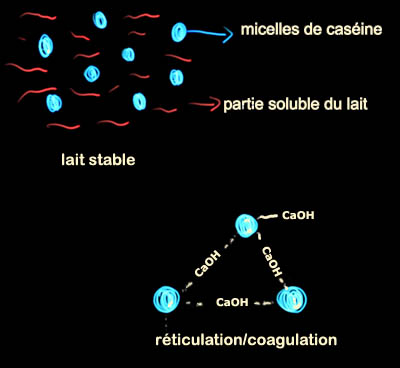
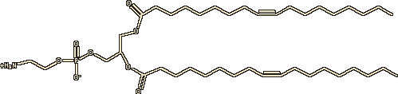
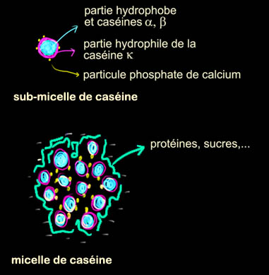

## Caséine, phosphore et dissociation - Les dialogues de Dotapea - Chapitre III
### Caséine, phosphore et dissociation - Les dialogues de Dotapea - Chapitre III
 Navig. page/section

  
  

\_\_\_\_\_

**Pages soeurs**

[I, A propos des liants](chap01liants.html)  
[II, Bulles, siccativ., struct. élec.](chap02bullessiccativation.html)  
III, Caséine, phosphore, dissociation  
[IV, Les orbitales](chap04orbitales.html)  
[V, L'aérogel](chap05aerogel.html)  
[VI, Polarisation de la lumière](chap06polaris.html)  
[VII, Sfumato et diffusion Rayleigh](chap07rayleigh.html)  
[VIII, Les interférentielles](chap08interferences.html)  
[IX, Dextrine, farine et chiralité](chap09dextrine.html)  
[X, L'ocre bleue](chap10ocrebleue.html)  
[XI, Les métamatériaux](chap11metamateriaux.html)  
[XII, Le jaunissement](chap12jaunissement.html)  
[XIII, Laser etc.](chap13laser.html)  
[XIV, L'holographie](chap14holographie.html)  
[XV, L'holographie numérique](chap15holographienum.html)  
[XVI, Extérieur, intérieur, chaux](chap16interieurexterieurchaux.html)  
[XVII, L'électrolyse et les ions](chap17electrolyseions.html)  
[XVIII, L'électricité, un peu plus loin](chap18electriciteplusloin.html)  
[XIX, Oxydation, métaux](chap19oxydationsmetaux.html)  
[XX, Les échelles](chap20echelles.html)  
[XXI, Nature et évolution des résines](chap21resines.html)  
[XXII, Le mouillage pigmentaire](chap22mouillage.html)  
[XXIII, La molette](chap23molette.html)  
[XXIV, Blanche neige](chap24blancheneige.html)  
[XXV, Lumière et matière](chap25lumiereetmatiere.html)  
[XXVI, Magnétisme](chap26magnetisme.html)  
[XXVII, Ambre et vieilles branches](chap27ambre.html)  
[XXVIII, L'origami miroir](chap28origamimiroir.html)  
[XXIX, Le feu](chap29feu.html)  
[XXX, Peau du métal](chap30peaudumetal.html)  
[XXXI, La ville en un souffle](chap31bellastock.html)  
[XXXII, Oxyder des matériaux](chap32oxydermateriaux.html)  
[XXXIII, Ocre bleue, une solution](chap33ocrebleuesimulation.html)

\_\_\_\_\_

Copyright © www.dotapea.com

Tous droits réservés.  
[Précisions cliquer ici](droitscopie.html)

**Les dialogues sur la physique-chimie  
appliquée aux arts**

**Chapitre III**

**Caséine, phosphore et dissociation**

dial   dial   dial

_[English text](english/chap03casein.html) _ 

Ce chapitre III des [Dialogues de Dotapea](dialoguesdotapea.html) est une discussion entre Jean-Louis, physico-chimiste au CNRS, et un candide, Emmanuel.

Les personnages sont réels, la discussion aussi. Elle peut reprendre à tout moment et ce texte peut s'allonger.

Emmanuel : On parle en cuisine de "cuisson chimique". Cela m'intrigue et je pense que ça peut ouvrir sur des choses qui intéresseront des artistes et des décorateurs. A quoi cette "cuisson" correspond-elle en physico-chimie des interfaces ?

Jean-Louis : A une [réticulation](chap01liants.html#reticulation)/[polymérisation](chap01liants.html#polymerisation) peut-être. Par exemple, si tu mets du [vinaigre](vinaigre.html) dans de la crème fraîche, elle coagule sans que l'on chauffe parce que le vinaigre polymérise les protéines du lait.

Emmanuel : Comment fait-il cela ?

Jean-Louis : Dans le lait ou la crème, la [caséine](caseine2.html) forme des [micelles](chap01liants.html#illustration1) qui servent à stabiliser le calcium. Ces micelles sont chargées négativement et donc se repoussent _sous l'action des forces [électrostatiques](electricite.html#electrostatique)_. Sous l'action d'acides (charges positives) (par exemple, l'acide lactique qui est produit par les bactéries qui "mangent" le lactose) ces micelles perdent progressivement leur charge. Quand elles deviennent neutres elles s'agglutinent.

Il y a une autre façon de coaguler les protéines du lait.  
Sous l'action [d'enzymes](enzyme.html) (dans notre estomac ou celui des veaux) les micelles sont partiellement déstabilisées. Les molécules de caséine se déroulent en partie (c'est une grosse molécule) et avec l'aide indispensable des ions calcium il se forme des "ponts" de molécules d'eau et de calcium entre micelles voisines et le lait ou la crème coagule.

Emmanuel : En marge de ces questions, quel est le rôle du [phosphore](phosphore.html) (que l'on retrouve dans la caséine) dans les "[phospholipides](phospholipide.html)" lactiques ?

Jean-Louis : Le phosphore ne sert à rien ! C'est juste l'élément sur lequel toute la molécule s'articule. Le phosphore porte la partie polaire chargée et les chaînes grasses hydrophobes.  Cf. molécule ci-dessous.

Note : dans cette représentation d'une molécule de _dioleoyl-phosphatidylethanolamine_, on trouve la partie [polaire](electronega.html#liaisonpolaire) à gauche, suivie du phosphore "central", puis de [chaînes grasses](chaine.html) à droite.

Emmanuel : D'accord. Le phosphore peut être au centre de structures de ce genre. Mais finalement, combien d'éléments peuvent-ils remplir ce genre de rôles ?

  
Jean-Louis : Une foultitude, mon bon monsieur. Mais la vie a choisi le phosphore, sans doute parce qu'il est disponible en abondance.  
 

Emmanuel : Certains évoquent un rôle finalement assez mineur des phospholipides par rapport à celui des protéines dans les émulsions à l'oeuf. Qu'en penses-tu ? 

Jean-Louis : Pour être franc, je ne sais pas. Si on cherche des [tensioactifs](tensioactivite.html), les phospholipides sont les candidats idéaux puisqu'ils sont omniprésents dans toute structure vivante. Mais les protéines peuvent aussi jouer un rôle de tensioactif. Alors ensuite savoir qui fait quoi.... Dans le cas de l'oeuf, les phospholipides sont certainement minoritaires, au moins en masse. Ceci dit, le propre d'un tensioactif est de savoir se mettre au bon endroit (les interfaces), et il en faut au finale très peu. Comme disait la pub, "quelques gouttes suffisent" !

[Lire passage in Chapitre I](chap01liants.html#phospholipidesetproteines)

**Caséine, micelles et enzymes**

Emmanuel : Un lecteur de Dotapea avait soulevé un questionnement intéressant sur la caséine : « _J'ai acheté un bouquin, "Couleurs végétales : teintures, pigments et encres", chez Les Ateliers de Provence, qui annonce dans son tableau des ingrédients, à l'article Borax : "C'est le borate de soude, un alcali transformant la caséine en une colle très adhérente" (sic). Et dans la même collection, le bouquin "Ocres et peintures décoratives de Provence", donne plein de recettes de peintures à la caséine, avec soit du bore, soit de la chaux, soit de l'ammoniaque.  
Bref, rien de très scientifique là-dedans, mais décidément, cette association caséine/bore revient souvent. »_

Il n'a pas tort : rien de très scientifique là-dedans, et pourtant, ce thème revient effectivement souvent.  
Il y a une chose qui me chiffonne (et c'est là que je veux en venir, à quelque chose de plus général) : comment et pourquoi un sel peut-il être utilisé comme alcali ?

 

**Caséine et borax, un questionnement récurent**

Jean-Louis : Un sel résulte de l'action d'un [acide](acides.html) sur une base (ou l'inverse, c'est pareil). On distingue des bases et acides forts et faibles. Cela n'a rien à voir avec leur pouvoir corrosif, Les adjectifs sont historiques et n'ont pas de rapport avec ce pouvoir. C'est une question de dissociation. Si dans la solution il y a la molécule de départ ET les deux bouts dissociés, c'est faible, si la solution ne contient que les bouts dissociés, c'est fort. L'ammoniaque et l'acide acétique sont "faibles" mais je ne te conseille pas d'y mettre les doigts.

L'acide chlorhydrique HCl est fort car dans sa solution, 100% des molécules HCl sont dissociées en ions H+ et Cl\-. L'acide acétique CH3COOH est faible car sa solution contient des molécules complètes, des ions CH3COO\- et des ions H+.

Emmanuel : Donc un acide fort se définit par le fait que quand on le met en solution, il se dissocie en éléments simples, c'est ça ?

Jean-Louis : Pas du tout. Le fait de se dissocier n'est pas propre aux acides ou aux bases. Le sel de cuisine, NaCl, se dissocie dans l'eau en Na+ et Cl\-. L'acide chlorhydrique en H+ et Cl\-, l'acide sulfurique en H+ et SO4\--. [L'ammoniaque](ammoniac.html) (une base) est une solution qui contient OH\- et NH4+. Le terme de fort ou faible a malheureusement un connotation de "puissance" qui est erronée. Pour le chimiste, faible veut dire que dans la solution d'acide, par exemple acétique, il y a un mélange de CH3COOH (non dissocié), de H+ et de CH3COO\- (dissociés). Fort veut dire que l'acide (ou la base) non dissociée n'existe plus dans la solution.

Emmanuel : Ma question était mal posée. Mais parlons maintenant des bases fortes ou faibles, puis des [sels](formationdesels.html).

Jean-Louis : C'est la même chose pour les [bases](alcali.html) : NaOH ([soude caustique](soudecaustique.html)) est une base forte car en solution elle contient uniquement des ions Na+ et OH\-. L'ammoniaque est une base faible car il reste des molécules non dissociées.

**La force et la faiblesse des solutions** 

En complément synthétique, lire un [passage](acides.html#toxforcefaiblesse) de l'article _Les acides_.

Ensuite, l'action d'une base forte sur un acide fort donne un sel neutre : HCl + NaOH donne NaCl qui a un [pH](ph.html) neutre (pH=7), l'action d'une base faible sur une acide fort donnera un sel plutôt acide, l'action d'une base forte sur un acide faible donnera un sel basique. NaOH étant une base forte, l'acide borique étant faible, le borate de sodium ou [borax](borax.html) est basique. Son pH est basique (pH~9). On peut donc considérer le borax comme une base, un alcali. Entendons-nous bien cependant, un sel n'est pas une base, même s'il fait monter le pH d'une solution.

 

**Comprendre la charge des sels**

Emmanuel : Quelle est la mesure des dissociations en jeu, jusqu'où cela va-t-il ? N'existe-t-il plus aucun lien  ? J'ai du mal à me représenter comment cela se passe.

  
Jean-Louis : Pour HCl ou NaCl, les deux fractions (H+ - Cl\-) et (Na+ - Cl\-) coexistent simplement dans l'eau. Je dis simplement mais c'est en fait très compliqué. Mais ça revient à dire que les fragments ne sont plus liés chimiquement. Dans le cas de NaCl, si on enlève l'eau on reforme le sel de départ. On a bien dissociation, pas décomposition. Dans le cas des acides/bases/sels faible, on a un équilibre chimique. La dissociation de l'acide acétique dans l'eau est limitée. A ce moment on a une proportion stable et connue de CH3COOH, de H+ et de CH3COO\-. Pas un de plus, pas un de moins. La "constante de dissociation" dépend du corps, de la température, du solvant, etc, etc.

\[sur ces points et particulièrement sur l'importance de la solvatation dans ces phénomènes,  
lire un bref [passage](chap17electrolyseions.html#selsbarrieredeau) du chap. XVII\]

 

**Mesure des dissociations**

Revenons-en maintenant à la caséine et au rôle du borax.

La caséine est une des principales protéines du lait (80%). Dans le lait elle forme des micelles, des petites structures sphériques dont l'intérieur est hydrophobe, l'extérieur hydrophile.

Elle servent à solubiliser le phosphate de calcium qui est totalement insoluble dans l'eau mais qui est nécessaire à l'alimentation des jeunes mammifères. En peinture, elle peut donc aussi servir à solubiliser/stabiliser des pigments. Le principe d'action est le même que pour les savons, qui servent à solubiliser les graisses dans l'eau. La caséine est insoluble si le pH est acide (c'est comme ça que l'on fait du fromage, en précipitant la caséine avec de l'acide), soluble si le pH est basique. J'imagine que le mélange du borax à la caséine est fait pour placer la solution vers les pH basiques, où la caséine reste en solution.

Certaines personnes appellent [borax](borax.html) l'acide borique lui même. Il est utilisé comme fondant pour le décapage des métaux avant la soudure, pour protéger des métaux sensibles de l'action de l'air quand on les fait fondre, et pour aider la soudure à bien remplir le plan de joint, notamment lors du soudage de l'or et de l'argent.

 

**Précisions sur la caséine**

Il peut servir d'agent de nettoyage ou de blanchiment. Je crois qu'il sert aussi pour abaisser le point de fusion (fondant) de certains émaux.

Un essai de synthèse sur la caséine, après quelques recherches.  
La caséine est insoluble. On l'obtient par l'action d'un acide et de la chaleur sur le lait. On l'obtient également naturellement par [fermentation](fermentation.html) bactérienne. C'est juste plus long.  
Cette caséine acide, insoluble, est transformée en caséinate par l'action d'une base. [Soude](soude.html) (NaOH), [chaux](chaux.html) (CaO), [potasse](potasse.html) (KOH), etc... Elle est alors soluble mais ses propriétés dépendent de la base choisie. Les caséinates de sodium ont une plus grande viscosité que ceux de calcium. Des colles à base de chaux et de caséine ont longtemps été utilisées, notamment dans l'aviation pour coller le bois. Les mélanges caséine + Na (apporté par du borax) ou caséine + Ca (apporté par la chaux) servent pour les peintures _[a tempera](tempera.html)_.

\[Note : d'autres informations sur les emplois de la caséine - notamment en peinture - sont évoquées d'une manière moins synthétique dans l'article [La caséine](caseine.html) de Dotapea. Voir aussi [l'article du glossaire](caseine2.html)\]

 

Note : sous une certaine forme, il peut effectivement servir de fondant ([lien](borax.html#tetraboratesodium))

[La suite : chapitre IV](chap04orbitales.html)

 

 [Communication](http://www.artrealite.com/annonceurs.htm) 

