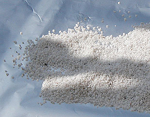
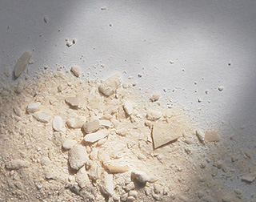
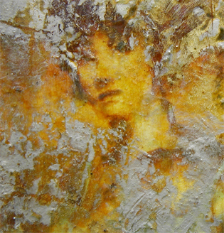

## Charges incolores
### Charges incolores, usage en arts plastiques
 **Charges incolores**  

_Les résines transparentes pour l'acrylique et l'huile sont traitées séparément sur ce site car leur fonction est plus complexe que celle d'une charge. De même, le sel, employé par les aquarellistes, ne peut être traité au chapitre des charges car il est surtout utilisé pour créer des "effets" picturaux._

_Description, précisions importantes_

_Qu'il s'agisse de charges, d'agents d'empâtement ou d'épaississants, le problème est sensiblement le même : il s'agit d'encombrer la pâte avec un produit sensiblement incolore qui se contente d'occuper du volume de la manière la plus neutre possible, sauf dans les cas où la matité, la brillance ou la granularité sont recherchées.  
En peinture à l'huile, ces produits ne doivent pas s'opposer à la siccativation. Ils doivent même parfois la faciliter._

On compte deux grandes catégories de charges incolores :

> \* les charges liantes (cire, chaux, liants émulsionnables, etc.)
> 
> \* les charges non liantes (poudres, matières sans viscosité). On peut nettement distinguer :
> 
> > \* les [colloïdes](colloide.html), qui ne sont pas dépourvus de viscosité au moment de leur mise en solution. Ils ne sont pas "liants" à proprement parler, mais ne sont pas insensibles aux milieu qui les entoure ;
> > 
> > \* les [cristalloïdes](cristalloide.html), qui sont dépourvus de toute réactivité et subissent avant tout la loi de la pesanteur. Les charges cristalloïdes sont d'une manipulation délicate.

L'appartenance d'un produit à l'une de ces catégories est indiquée en tête de chaque rubrique.

Important : lire aussi l'article _[Pâtes, charges et agrégats](pateschargesagreg.html)_.

\_\_\_\_\_

_Charges transparentes traditionnelles_

Les cires

_(charges liantes)_

Les plus anciennes charges en terme de produits auxiliaires **bruts** sont probablement [les cires](cires.html), d'usage antique. S'agit-il d'ailleurs vraiment de charges ? Disons qu'elles sont des [liants](liant.html) faisant office de charges.

Bien que se rangeant dans la catégorie des charges liantes, les cires sont fragiles et doivent être introduites parcimonieusement dans la pâte pour éviter de fragiliser celle-ci. Sans huile, la cire s'empâte bien, certes, mais elle est vraiment très très friable. Un mélange huile-cire donne d'excellents résultats, que ce soit sous la forme d'un liant ou d'un médium ([médium vénitien](mediumspourlhuile.html#mediumgelvenitien)).

[Lire l'article consacré aux cires comme adjuvants.](cirecommeadjuvant.html)

La poudre de marbre

_(charge non liante cristalloïde)_

Un peu plus récente, la _poudre de marbre_ est encore assez utilisée. Demander le grain fin de préférence (voir [image ci-dessous](chargesincolores.html#pdrmarbregfin)). Le grain moyen ([ci-contre](chargesincolores.html#pdrmarbregmoy)) peut être exploité pour créer une matière au moins aussi grenue que le sable. 

Quel qu'en soit le grain, la poudre de marbre n'est pas tout à fait incolore : elle est blanchâtre et très légèrement teintée (vert ou autre couleur, en fonction de la provenance du marbre). Elle doit être adjointe de liant ([huile](huiles.html), [liant acrylique](acrylique.html), etc.) et peut être considérée, au point de vue de sa préparation, comme la soeur jumelle du "pigment incolore" qu'est l'[hydrate d'alumine](chargesincolores.html#microbillesdeverre), c'est-à-dire qu'_elle est tout aussi fragilisante_ pour la peinture à l'huile car c'est un [cristalloïde](cristalloide.html) qui n'a aucune viscosité lorsqu'il est mis en solution. Dans l'huile particulièrement, elle "tombe", elle glisse et crée des accidents picturaux.

L'emploi de certains adjuvants (voir notamment _[La cire comme adjuvant](cirecommeadjuvant.html)_) ou des [siccatifs](siccatifs.html) peut permettre de "figer" la pâte avant que la chute de la poudre provoque des catastrophes. Il faut cependant utiliser ces produits de manière mesurée.

Lire absolument un _[passage in Les terres blanches](terresblanches.html#craiemarbre)_ sur la composition et la structure de ce produit.

_Voir aussi [Les marbres](marbres.html)  
et le passage consacré à l'hydrate d'alumine, [ci-dessous](chargesincolores.html#microbillesdeverre)._

Les émulsions

_(charges liantes)_

Les substances destinées à produire une [émulsion](liantsemulsions.html) sont d'un usage souvent ancien. Elles se classent en différentes catégories :

> \* les émulsions fines, réalisées avec [l'oeuf](oeuf.html) combiné à l'huile. Elles n'apportent guère d'épaisseur supplémentaire et leur destination s'apparente à celle d'un médium plutôt liquide
> 
> \* les émulsions épaississantes (huile + liant aqueux). Citons la [chaux](chaux.html). Fortement [alcaline](alcali.html), il peut être utile de neutraliser son [pH](ph.html) à l'aide d'un ester. Un travail peu simple qui peut être long étant donné la lenteur naturelle des esters sur le plan de la réactivité chimique. Sans neutralisation, le choix des pigments doit être impérativement réduit à la palette de la peinture à [fresque](fresque.html). de plus, il faut l'employer en petite quantité car même très pure, elle est un peu colorée. En revanche, l'empâtement réalisé à l'aide de chaux est bien solide et [siccative](sechagesiccativation.html) bien.

L'os de seiche

_(charge non liante colloïde)_

Nous sommes quelques uns à avoir essayé l'os de seiche lavé, réduit en poudre et longuement séché.

Son comportement est intéressant : d'une transparence moyenne, d'une certaine neutralité chromatique bien que plutôt blanc, il présente une assez bonne tenue dans la pâte. Il a quelques inconvénients :

 - il est légèrement alcalin et tend à brunir, avec le temps, en présence de peinture à l'huile

 - il est difficile de le broyer finement (voir ci-contre) car même très sec il demeure mou. Il est donc adapté aux "effets de matière" assez grossiers

 - ce n'est pas facile de se le procurer pour qui n'habite pas sur le littoral !

Toute personne connaissant d'autres produits et procédés de fabrication anciens ou naturels ayant d'aussi bonnes qualités de transparence et de neutralité chromatique est chaleureusement [invitée à faire partager ses connaissances](ecrire.html).

\_\_\_\_

_Charges transparentes contemporaines_

_charge non liante cristalloïde_

**L'hydrate d'alumine** (lire l'article [alumine](alumine.html) du glossaire) est un produit brut contemporain qui ne peut être utilisé n'importe comment, sans précautions. Pourtant, c'est un "must", un "incontournable" qu'il faut vraiment essayer.

[Lire en premier de préférence l'article _Pâtes, charges et agrégats_.](pateschargesagreg.html)

[Inerte](inerte.html) (testé dans différentes solutions neutres, cet élément laisse indifférent le [papier tournesol](papiertournesol.html)), il peut être combiné avec à peu près n'importe quel liant : huile, acrylique, etc., mais de manière différente en fonction du temps de séchage impliqué par la technique utilisée. Un liant aqueux à "prise rapide" (l'acrylique, par exemple), autorise un emploi massif et des empâtements nettement plus audacieux qu'un liant "lent" comme l'huile, qui nécessitera l'adjonction d'autres substances même pour une épaisseur relativement faible.

Cette charge présente des points forts : sa très grande transparence et sa totale neutralité chromatique et chimique, mais par contre, elle ne recèle aucune propriété solidifiante - c'est un euphémisme : en fait, **elle est fragilisante** pour la peinture à l'huile, comme la [poudre de marbre](chargesincolores.html#lapoudredemarbre) ou toute charge [cristalloïde](cristalloide.html). Elle affiche un grand mépris de son environnement. Elle glisse, tombe, n'obéissant qu'à la pesanteur alors même que l'huile commence à durcir.

Les résultats peuvent être catastrophiques. Ils se reconnaissent à des plissures en demi-cercle si le tableau a été peint à la verticale ou bien en sortes de réseau complexes s'il a été réalisé à l'horizontale.

Pour les empâtements à l'huile ou tout emploi en grande quantité, l'hydrate d'alumine doit donc être combinée à bon escient avec d'autres agents comme la cire (lire les textes [_La chaux - utilisation en peinture à l'huile_](chaux.html#utilisationenpeinturealhuile) et [_La cire comme adjuvant_](cirecommeadjuvant.html)), éventuellement des [siccatifs](siccatifs.html) ou bien d'autres charges, permettant une bonne [réticulation](reticulation.html) tout en figeant le mouvement de chute.

Elle donne quand même des résultats magnifiques en [glacis](glacis.html) peu chargés, d'épaisseur modérée, en présence d'une bonne dose de [résine](resinestendres.html). Dans l'exemple ci-dessus ([photo](chargesincolores.html#photoalumine)), l'épaisseur de la pâte traitée avec l'alumine et sa transparence - qui ne produit qu'un très léger flou malgré une surface très accidentée - sont rendus sensibles par les éléments ajoutés en "avant-plan", bien nets, qui semblent flotter sur un plan interposé, comme sur une sorte de vitre. Un résultat un peu semblable bien que moins transparent peut être obtenu en peinture acrylique à l'aide de gels moyennement épais.

L'alumine est matifiante, ce qui peut rendre bienvenue l'adjonction de [dammar](resinedammar.html) (très brillant et très peu coloré) ou pour l'acrylique, de médium brillant. Pour l'huile, le [baume de térébenthine de Venise](venise.html) permet de limiter les [embus](embu.html). Cependant, il faut signaler que l'on peut aussi utiliser la charge précisément pour créer volontairement des embus.

Employée conjointement à une [émulsion huile/méthylcellulose](liantsemulsions.html#emulsionhuileliantmethylcellulosique), l'hydrate d'alumine blanchit. Lentement, en séchant, elle redevient cependant transparente (il faut compter quelques jours ou davantage). Si des zones blanches demeurent au coeur de la pâte, cela signifie que l'émulsion n'a pas pu évacuer son eau qui reste piégée, accident récurent avec cette émulsion. Celle-ci, de toutes façons, donne une pâte beaucoup moins limpide que l'huile pure ou mélangée à d'autres liants et cela est rendu encore plus sensible par la présence de la charge.

Certaines sources évoquent l'association d'alumine avec d'autres substances que l'hydrate (qui n'est autre que H2O) : phosphate, stannate, sulfate (mentionnés par [Xavier de Langlais](livres.html#langlais)), borate d'alumine - voir _[ures, ites et ates](uresiresates.html)_. Nous n'avons pu nous procurer ces produits, dont aucun n'est annoncé comme "[colloïdal](colloide.html)". L'hydrate d'alumine est [inerte](inerte.html) et ne pose pas de problèmes d'incompatibilité, contrairement aux sulfates, noircissant au contact du plomb des siccatifs. L'acétate d'alumine est signalée comme imperméabilisant des [gélatines](gelatine.html), dont la [colle de peau](colledepeau.html).

\_\_\_\_\_

_charge non liante cristalloïde_

**Les microbilles de verre** sont des charges cristalloïdes sur lesquelles nous n'avons aucune information pour le moment.

\_\_\_\_\_

_charge non liante colloïdale_

**La silice colloïdale** est largement utilisée en peinture décorative, mais aussi, en moindres proportions, en peinture artistique. Elle est un produit du plus haut intérêt. Il apparait que :

> \* cette charge est assez grisâtre quoique non dépourvue de transparence
> 
> \* sa "plasticité" est particulièrement remarquable pour l'empâtement, y compris en peinture à l'huile (nous disposons d'ailleurs de témoignages concordants)
> 
> \* elle est absorbante. Contrairement aux charges cristalloïdes, elle semble absorber l'huile comme le ferait un pigment moyen. Une certitude : elle n'est pas insensible au milieu qui l'entoure.

Un descriptif approfondi de la silice colloïdale est disponible dans l'article du glossaire qui lui est consacré. [Cliquer ici](silicepeinture.html#silicecolloidale)

\_\_\_\_\_

_charge non liante en association pigmentaire nanométrique_

**Les pigments à nanocharges** sont abordés dans la section « Hi-Tech ». [Cliquer ici](hitechnanocharges.html)

\_\_\_\_\_

_charge liante_

_Le [liant méthylcellulosique](methylcellulosiqueliant.html), facile à émulsionner avec les huiles à peindre, semble assez bien se conserver._

_Il est assez utilisé, y compris avec la peinture acrylique ou vinylique._

_Optiquement parlant, il semble moins neutre, plus trouble qu'une charge telle que l'alumine par exemple, surtout en [émulsion maigre](liantsemulsions.html#emulsionsmaigres). En peinture à l'huile, il est un peu blanchâtre avant séchage complet._

_Son pouvoir solidifiant pour la pâte est remarquable : il est lui-même liant et à ce titre contribue à la solidité générale s'il est appliqué gras sur maigre. Les recettes de médiums à l'huile prévoient quand même l'adjonction de résines et de siccatif à ce produit (voir [article](mediumhuilemethylcell.html)) - ajout inutile pour les peintures synthétiques aqueuses._

_Dans le travail en empâtement, qu'il s'agisse d'huile ou d'acrylique, **l'adjonction d'un [siccatif](siccatifs.html) ou d'un gel solidifiant est malheureusement indispensable**. Sans cela, avec l'huile, la pâte forme une peau, le dessous tarde grandement à siccativer ou ne siccative jamais. Avec l'acrylique, des craquelures peuvent apparaître._

_De toute manière, ce liant étant réversible, il faut veiller à ne pas l'employer en trop grande quantité si votre travail implique l'apposition de glacis multiples, quoique le mode d'application (voir [posé vs brossé](brossepose.html)) puisse éviter dans une certaine mesure les problèmes de mise en solution intempestive des couches inférieures._

\_\_\_\_\_

_charges liantes_

_Différentes émulsions_

En peinture à l'huile, les émulsions "huile + certains liant aqueux" peuvent être utilisées comme charges, comme on l'a vu ci-dessus avec l'émulsion huile/méthylcellulose. Mais certaines émulsions fines, notamment l'émulsion à l'oeuf, ne rentrent pas véritablement dans ce cadre car elles ne "chargent" pas vraiment la peinture.

Parmi les [alkydes](alkydes.html), certains liants et médiums plus ou moins épais sont employés par les peintres. Les temps de séchage sont effectivement intéressants. Il est cependant impératif de tester les produits car, plus ou moins maigres, on ne peut pas les employer à n'importe quelle phase de l'élaboration d'un tableau. De plus, certains donnent un film fin qui ne présente pas plus d'intérêt que des produits classiques pour l'huile. Comme nous le signalions au sujet de l'oeuf, toute émulsion n'est pas forcément épaisse et ne peut être considérée comme charge. 

[Lire l'article sur les émulsions](liantsemulsions.html).

\_\_\_\_\_

_charges non liantes ou semi-liantes_

En dehors du liant méthylcellulosique, les épaississants pour l'acrylique sont les "[médiums-gels](mediumspourlacrylique.html#mediumsgels)" du commerce. Certains sont de puissants agents d'empâtement.

 [Communication](http://www.artrealite.com/annonceurs.htm) 

