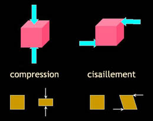

## Cisaillement et compression
### Cisaillement et compression, portée en arts plastiques
 **Cisaillement et compression**

Des mots courants... mais que signifient-ils exactement dans le contexte de Dotapea, c'est-à-dire des arts plastiques et des champs voisins (donc sous un angle essentiellement [rhéologique](rheologie.html), mais pas exclusivement) ?

Prenons un exemple. Si nous prenons un cube de matière, toute déformation complexe que nous lui infligeons se réduira en :

> \* une certaine proportion de compression. Les forces appliquées "rentrent" vers l'intérieur du cube, perpendiculairement aux  
> faces,
> 
> \* et une certaine proportion de cisaillement. Les forces appliquées sont parallèles aux faces.

Des compressions pures ou des cisaillements purs sont également possibles.

Autre exemple : la peinture que l'on "tire" avec un pinceau est cisaillée entre :

> \* la toile, à laquelle la peinture adhère. Elle ne bouge pas, donc en ce point la vitesse et le déplacement sont nuls
> 
> \* et le pinceau (qui se déplace avec une vitesse non-nulle parallèlement à la toile.

Le poids même d'une peinture ou d'une colle peut également provoquer un cisaillement (support vertical typiquement) et/ou une compression (support horizontal). [Voir exemple in _La rhéologie_.](rheologie.html#cisaillement)

Cisaillements et liquides : lire [passage](gazliquidessolides.html#liquidescisaillement) in Les phases de la matière

Compressibilité et phases de la matière : lire un [autre passage](gazliquidessolides.html#compressibilite) du même article

Avec la contribution majeure de [Jean-Louis](quinoussommes.html#jeanlouis)

