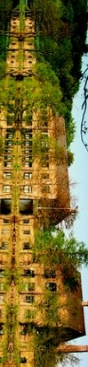

## Courrier des lecteurs 9/8/2011 - M.V.
### CDL - Marouflage sur trapèze
 **VINGT RECETTES**

**pour des PEINTURES de type traditionnel du Danemark**

**Par Søren Vadstrup**

  

Le Centre Raadvad

(...)

\-----

VUE D'ENSEMBLE de PEINTURES traditionnelles et naturelles

A. Peinture à l'huile

> 1\. Peinture à l'huile de lin bouillie
> 
> 2\. Peinture à l'huile de lin crue
> 
> 3\. Peinture à l'huile avec du goudron de bois \[wood tar\]
> 
> 4\. Peinture à l'huile de poisson

B. Peintures à la colle

> 1\. Détrempe à la colle animale
> 
> 2\. Détrempe à la colle de cellulose
> 
> 3\. Mousse de couleur à la carraghénine \[produit extrait d'algues rouges, additif alimentaire\]
> 
> 4\. Détrempe à la bière
> 
> 5\. Détrempe à la farine de pommes de terre (colle Sichell)
> 
> 6\. Détrempe à la farine ordinaire
> 
> 7\. Détrempe à la bouillie de gruau \[flourporridge\] (boue de couleur suédoise)
> 
> 8\. Détrempe à la caséine

C. Temperas

> 1\. Temperas à la colle animale ou végétale
> 
> 2\. Tempera en pâte à la farine ordinaire
> 
> 3\. Tempera en pâte à la bouillie de gruau \[flourporridge\]
> 
> 4\. Tempera à la caséine
> 
> 5\. Tempera au savon
> 
> 6\. Tempéra aux oeufs et à l'huile \[mayonnaise\]
> 
> 7\. Tempéra à la cire et à la caséine
> 
> 8\. Sang de boeuf

 

[Center for](http://www.bygningsbevaring.dk/)

[Bygningsbevaring,](http://www.bygningsbevaring.dk/)

