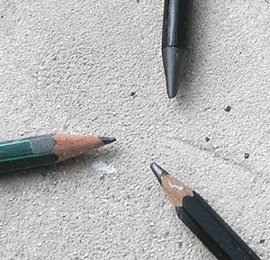
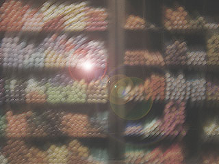
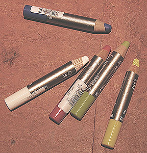

## Le crayon
### Le crayon, usage en arts plastiques
 **Les crayons**



_La [pierre noire](pierrenoire.html), minéral naturel de composition chimique similaire à la mine de crayon actuelle (donc chargée d'une quantité importante de silice), a probablement été utilisée très antérieurement. On ne peut donc pas affirmer que le graphite était intégralement un nouveau venu dans l'univers pictural._

_Le graphite a cependant détrôné la mine de plomb véritable et la [pointe d'argent](pointedargent.html). Lire l'article du glossaire consacré à la [plombagine](plombagine.html)._

_La mine de plomb était bien répandue depuis le XVème et le demeura jusqu'au XIXème. Elle était constituée d'un alliage nocif d'étain (1/3) et de plomb (2/3). Sa tendreté a fait son succès jusqu'à ce que le graphite démontre les mêmes capacités. La "mine de plomb" contemporaine, actuellement disponible dans le commerce (en haut sur la photo, [détails ici](graphite.html#minedeplombetminegraphite)), de même que la mine des crayons noirs, sont - heureusement - constituées de graphite._

_Utilisé pur aux premiers temps, le graphite était très friable. C'est pour cette raison qu'il aurait été progressivement renforcé par des bouts de bois dont la forme se perfectionna progressivement. C'est ainsi que le crayon serait apparu et aurait évolué au fil des siècles comme nous le verrons [ci-dessous](crayon.html#historique). Le bois de cèdre est réputé le meilleur (information livrée sous réserve de confirmation)._

**L'usage artistique**

La mine de plomb et la pointe d'argent (largement utilisée par Raphaël, Vinci, Fouquet, Van Eyck, Holbein ou Dürer) sont essentiellement dédiés à [l'esquisse](esquisse.html). Le crayon à son tour sera réputé utile en premier lieu pour ce type de travaux, bien que de très grands maîtres comme Prud'hon ou Ingres réaliseront des chefs d'oeuvres d'une grande complexité picturale (bien au-delà de l'esquisse) à l'aide de cet outil très simple.

Les esquisses, croquis et dessins étaient très souvent réalisés sur des papiers de couleur et rehaussés de blanc. Encore aujourd'hui, le choix du papier est indissociable à plusieurs titres de celui du crayon, on le verra ci-dessous.

**Petit historique**

En 1659, un premier "fabricant de crayons" apparaît dans les archives de Nuremberg.

Kaspar Faber produit au milieu du XVIIIème siècle une "gaine de bois" encore rudimentaire. En 1795, un mélange de graphite et d'argile apparaît simultanément en Autriche (Hartmuth) et en France (Nicolas Conté). 

A ce moment, le procédé de fabrication est le suivant : réduire le graphite en poudre et l'incorporer à de [l'argile](argile.html), mettre le résultat du mélange en forme de bâtonnets puis cuire à haute température.

Selon nos informations, aujourd'hui encore, les secrets de fabrication résident principalement dans les paliers de cuisson.

Lothar Faber crée, autour de 1839, les graduations de type H, 2H, 3H, etc., et HB, B, 2B, etc., en liaison directe avec la proportion d'argile : plus celle-ci est importante, plus la mine porte du côté "H", devient dure et est désignée comme "sèche" ou "maigre". Cette classification est conforme au concept du "[gras](gras.html)" : l'argile est une charge (maigre), le graphite joue simultanément le rôle de liant (gras) et de pigment.

En principe, les crayons dits "gras" s'effacent plus aisément dans la mesure où ils laissent moins de marques, de rayures sur le papier. Ils sont cependant parfois assez tenaces pour laisser des traces irréversibles. Le choix du papier doit tenir compte de ces facteurs.

Le crayon sec ressemble très fortement à la pointe d'argent très utilisée auparavant.

Un peu plus récemment, les fabricants ont adjoint de la cire au mélange graphite+argile.

C'est le même Lothar Faber qui crée le crayon hexagonal. Il exploite déjà des mines de graphite situées en Sibérie (Irkoutsk,1856). Il impose sa marque sur chaque crayon et en normalise la taille : 17,5 cm (une norme qui demeurera).

La "mine de plomb" contemporaine, en fait constituée de graphite, et la "mine graphite" sont décrites [ici](graphite.html#minedeplombetminegraphite).

_Naissance des différents crayons de couleurs et destinée des graduations H et B_



Autour de 1900 apparaît la fabrication en masse de crayons de couleur (généralement à base de [cires](cires.html), d'huiles peu [saturées](saturation.html) et de [pigments](pigments.html), déclinés en un nombre vertigineux de couleurs car le mélange est malaisé). Parallèlement, les gammes de crayons au graphite s'étendent du 8B au 8H, graduation qui demeurera référentielle. Progressivement, les ["cires" solubles à l'eau](cires.html#lesciressynthetiquesdiluablesaleau) apparaissent et avec elles, les **crayons aquarellables** (voir photo ci-dessous : un exemple de crayons aquarellables), dont on dissout le trait d'un seul coup de pinceau, contrairement aux [sanguines classiques](sanguine.html#laveritablesanguine) à la gomme arabique qui nécessitent une préparation plus longue. Par la suite, aucune invention majeure ne surviendra.

**Le crayon-pastel** (dit à tort _crayon-fusain_, un autre produit) doit aussi être mentionné. Il ne s'agit, ni plus ni moins, que d'un pastel sec très fin entouré de bois. Il apporte ce qui, peut-être, manque aux "craies" de pastel : une précision disponible instantanément, à l'aide d'un banal taille-crayons.

_Mines et porte-mines_

La formule "crayon" n'a pas totalement détrôné la formule "mine + porte-mine". Différents fabricants proposent ces deux produits. L'utilisation du porte-mine remonterait à celle de la pointe d'argent, c'est à dire qu'elle serait fort ancienne.

On ne parle pas ici de mines fines destinées à des travaux industriels nécessitant de la précision, mais de cylindres plus épais, de quelques millimètres de diamètre. La mine peut être taillée de différentes manières (papier abrasif), notamment pour obtenir un méplat ou un tranchant, à l'instar d'une "mine de plomb" ou "mine graphite" contemporaine. Voir _[graphite (outil)](graphite.html)_.

Certains de ces porte-mines sont de beaux objets pouvant atteindre une valeur financière appréciable de même qu'une valeur affective.

_Non-identifié : le crayon carbone_

Un intitulé aussi flou ne permet pas de le décrire. Il laisse une trace noire mais il n'est pas documenté. On ne sait pas ce que c'est. Si : du carbone. Nous voici bien avancés. Les fabricants gagneraient à en dire un peu plus.


 [Communication](http://www.artrealite.com/annonceurs.htm) 

[](index-2.html#20131014)


```
title: Le crayon
date: Fri Dec 22 2023 11:26:45 GMT+0100 (Central European Standard Time)
author: postite
```
