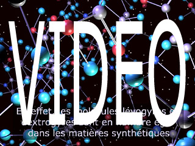

## Dextrine, farine et chiralité
### Dextrine, farine et chiralité
 Navig. page/section

  
  

\_\_\_\_\_

**Pages soeurs**

[I, A propos des liants](chap01liants.html)  
[II, Bulles, siccativ., struct. élec.](chap02bullessiccativation.html)  
[III, Caséine, phosphore, dissociation](chap03caseine.html)  
[IV, Les orbitales](chap04orbitales.html)  
[V, L'aérogel](chap05aerogel.html)  
[VI, Polarisation de la lumière](chap06polaris.html)  
[VII, Sfumato et diffusion Rayleigh](chap07rayleigh.html)  
[VIII, Les interférentielles](chap08interferences.html)  
IX, Dextrine, farine et chiralité  
[X, L'ocre bleue](chap10ocrebleue.html)  
[XI, Les métamatériaux](chap11metamateriaux.html)  
[XII, Le jaunissement](chap12jaunissement.html)  
[XIII, Laser etc.](chap13laser.html)  
[XIV, L'holographie](chap14holographie.html)  
[XV, L'holographie numérique](chap15holographienum.html)  
[XVI, Extérieur, intérieur, chaux](chap16interieurexterieurchaux.html)  
[XVII, L'électrolyse et les ions](chap17electrolyseions.html)  
[XVIII, L'électricité, un peu plus loin](chap18electriciteplusloin.html)  
[XIX, Oxydation, métaux](chap19oxydationsmetaux.html)  
[XX, Les échelles](chap20echelles.html)  
[XXI, Nature et évolution des résines](chap21resines.html)  
[XXII, Le mouillage pigmentaire](chap22mouillage.html)  
[XXIII, La molette](chap23molette.html)  
[XXIV, Blanche neige](chap24blancheneige.html)  
[XXV, Lumière et matière](chap25lumiereetmatiere.html)  
[XXVI, Magnétisme](chap26magnetisme.html)  
[XXVII, Ambre et vieilles branches](chap27ambre.html)  
[XXVIII, L'origami miroir](chap28origamimiroir.html)  
[XXIX, Le feu](chap29feu.html)  
[XXX, Peau du métal](chap30peaudumetal.html)  
[XXXI, La ville en un souffle](chap31bellastock.html)  
[XXXII, Oxyder des matériaux](chap32oxydermateriaux.html)  
[XXXIII, Ocre bleue, une solution](chap33ocrebleuesimulation.html)

\_\_\_\_\_

Copyright © www.dotapea.com

Tous droits réservés.  
[Précisions cliquer ici](droitscopie.html)

**Les dialogues sur la physique-chimie  
appliquée aux arts**

**Chapitre IX**

**Dextrine, farine et chiralité**

dial   dial   dial

Ce chapitre des [Dialogues de Dotapea](dialoguesdotapea.html) est une discussion entre Jean-Louis, physico-chimiste au CNRS, et un candide, Emmanuel.

Les personnages sont réels, la discussion aussi. Elle peut reprendre à tout moment et ce texte peut s'allonger.

Tout d'abord une introduction vidéo par le biais du canal web de ArtRéalité.

Emmanuel : Je voudrais te poser une question en relation à la fois avec la peinture et avec un sujet que nous avons abordé récemment : qu'appelle-t-on exactement "dextrogyre" (la [dextrine](dextrinefarines.html) par exemple) et "lévogyre" ? Qu'est-ce qui tourne à droite ou à gauche exactement ? Est-ce en relation avec la [polarisation de la lumière](chap06polaris.html) ?

Jean-Louis : Oui, ça a un rapport avec la polarisation.

Selon qu'une molécule est superposable à son image dans un miroir ou pas elle est dite achirale ou chirale. Une main n'est pas superposable à son image, puisque qu'une main droite devient une main gauche dans l'image \[voir [vidéo](chap09dextrine.html#video)\]. Cette propriété de chiralité est liée à la présence d'un atome dit "asymétrique" dans la structure moléculaire. Deux molécules peuvent avoir exactement la même formule chimique et ne différer que par la structure de cet atome asymétrique. Ce sont des "énantiomères".

Emmanuel : Si je ne dis pas une sottise, ce sont des [isomères](isomerie.html) qui ont une version D et une version L alors que d'autres isomères (diastéréoisomères, épimères, etc.) n'ont pas des formes liées à ces géométries de miroirs. Est-ce que c'est bien ça ?

Jean-Louis : Oui, c'est ça.  
 

Le fait qu'une molécule soit chirale entraîne notamment qu'elle soit "optiquement active", ce qui veut dire qu'elle agit sur la polarisation d'une onde lumineuse incidente. Ca a été découvert par Pasteur, sur l'acide tartrique. Si on fait traverser une solution d'acide tartrique "naturel" c'est-à-dire organique à un rayon lumineux polarisé rectilignement (grâce à un polariseur), on remarque que la direction de polarisation tourne lors de la traversée de la solution. C'est le "pouvoir rotatoire".

Emmanuel : Ce qui surprend, c'est que cela ait pu être repéré à cette époque-là. Comment mesure-t-on de tels phénomènes ? Et le mouvement rotatoire se poursuit après la traversée ? Il y a une sorte d'inertie ? 

**Dans la lumière, qu'est-ce qui tourne ?**

Jean-Louis : Ca serait mignon mais pas du tout. Ca s'arrête en 10\-15 secondes... Il n'y a pas d'inertie, simplement tous ces phénomènes optiques ont lieu à des échelles de temps de l'ordre de 10\-15 secondes, le temps moyen pour émettre ou absorber un photon.

On imagine la lumière un peu comme un jet d'eau qui sort d'un tuyau. Ce n'est vrai que dans le vide. Dans un milieu quelconque, les photons sont continûment absorbés par les atomes du milieu et réémis à l'identique. La lumière que tu vois "sortir" d'une vitre n'est pas celle qui y est entrée!

Le phénomène de polarisation ou de rotation du plan de polarisation s'arrête sur le dernier atome du milieu traversé, en 10\-15 secondes.

Pour que le phénomène soit décelé il faut faire traverser une grande longueur d'échantillon. J'ai vu des polarimètres qui avaient un tube d'un mètre de long. Plus habituellement ces instruments mesurent un bonne vingtaine de centimètres.

La rotation va vers la droite (dextrogyre) ou la gauche (lévogyre) dépend entre autres de la concentration, de la longueur traversée, de la longueur d'onde de la lumière, de la température, etc.

 

**La lumière se transmet de différentes manières**

Pour revenir aux expériences de Pasteur, miracle, une solution d'acide tartrique "de synthèse" n'a aucun pouvoir rotatoire. Cet argument a été utilisé par les créationnistes qui disaient à l'époque que même si les molécules étaient identiques, c'était la trace de la main de Dieu qui faisait que les molécules naturelles avaient un pouvoir rotatoire, alors que celles crées par l'homme n'en avaient pas.

Pasteur a montré que la synthèse était en fait "symétrique" et qu'elle produisait les deux sortes d'acide tartrique. Il a pu les trier avec des petites pinces et un bon microscope (les cristaux sont très légèrement différents) et montrer qu'il y avait des cristaux lévogyres, dextrogyres, et que la solution faite avec le mélange des deux n'avait aucun pouvoir rotatoire parce que ça se compensait exactement.

  
Il se trouve que l'immense majorité des molécules biologiques sont optiquement actives. Je crois que l'on ne sait pas pourquoi. Et le plus fort, c'est que une seule des deux formes moléculaires est active. Si tu manges du sucre "gauche" ton petit corps ne pourra rien en faire, sauf l'éliminer. Et il n'a d'ailleurs pas le goût de sucre...

La manip de Pasteur était vraiment très belle.

La synthèse dite "asymétrique", qui produit directement les molécules sans avoir à trier manuellement les cristaux est un domaine très actif et très difficile. Imagine que pour l'immense majorité des médicaments, la moitié de ce que tu avales (mais qu'il a fallu synthétiser et purifier au prix fort) ne sert à RIEN !

Emmanuel : Incroyable ! On a tendance à penser a priori que nos ventres ne font pas la différence vu la force des acides, l'activité bactérienne et la chimie hépatique.

 

**Les bactéries ont des préférences**

Jean-Louis : La plupart des réactions biologiques ne sont pas des réactions "brutales" qui demanderaient un apport d'énergie sous forme de chaleur, comme dans un labo de chimie. Ce sont des réactions [enzymatiques](enzyme.html) qui fonctionnent par des mécanismes clé/serrure. Donc si la clé est tournée dans le mauvais sens, la serrure ne s'ouvre pas.

En corollaire il y a les "fausses clés" qui ne sont pas faite pour ça mais qui rentrent quand même dans la serrure. Par exemple la molécule de [chloroforme](chloroforme.html), CH2Cl2 n'a aucun rapport avec le sucre mais elle rentre dans les mêmes récepteurs qu'elle stimule en outre vingt fois plus que le vrai sucre !

Ou la molécule d'oxyde de carbone qui se bloque dans la serrure de l'hémoglobine, etc.  
 

Tout ça est assez compliqué, notamment au niveau moléculaire. Ca s'appelle la stéréochimie et je ne connais pas tout, de loin.

 

**La clé, une question de forme**

Emmanuel : On parle d'un liant que l'on nomme "dextrine" et qui semble être un dérivé de la farine (via [l'amidon](amidon.html) semblerait-t-il). L'intérêt de la dextrine est-il lié à une réaction enzymatique ? Par exemple, dans le cas de la peinture "à la [bière](autresliants.html#biere)", on peut supposer que des levures interviennent. Parce que celles-ci ont des réactions uniquement avec les versions "dextres" ?

 

**Le traitement à la levure et le traitement sans levure**

Jean-Louis : Cela s'appelle dextrine à cause du pouvoir rotatoire "dextrogyre" des solutions aqueuses que l'on prépare. Comme c'est d'origine organique, il n'existe "naturellement" que cette forme. Ainsi que tu le sais maintenant, si il y avait une forme "lévogyre", elle ne serait pas métabolisable, donc inutile pour les organismes vivants. Si on fait la synthèse d'une telle molécule, sauf à prendre des précautions très contraignantes et très particulières, on fabriquera évidemment tous les isomères optiques.

Comme cette molécule est plus complexe que l'alanine dont nous avons parlé \[[voir vidéo](chap09dextrine.html#video)\] et qu'il y a plusieurs centres chiraux, il y en aura de plusieurs sortes (à tout hasard je dirais au moins 4 ou 5). Pour faire de la colle elles seront probablement toutes aussi bonnes, mais biologiquement une seule fonctionnera.

Emmanuel : Les décorateurs de théâtre et sans doute d'autres professionnels de la décoration feraient (sous réserve d'une enquête plus approfondie) lever la farine avec de la bière, c'est intégralement lié à la biologie. L'aspect dextrogyre ne semble déterminant en peinture ou en collage que sur le versant enzymatique, pas du tout par l'action qu'il a sur la lumière.

Jean-Louis : Très certainement. Notre oeil n'est pas sensible à la polarisation de la lumière.

Emmanuel : C'est le levage qui semble faire une différence dans la pratique en peinture. Sans parler de la possibilité de cuisson. Certains artistes travaillent sur du pain et obtiennent un résultat finalement assez durable.

Sans usage de levure, on fait surtout de la peinture à la farine pour enfants.

Jean-Louis : Comme c'est comestible, ça explique sans doute l'utilisation dans ces peintures.

 

En marge de ce dialogue, lire un [passage](gazliquidessolides.html#enmarge) de l'article _Gaz, liquides, solides, les phases de la matière_ : bière et CO2 ou autres substances, comment mêle-t-on du gaz à du liquide ?

A suivre...

_Chapitre suivant : [X, L'ocre bleue](chap10ocrebleue.html)_

 

 [Communication](http://www.artrealite.com/annonceurs.htm) 

