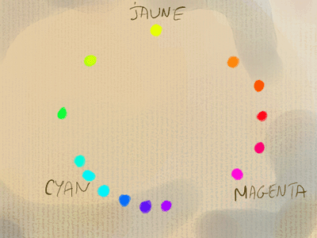

## Exemple de palette
### Exemple de palette basique pour la peinture
 **Exemple de palette**  

**Dotapea n'est pas un site pédagogique à proprement parler. Pourtant, sachant à quel point il est difficile, pour une personne qui cherche à apprendre, de choisir ses premières couleurs, nous présentons ici quelques informations** **censées permettre de constituer une première palette.**

Il s'agit essentiellement de pouvoir reconstituer la quasi totalité des couleurs _sans grande perte de luminosité_, performance interdite par l'emploi des seules primaires. Quatre enjeux se distinguent :

> \* _la possibilité de fabriquer des **verts vifs** et printaniers tout comme des verts "sophistiqués" plus **rompus**_ : il faut un jaune fort et couvrant de toute manière, mais c'est le choix du bleu qui déterminera la _pureté_ du vert : un bleu violacé donnera un vert moins pur et plus sombre qu'un bleu tirant déjà sur le vert. _Il est donc conseillé de disposer d'un bleu "chaud" (manganèse ou céruléum) d'une part et d'un bleu plus froid d'autre part (outremer foncé ou cobalt foncé)._  
> Par ailleurs, la capacité de produire un vert acide détermine la possibilité d'obtenir par la suite des verts complexes **clairs** (type vert doré, vert olive ou bien tendant vers l'émeraude, le Véronèse).
> 
> \* _la création de violets lumineux,_ quasiment irréalisable avec un magenta, d'emblée trop sombre et peu couvrant. Le rouge vermillon, bien que tirant sur l'orangé, est assez éclatant pour donner de meilleurs résultats en combinaison avec un outremer par exemple malgré l'important écart chromatique entre ces deux pigments.
> 
> \* _la synthèse de teintes ocres (jaunes, rouges ou brunes) bien lumineuses._ Une première base, très lumineuse, _jaune de cadmium clair ou moyen + rouge vermillon_ donne un orangé. Le bleu (outremer particulièrement car les bleus trop verts donneraient un mélange sale) va transformer cet ensemble. En fonction du rapport _jaune de cadmium / rouge vermillon_, le résultat tirera sur l'ocre jaune ou sur les terres rouges.
> 
> \* _l'obtention de **rouges splendides**_. Pour cela, la garance (ou alizarine) apposée en glacis sur un vermillon ou un rouge de cadmium, en fait sur n'importe quel rouge ou couleur proche (bruns, violets), donne des résultats vraiment somptueux. C'est la raison d'être des [laques](laques.html). 

_Les couleurs à conseiller aux débutants sont grosso modo celles sur lesquelles il existe un fort consensus (outremer, vermillon, céruléum, garance). Les terres (une jaune, une rouge, une brune) et quelques autres deviennent vites indispensables pour constituer une véritable palette._

 **Le noir** peut être oublié pour ce qui concerne les peintures les plus transparentes comme l'aquarelle. Il est beaucoup plus intéressant de le recomposer par un mélange de bleu et de brun, ne serait-ce que dans un premier temps pour moduler des noirs chauds et froids. Dans l'ensemble, l'emploi d'un noir plutôt neutre et assez pur (du type noir d'ivoire ou de Mars) va véritablement caractériser - pour ne pas dire envahir - un tableau quel que soit le procédé de peinture.

 **Le blanc** est d'un emploi délicat dès qu'il s'agit de transparence. Il devient vite encombrant. Par contre, il est utile dès lors qu'il s'agit de travailler en pâte. En quantité importante, il fait dériver la palette vers un "style pastel" qui intéresse certains peintres. Il peut-être utile de restreindre l'emploi du blanc dans les premiers temps de l'apprentissage car il dénature les couleurs des autres pigments au moment même où il s'agit de les découvrir. Il est

_Pour résumer_

> Le choix des bleus est un enjeu fondamental dans la constitution d'une palette. Il est vraiment conseillé de s'y attarder.
> 
> L'outremer foncé et l'un au moins des bleus chauds de référence ([phtalocyanique](phtalocyanines.html) notamment) sont indispensables.
> 
> Le vermillon imitation (ou le rouge de cadmium clair) ne peut être omis de même qu'un jaune de cadmium clair ou à la rigueur moyen.
> 
> La garance (ou un autre rouge froid et transparent de type carmin, alizarine, etc.) est assez importante.
> 
> Le noir et le blanc ne sont pas des couleurs anodines. Elles ont une certaine présence sur les oeuvres.
> 
> Il ne s'agit que d'indications pour commencer l'élaboration d'une palette. L'exploration renouvelée des pigments est aussi souhaitable qu'inévitable car certaines teintes seront toujours moins belles et sans surprises synthétisées par un mélange sur la palette que dans leur clarté, leur vivacité brutes. De plus, le confort acquis par l'adjonction de splendides couleurs prête à l'emploi est irremplaçable. Les couleurs terreuses, particulièrement, ainsi que certains bleus et certains rouges francs, offrent des possibilités incomparables pour qui souhaite sortir du contexte de la toute première approche.

Voir [synthèse soustractive](synthesesoustractive.html).

 [Communication](http://www.artrealite.com/annonceurs.htm) 

