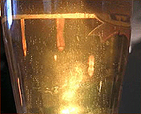

## Fermentation
### Fermentation, article du glossaire
 _Du latin_ fermentum_, levain, de_ fervere_, bouillir_

Transformation de substances organiques par des bactéries, avec l'intervention [d'enzymes](enzyme.html).

Dans le cas de _l'alcoolification_, il s'agit de la transformation du [glucose](glucose.html) en un [anhydride](anhydride.html) et un [alcool](alcool.html). Des traces sont attestées avant 3 000 BC à Skara Brae dans les îles Orcades (Royaume-Uni). Il s'agissait d'une bière d'épeautre qui a pu être reconstituée à partir des résidus.

Les habitants de ce lieu exceptionnel - et parfaitement conservé - connaissaient bien le processus de fermentation puisqu'ils l'exploitaient par ailleurs non seulement pour l'alcoolification mais simplement pour se chauffer à l'aide d'une sorte de  fumier entassé autour de leurs habitations de pierre, dans une région à l'époque dépourvue d'arbres.

Tout produit contenant du sucre sous des formes variées, par exemple la farine, les céréales ou les fruits, peut normalement être fermenté. Il est possible d'amplifier ce processus en ajoutant du sucre pur. C'est la _chaptalisation_.

> CHAPTALISER (...) Action d'ajouter du sucre au moût de raisin avant la fermentation pour augmenter le degré alcoolique du vin. _La chaptalisation est règlementée._

_Acad. fr._

Voir aussi [moût](mout.html).

 [Communication](http://www.artrealite.com/annonceurs.htm) 

