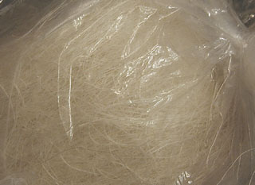

## Filasse
### Filasse, article du glossaire
 Il s'agit d'un textile qui n'a pas encore été filé (chanvre, lin).

Accessoire important en modelage du plâtre notamment (lire passage in [Le plâtre, modelage, moulage](platresculpt.html#filasse)), elle donne du corps à ce dernier et permet de garder des espaces creux dans une sculpture ou une structure.

On achète la filasse chez les fournisseurs d'articles pour les arts plastiques ou pour la plomberie. Son coût assez élevé peut surprendre et son odeur également...

_L'étoupe blanche_ désigne la filasse de la qualité la plus grossière. La noire est goudronnée pour calfater des coques de navires et provient de la récupération de vieux cordages.

Il existe une "filasse de [staffeur](staff.html)" synthétique.


```
title: Filasse
date: Fri Dec 22 2023 11:27:07 GMT+0100 (Central European Standard Time)
author: postite
```
