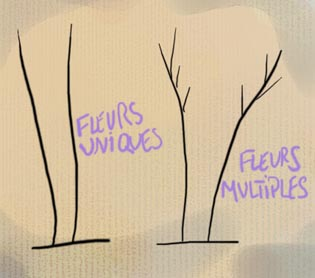

## Fleur
### Fleur, article du glossaire
 **Accès direct glossaire**

**[A](a.html)  [B](b.html)  [C](c.html)  [D](d.html)  [E](e.html)  [F](f.html)  [G](g.html)  
[H](h.html)  [IJK](ijk.html)  [L](l.html)  [M](m.html)  [NO](no.html)  [P](p.html)  
[QR](qr.html)  [S](s.html)  [T](t.html)  [UV](uv.html)  [WXYZ](wxyz.html)**

**La fleur  
Article du [glossaire](glossaire.html)**

Il existe plusieurs acceptions du mot fleur concernant directement ou non le domaine des [pinceaux](pinceaux.html) et des brosses.

> 1\. Extrémité la plus effilée d'un poil
> 
> 2\. Sur l'animal, partie apparente du poil (opp. racine)
> 
> 3\. Pinceau monté "sur fleur" : la [virole](virole.html) est placée sur la fleur du poil.




 [Communication](http://www.artrealite.com/annonceurs.htm) 

[](index-2.html#20131014)


```
title: Fleur
date: Fri Dec 22 2023 11:27:07 GMT+0100 (Central European Standard Time)
author: postite
```
