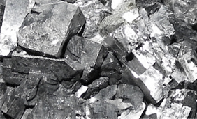

## Galène
### Galène, article du glossaire
 _Du grec_ galênê_, plomb_

L'utilisation de la galène ne s'est pas limitée dans le passé à la réalisation de postes de TSF ("postes à galène") : ce sulfure de plomb - PbS - assez impur (garni d'autres métaux) fut utilisé dès l'Assyrie antique pour réaliser des [glaçures](glacure.html).



Cette utilisation s'est prolongée au fil des siècles mais la [céruse](ceruse.html) a davantage été employée.

On mentionne une galène contenant une forte quantité [d'antimoine](antimoine.html) qui servirait encore de nos jours dans la fabrication de [khôl](khol.html) (information non confirmée mais un usage très ancien l'est - [lien](hitechvertusplomb.html#ebers)).

Un tel métal associé à de l'étain est une base pour la fonte et différents traitements de métaux blancs.


```
title: Galène
date: Fri Dec 22 2023 11:27:11 GMT+0100 (Central European Standard Time)
author: postite
```
