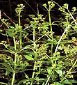

## La garance
### La garance, usage en arts plastiques et autres
 **La garance**  

_La plante et son histoire_

_Le pigment garance a longtemps été extrait d'une plante éponyme ([voir photo ci-dessous](garance.html#photoplante))._

_La garance (_rubia tinctorium_) est une herbe vivace rubiacée (environ un mètre de hauteur) dont le rhizome (80 cm de profondeur au maximum) contient une substance puissamment colorante qui donne aux moutons qui la consomment l'aspect de fauves barbouillés de sang. Curieusement, elle teinte même les os des êtres qui s'en nourrissent (y compris le bec et les pattes des oiseaux) ainsi que le lait._

Sa fleur est d'un blanc jaunâtre (floraison de mai à juillet), ses fruits sont de petits "pois" noirs. Elle pousse sur les sols très riches mais sa racine n'est extractible que lorsque le terrain présente en plus la caractéristique d'être très léger.

Sommaire

[La plante et son histoire](garance.html#laplanteetsonhistoire)

[Extraction](garance.html#extraction)

[Synthèse](garance.html#synthese)

[Toxicité](garance.html#toxicite)

[Le pigment et son emploi en peinture](garance.html#lepigment)

Le terme [alizarine](alizarine.html) désigne selon les sources tantôt la racine, tantôt le colorant que celle-ci contient et qui se situe dans l'[aubier](aubier.html).



Peut-être née en Perse, la garance a été utilisée pour teindre des textiles dès 2000 BC dans une zone originelle élargie : en Inde, en Palestine, en Égypte et chez les Scythes au IVème siècle BC. Ne pouvant être cultivée avec les moyens de l'époque dans la plupart des autres régions du monde (sauf exceptions, par exemple en Australie où elle fut utilisée localement pour la peinture traditionnelle), elle a été l'objet d'un commerce intense (exemple : présence de garance dans une tombe norvégienne du VIIIème siècle BC ou dans le Japon médiéval, à Pompéi, etc.) car sa beauté et sa tenue étaient très recherchées tant pour la teinture que pour la peinture et l'écriture (encres).

Tardivement, la Hollande s'est spécialisée dans cette culture. Elle n'est apparue en France que dans les années 1760 (Avignonnais, Alsace).

Il n'est pas exclu que les pantalons garance des soldats de la 1ère guerre mondiale aient été teints avec une garance probablement synthétique fabriquée en région alsacienne, c'est-à-dire allemande à cette époque.

Parmi les colorants végétaux, la garance est l'un des plus permanents, surtout en tant que teinture.

Elle faisait partie des teintures dites "[bon teint](teint.html)" et permettait également de colorer le cuir (mordant typique : [alun](alun.html)). L'alun apparaît d'ailleurs assez souvent dans les recettes, y compris en peinture.

_Extraction_

Le prix relativement élevé de la garance était dû notamment à la difficulté du travail d'extraction. Le labeur était rude dans les garancières  : il fallait deux hommes pour extirper la racine de la plante. Celle-ci était ensuite séchée au soleil, séparée de son écorce, battue et broyée par des moulins puis tamisée. La qualité du produit obtenu dépendait de la quantité d'écorce restante (une grande quantité donnait une qualité dite "robée", mauvaise).

Puis, une opération [d'hydrolyse](hydrolyse.html) est réalisée afin de débarrasser les [glycosides](glycoside.html) de leur sucre. D'autres traitements suivent et il existe différentes méthodes.

La garance contient en effet une importante quantité de produits colorants, de famille [anthraquinonique](anthraquinones.html).

Un point important doit être signalé : la quantité de composés anthraquinoniques que contiennent les racines de garances est extrêmement variable en fonction de facteurs tels que l'âge de la plante, sa variété et la nature des sols. Sans parler du traitement appliqué qui est déterminant : s'agit-il de destiner le colorant à la teinture ou à la peinture, de le conditionner avec quels mordants et quels agents réactifs, de quel "robage" initial s'agit-il. Nous avons pris l'habitude d'une garance industrielle elle-même hétérogène, mais le traitement traditionnel l'est encore davantage, partant d'un individu moins contrôlable : la plante.

Pour teindre un tissus, il fallait ajouter à "[l'alizarine](alizarine.html)" obtenue du [calcaire](calcaire.html) (craie) et de [l'alun](alun.html), jouant le rôle de mordant. Mais de nombreuses variantes sont envisageables.


_Synthèse et imitations_

En 1826, la composition de l'alizarine est identifiée. En 1869, Graebe et Liebermann parviennent à créer une alizarine synthétique - non une imitation. C'est la ruine pour tous les producteurs de garance naturelle, la fortune pour les industriels.

Le produit de synthèse créé est [anthraquinonique](anthracene.html).

Aujourd'hui, un mélange de quinacridone et de dikéto-pyrrolo-pyrrole (PR206) est proposé comme substitut _permanent_ de la version dite "cramoisie"  (_alizarin crimson_ en anglais), très courante en peinture aquarelle notamment.

_Toxicité_

Concernant l'alizarine de synthèse et la garance, leur nocivité est très faible (problèmes digestifs de courte durée). Les imitations communes ne sont pas non plus signalées comme particulièrement agressive généralement, mais il peut exister des exceptions.

La garance véritable aurait même réapparu sous la forme de colorants alimentaires.

_Le pigment et son emploi en peinture_

La garance en tant que pigment à peindre est généralement déclinée aujourd'hui en trois principales teintes :

> \* la garance rose (d'aspect tantôt blanchâtre, tantôt très transparent, de composition variable)
> 
> \* la garance foncée (une couleur de référence sur la palette)
> 
> \* la garance [cramoisie](cramoisi.html) (en anglais _alizarine crimson_), aux riches nuances sombres, très utilisée pour l'aquarelle.  
> Les cramoisis du passé, réputés violacés, ne ressemblent probablement pas à ceux du présent, souvent brunâtres (ils contiennent parfois un [PBr](nomenclaturepig.html)) et d'ailleurs fort beaux. C'est Bourgeois qui a créé cette couleur dès 1816, souhaitant la substituer au [carmin de cochenille](laquesanciennes.html#lecarmindecochenille).

Une quatrième variété est proposée par certains fabricants (qui ne spécifient pas sa composition) : un soi-disant "rouge de garance", en fait un curieux rouge curieusement orangé que nous ne mentionnons que pour mémoire.

Garances et laques de garance sont un même produit de base, transparent par nature, que l'on peut rendre encore plus transparent à l'aide d'une [charge incolore neutre](chargesincolores.html) pour lui conférer l'appellation de [laque](laques.html). Dans tous les cas, ces produits sont largement utilisés en [glacis](glacis.html). Ils peuvent embellir, voire magnifier des rouges, des violets, des bleus, etc.

Dans un lointain passé, on a utilisé la garance et le [kermès](laquesanciennes.html#kermes) pour compenser le vieillissement de couleurs rouges fugaces comme le [cinabre](vermillons-2.html). Tandis que celui-ci s'assombrissait, la garance, posée par-dessus et le protégeant, s'éclaircissait doucement.

Lecture conseillée : [La garance sur Pourpre.com](http://pourpre.com/chroma/dico.php?typ=fiche&&ent=garance)

Lire aussi [l'article du glossaire](garancegloss.html)


 [Communication](http://www.artrealite.com/annonceurs.htm) 

[](index-2.html#20131014)


```
title: La garance
date: Fri Dec 22 2023 11:27:11 GMT+0100 (Central European Standard Time)
author: postite
```
