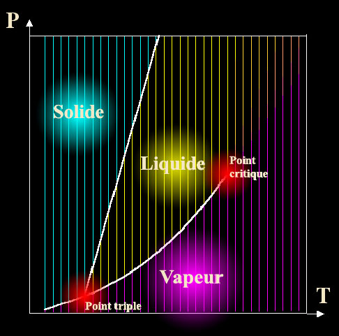
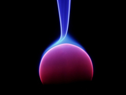

## Gaz, liquides, solides
### Gaz, liquides, solides, états de la matière, portée en arts plastiques
 Navig. page/section

  
  

\_\_\_\_\_

**Pages soeurs**

[Les dialogues de Dotapea](dialoguesdotapea.html)  
[Les échelles](echelles.html)  
Gaz, liquides, solides (phases)  

[Diluants, solvants, dissolvants](diluantssolvants.html)  
[La saponification](saponification.html)  
[Saturation](saturation.html)  
[Les liaisons entre atomes](liaisons.html)  
[La conduction électrique](conductionelec.html)  
[Oxydants/réducteurs/acides/bases](oxyreducacidesbases.html)  
[Oxydoréduction](oxydoreduction.html)  
[Les acides](acides.html)  
[Les alcalis](alcali.html)  
[Les sels, leur formation](formationdesels.html)  
[L'émulsion](emulsion.html)  
[L'ester](ester.html)  
[L'ion et l'isotope](ion.html)  
[Electronégativité, polarité](electronega.html)  
[L'onde](onde.html)  
[La tensioactivité](tensioactivite.html)  
[Cisaillement et compression](cisaillecompr.html)  
[Différenciation magmatique](differenciatmagma.html)  
[Pâtes, charges et agrégats](pateschargesagreg.html)  
[Le colloïde](colloide.html)  
[Toxicité, nocivité, pollution](toxicite.html)  
[Distillation, raffinage](distillationraffinage.html)  
[La photoluminescence](photoluminescence.html)

\_\_\_\_\_

Copyright © www.dotapea.com

Tous droits réservés.  
[Précisions cliquer ici](droitscopie.html)

**Phases de la matière**

Le sens commun suffit généralement à distinguer les gaz, les solides et les liquides. Les gaz sont impalpables, les liquides coulent, les solides ne coulent pas. Après, si l'on rentre dans les détails, il y a les verres qui sont des liquides mais qui ne coulent pas, il y a les solides plastiques, les cristaux liquides, les gels, toute une zoologie.

Il y a encore des empoignades pour savoir qui est quoi. Très schématiquement, les gaz sont peu denses et très compressibles. Les liquides sont denses, peu compressibles, et surtout ne transmettent pas les [cisaillements](cisaillecompr.html). Les solides sont denses, peu compressibles en général (il y a des exceptions, alors que les liquides sont universellement peu compressibles), et transmettent toutes les contraintes y compris les cisaillements.

La compressibilité des gaz est réelle et facile à voir. Les solides et les liquides sont "presque" incompressibles, mais ils restent compressibles. Mais c'est vraiment très faible.  
Le ferrailleur, le sculpteur (César par exemple) ne compressent pas véritablement les métaux. Ils chassent l'air. La compressibilité implique qu'il y ait "du vide" dans la structure, à tout le moins de la place à récupérer. Dans les liquides les atomes ou les molécules sont quasiment au contact, alors il ne reste pas grand chose à gagner.

Dans les solides il y a un peu plus de vide, selon la structure.  
Une structure solide "cubique" est beaucoup plus vide qu'une structure "hexagonale compacte". Ca explique pourquoi certains métaux seront plus compressibles que d'autres.

La "vraie" différence, les liaisons

Une distinction sans doute plus fondamentale entre solides, liquides et gaz est que dans les deux premiers, les molécules sont en interaction. Et plus globalement nous avons :

> \* des liaisons électroniques (covalentes, ioniques, métalliques \[voir [Les liaisons](liaisons.html)\]) dans les solides,
> 
> \* des [liaisons H](liaisons.html#hydrogene) et/ou [de Van der Waals](liaisons.html#vanderwaals) dans la plupart des liquides,
> 
> \* dans les gaz, au contraire, on peut considérer que les interactions sont purement mécaniques : les atomes ou molécules se heurtent ou ne se heurtent pas. Il n'y a pas de cohésion.

La présence de liaisons (au sens large) dans les phases denses explique également pourquoi on peut avoir des phénomènes d'évaporation et de transition vers un état gazeux : l'apport d'énergie thermique libère les molécules ou les atomes dès que cette énergie apportée excède l'énergie dite "de liaison" qui maintient tout ensemble dans les phases condensées.

**Les conditions des changements de phases**

A lire sur l'évaporation comme  
phénomène physique et non chimique,  
un [passage](chap27ambre.html#evaporation) du chap. XXVII

Commençons par le commencement. Sous la pression de l'atmosphère au niveau de la mer, l'eau bout à 100°C. Dans une cocotte-minute où il y a davantage de pression, l'eau bout vers 120°C, ce qui permet donc de chauffer davantage les aliments pour les cuire plus rapidement. Un [autoclave](autoclave.html) permet de réaliser des opérations tout à fait semblables, mais à des niveaux de pression et/ou de température supérieurs.

Au sommet du Mont-blanc où la pression est moindre, l'eau bout vers 70°C ce qui exclut d'y réussir un bon café.

De même, la glace fond à 0°C sous la pression d'une atmosphère normale (niveau de la mer), mais à plus haute température si la pression augmente.

On peut tracer un ensemble de courbes qui s'appelle "diagramme de phase" pour un corps donné et ces courbes indiquent à quel point un changement de phase a lieu.

Quand on franchit une ligne, le corps change d'état. Le long d'une horizontale, de la droite vers la gauche, le gaz se liquéfie puis se solidifie.

Il existe des points dits "singuliers" (en rouge sur le schéma ci-dessus) : le point triple où coexistent simultanément liquide+gaz+solide, et le point critique à partir duquel on ne peut plus distinguer gaz et liquide.

Au point critique, le liquide "bout" et la vapeur se condense sans que l'on s'en rende compte. _A cet endroit, la [tension superficielle](tensioactivite.html) du liquide est quasi-nulle puisqu'elle doit être égale à celle du gaz._ Dans le cas des [aérogels](chap05aerogel.html) c'est l'effet recherché, l'absence de tension de surface annule les forces capillaires qui détruiraient le gel quand le solvant en sort.

A titre indicatif, le point critique de l'eau est vers 370°C et 220 atmosphères. Celui du méthanol est de 240°C et 80 atmosphères. 

**Une miscibilité liquides/gaz**

**En marge du [chapitre IX](chap09dextrine.html) des [Dialogues de Dotapea](dialoguesdotapea.html)**

\[accès direct [Plasmas](gazliquidessolides.html#plasma)\]  
\[accès direct [Superfluide](gazliquidessolides.html#superfluide)\]

Ce dialogue part de l'utilisation de bière  
dans certains procédés de peinture

Jean-Louis : La quantité de CO2 que l'on peut dissoudre dans la bière dépend de la température : plus c'est froid, plus on en met. Symétriquement, plus c'est chaud, plus il en sort. C'est le phénomène qui est à craindre si la planète se réchauffe : les océans plus chauds rejettent le CO2 dissout et le phénomène s'auto-amplifie. Le demi pression mousse bien parce qu'on fait monter la bière de la cave en lui mettant une surpression de CO2.

Emmanuel : Le fait que plus un liquide est froid, plus on peut y placer de gaz, est-ce lié à l'approche du [point critique](gazliquidessolides.html#pointtriplepointcritique) ?

Jean-Louis : Non, pas que je sache. C'est une question d'affinité chimique. Les corps ont une limite de solubilité plus ou moins grande.

Emmanuel : A ce sujet, je n'ai jamais compris comment il pouvait y avoir de l'oxygène libre, enfin de l'air ou d'autres gaz, dans l'eau. Questionnement naturel je crois : dans un liquide on a l'habitude de voir les bulles monter, pas rester sur place !

Jean-Louis : Oui, c'est la poussée d'Archimède. Plus c'est gros, plus ça pousse.

Quasiment tout est soluble dans l'eau. Le fer est soluble dans l'eau. Pas beaucoup, certes, mais c'est mesurable. Les gaz sont donc aussi solubles dans l'eau, et dans d'autres corps ou solvants. Si tu y réfléchis, c'est étrange qu'un solide comme le sucre disparaisse dans l'eau, non ?

Seuls les gaz sont totalement miscibles entre eux. Tous les liquides ne le sont pas (eau/huile), et tous les solides non plus. Mais on peut dissoudre deux métaux l'un dans l'autre, ça s'appelle une solution solide. Il faut juste chauffer.

Emmanuel : Apparemment, quand elles sont plus petites, les bulles montent moins, et encore, pas sûr. Ces questions se posent en peinture entre autres. Peut-être en météo, à l'inverse : comment se forment les gouttes de pluie ? J'ai l'impression que ce ne sont pas des sujets faciles.

Jean-Louis : Les gouttes ne peuvent se former (on dit nucléer) que si il y a un germe, qui est généralement une poussière. Dans un verre de bière les bulles partent généralement du verre parce que c'est là qu'il y a le plus de points de nucléation.  
Un liquide très propre dans un verre très propre aura beaucoup de mal à bouillir. Il faudra aller au delà de 100°C. C'est utilisé dans les "chambres à bulles" en physique des particules.

Emmanuel : A propos de mousse, il y a eu récemment une tempête dans l'Atlantique Nord. Les vents étaient localement de 11 sur l'échelle de beaufort. Lorsqu'ils ont cette force, la mer devient totalement blanche, dit-on. Les gaz contenus juste sous la surface semblent remonter comme lorsque l'on sert un demi.  
Comment charge-t-on un liquide de gaz, pourquoi ce gaz est-il évacué par la même agitation sous forme d'écume ?

Jean-Louis : Ce n'est pas les gaz dissouts, c'est le vent qui brasse la mer et forme une [émulsion](emulsion.html) air/eau. C'est stabilisé par tous les trucs qui sont dissouts dans l'eau de mer. Si tu attends, l'écume se retransforme en eau et en vent...

Emmanuel : Le plancton (etc.) vu comme émulsifiant air/eau ? C'est vrai : avec de l'eau douce propre, pas d'écume. Quelques bulles tout au plus.

Jean-Louis : La question des bulles est que mathématiquement (et donc physiquement), l'énergie nécessaire pour créer une bulle est inversement proportionnelle à son diamètre. Donc en principe, une bulle naissante extrêmement petite demande une énergie de nucléation impossible à trouver. Mais si on part d'une impureté, une poussière, etc..., on a déjà créé un certain volume dans le liquide. La bulle croît à partir de cette inhomogénéité initiale.

Emmanuel : Peux-tu dire quelques mots sur les **plasmas** ?

Jean-Louis : Un plasma est un état de la matière dans lequel, schématiquement, les électrons ont quitté leur atome d'origine et se promènent en liberté. C'est un milieu globalement neutre, mais formé de particules chargées.

Si l'essentiel de l'énergie du milieu est sur les électrons, c'est un plasma "froid", si les atomes sont aussi énergétiques, c'est un plasma "chaud". On peut former un plasma en chauffant très fortement un milieu, c'est ce qu'on observe en astrophysique, dans la couronne solaire par exemple, ou en excitant ce milieu par une décharge électrique, comme dans les tubes fluorescents, les écrans "plasma", les aurores boréales. Les particularités du plasma sont, entre autres, une extrême réactivité chimique et physique, une sensibilité aux champs magnétiques et électriques.

\[Lire un important [passage](chap19oxydationsmetaux.html#plasmaetmetaux) du chapitre XIX des Dialogue de Dotapea\]

Il y a eu de nombreuses expérimentations artistiques avec les plasmas, à cause des effets spectaculaires que l'on peut générer, quoique on soit toujours limité par un "contenant", généralement un tube à vide (tube à décharge plasma). On ne peut pas produire des plasmas "libres", i.e. hors d'une enceinte, si l'on ne dispose pas de moyens énergétiques considérables (irréalistes). Une utilisation amusante et anecdotique des plasmas est l'effet Kirlian (dit aussi effet corona ou effet couronne).

Emmanuel : Cela correspond à peu près aux fameuses auras des "feux de Saint Elme" et ce sont des effet spectaculaires. En termes d'utilisations artistiques on peut mentionner les simples lampes à plasma qui peuvent être intégrées de manières variées dans une oeuvre. Elles contiennent du néon ou du xénon. Peu de choses les différencient des "[tubes à néon](phosphofluo.html#neons)" si ce n'est une pression plus faible, une tension électrique plus élevée et bien sûr une apparence beaucoup plus riche et changeante.

Version grand format, informations et droits de reproduction : cliquer sur l'image

Tout autre chose, que dirais-tu du **superfluide** ? S'agit-il d'une phase de la matière ou d'un particularisme des fluides ?

Jean-Louis : Je ne suis pas expert en superfluidité, mais à ma connaissance ce n'est pas considéré comme une autre phase de la matière. Déjà il n'y a que l'hélium qui soit superfluide, ça fait pas beaucoup de monde. Un peu de la même façon que certains métaux sont magnétiques, d'autres supraconducteurs, il se trouve que l'hélium peut devenir superfluide.

Emmanuel : En quoi le superfluide est-il à la fois fluide et super ?

Jean-Louis : En tant que fluide il continue à avoir une [tension superficielle](tensioactivite.html). Sa superfluidité concerne sa [viscosité](viscosite.html) qui est nulle.

**Cristaux liquides**

Emmanuel : J'ai lu ici ou là que les cristaux liquides pourraient être considérés comme une phase intermédiaire. Phase intermédiaire ou intermédiaires entre phases, qu'en penses-tu ?

Jean-Louis : C'est carrément dans leur définition ! Cristal liquide = mésophase, du grec méso "entre, intermédiaire, milieu".

**Appellations non-contrôlées**

On évoquera surtout ici le "demi-liquide", terme récurremment utilisé dans les ouvrages techniques Beaux-arts.

Ce terme ne devrait pas être assimilé à un état particulier de la matière. On n'est pas demi-liquide mais liquide et solide, voire liquide, solide, gazeux et plasmatique, c'est-à-dire que dès lors que l'on évoque des structures sur des échelles larges, celles-ci peuvent inclure des matières qui sont présentes en n'importe quelle phase sans que cela implique de définir des phases intermédiaires. Le terme "demi" induit là en erreur mais il est vrai qu'il n'existe guère de termes adaptés à cette sorte de pluralité.

 

 

 [Communication](http://www.artrealite.com/annonceurs.htm) 

