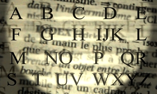

## Glossaire
### Page centrale de la section glossaire du site Dotapea
                   

Pour toute recherche thématique, utiliser la section "[Thèmes](themes.html)". Une recherche transversale simple peut être effectuée à partir de n'importe quelle page (champ situé en haut à droite).

Les définitions du glossaire ressemblent un peu à celles d'un dictionnaire. Vous trouverez souvent une étymologie succincte (développée seulement si elle peut apporter des éclaircissements) et un texte - le plus concis possible - essayant de décrire le mot concerné.

En 2005-2006, le glossaire a été totalement révisé et segmenté, c'est-à-dire que chaque définition a donné lieu à une page séparée, voire à un déplacement dans le corps du site. L'index de chaque lettre est pourvu d'une icône/lien permettant d'identifier visuellement le type d'entrée.

Index alphabétique du glossaire