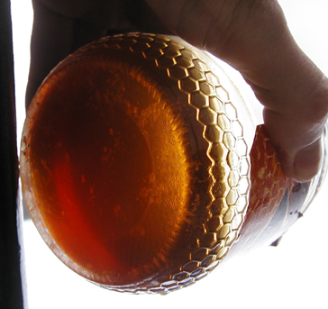

## Glucose
### Glucose, article du glossaire
 _Etymologie : voir [glycérine](glucose.html#glycerine)_



Il n'est pas gras et ne doit pas être confondu avec les [glycérides](glucose.html#glyceride), qui le sont, malgré la proximité étymologique et phonétique.

C'est le carburant essentiel de l'organisme. Il s'agit d'un [glucide](glucide.html) élémentaire, naturellement [dextrogyre](dextrogyre.html) de type [ose](glucide.html#oses) à six atomes de carbone, C6(H2O)6. Sa structure est [cyclique](cyclique.html) et ressemble pour sa base à celle du [benzène](benzene.html) (six carbones) ou plus poétiquement aux cellules d'une ruche, un hasard qui peut troubler.

L'une des branches de la molécule n'est autre au CH2OH, c'est-à-dire une [fonction alcool primaire](alcool.html#fonctionalcoolprimaire). Elle est "détachée" par les bactéries responsables de la [fermentation](fermentation.html). Dans le cas de l'alcoolification, elles la lient à un [méthyle](methyle.html) CH3, ce qui forme une molécule d'éthanol, c'est-à-dire d'alcool ordinaire.

On trouve le glucose dans le miel, le raisin, [l'amidon](glucose.html#amidon) et d'autres ressources naturelles.

Voir [alcoolification](fermentation.html#alcoolification).

Voir aussi [dextrine, farines](dextrinefarines.html), [cellulose](cellulose.html) et _[Le sucre.](sucre.html)_


 [Communication](http://www.artrealite.com/annonceurs.htm) 

[](index-2.html#20131014)


```
title: Glucose
date: Fri Dec 22 2023 11:27:13 GMT+0100 (Central European Standard Time)
author: postite
```
