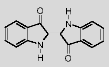

## Indican et indoxyle
### Indican et indoxyle, article du glossaire
 Il est assez difficile de définir l'indican (un mot récent, du latin _indicum_, indigo, 1873) et la description qui suit est livrée _sous toutes réserves_. De manière courante, il est considéré comme le principe colorant de l'indigo. En fait, scientifiquement parlant, il serait le _précurseur_ de [l'indigo](bleusfroids.html#lindigo) (correspondant possiblement à l'Isatan B).

[Lire le texte consacré à l'indican dans l'article _Les bleus moyens et froids_.](bleusfroids.html#indican)

  
Il s'agit d'un élément végétal (un [glucoside](glucoside.html)) extrait des feuilles de l'indigotier (_indigofera tinctoria_, arbrisseau tropical) ou d'_isatis tinctoria_ (voir [indigo médiéval](bleusfroids.html#lindigomedieval)), ainsi que de nombreuses autres espèces. Pour en faire un colorant, il faut l'oxyder.

_L'indoxyle_ serait l'une des deux parties de la molécule d'indigo (cf. schéma), mais encore une fois, insistons sur le fait qu'il semble bien qu'il existe une certaine confusion entre acceptions scientifiques et acceptions proprement lexicales. Nous espérons pouvoir fournir des définitions plus claires ultérieurement si possible.

Voir aussi [Indanthrène](indican.html#indanthrene) et [Pourpre](pourpre.html).

 [Communication](http://www.artrealite.com/annonceurs.htm) 

