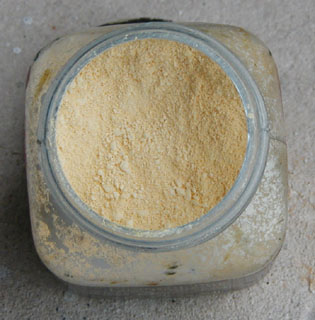

## Jaune de Naples
### Jaune de Naples, pigment utilisé en arts plastiques
 **Jaune de Naples  
et autres jaunes d'antimoine**

Sa teinte est assez éloignée des imitations actuelles (généralement une couleur [azoique](azoiques.html) adjointe de [blanc de zinc ou de titane](blancssynthetiques.html), voir photo ci-contre).  
L'original n'a pas leur blancheur. A l'état pigmentaire, il ressemble à une ocre bien ferreuse qui aurait été teintée de soufre jaune vif. Il est en principe semi-transparent ([voir cependant note ci-dessous](jaunedenaples.html#transpar)).

Lecture conseillée : [Le jaune de Naples sur Pourpre.com](http://pourpre.com/chroma/dico.php?typ=fiche&&ent=naples)

L'utilisation de ce pigment serait très ancienne (chaldéenne selon la légende), bien antérieure de toute façon à l'exploitation napolitaine. [Anne Varichon](livres.html#annevarichon) mentionne un usage par des verriers d'Egypte et de Mésopotamie autour de 2500 BC.

Il aurait été fabriqué à partir de plomb et d'oxyde d'[antimoine](antimoine.html) (le sulfate de chaux n'est mentionné que pour la peinture, mais nous ignorons s'il était absent de la version naturelle antique destinées aux [verres](verre.html) et [glaçures](glacure.html)). Sous cette forme simple, il est aussi réputé pour son instabilité en mélange. Selon la même source, Rome l'aurait remplacé par du [stannate](stannate.html) de plomb... avant qu'il ne retrouve sensiblement au Moyen-âge sa composition première. Il a ainsi été apprécié par des peintres jusqu'au XIXème siècle. [Cennini](livres.html#cennini) le nommait "giallorino", d'autres, plus tard, "giallolino", ce qui ne signifie d'ailleurs rien de bien précis (cf. [giallolino](laquesanciennes.html#laquedegaude)).

En poterie, les combinaisons simples d'oxydes de plomb et d'antimoine peuvent encore être rencontrées dans les [glaçures](glacure.html) où on leur adjoint, là encore, un oxyde d'étain stabilisant.

_Tuf et fabrication classique du jaune de Naples_

D'après un jeune peintre napolitain dont nous avons recueilli le témoignage, les artistes de la région se serviraient souvent du [tuf](tuf.html) (_tuffo_) volcanique local pour fabriquer des pigments. Par ailleurs, ce minéral est employé comme pierre de taille pour la construction des habitations (_tufeau_).

L'extraction et/ou la fabrication originelle du jaune de Naples demeure un mystère et constitue encore aujourd'hui un objet de polémiques. Il semble qu'il ne s'est pratiquement jamais agi d'un pigment naturel mais bien d'une synthèse humaine, ce que semblent confirmer les premières synthèses ([voir ci-dessus](jaunedenaples.html#antiquite)). Les procédés de fabrication sont d'ailleurs innombrables et s'additionnent parfois d'une touche de malhonnêteté (voir ci-dessous _[Intérêt des imitations, faux Naples](jaunedenaples.html#interetdesimitations)_).

Notre jeune artiste ne mentait probablement pas : il est probable que le "minerai brut" du jaune de Naples soit extrait de parties bien spécifiques d'une masse de [tuf](tuf.html) asséché (apportant au moins la chaux) ou bien des solfatares napolitaines (apportant peut-être le soufre, le plomb et l'antimoine), ou bien les deux car il faut probablement associer plusieurs composants naturels. Mais qui sait si l'idée de produire ce pigment n'est pas née, justement, d'un exemple naturel ?

Curieusement, la blanchâtre imitation contemporaine du jaune de Naples ressemble à la description du tuf napolitain plus qu'à l'authentique pigment, plus ocre, plus sombre et intense.

Quant à la fabrication telle qu'elle est pratiquée depuis un siècle ou davantage à partir d'ingrédients purement chimiques, elle est réalisée de différentes manières, mais nous ne citerons - pour mémoire - que les deux relevées par Coffinier (1908), qui les tenait de Fougeroux de Boudaroy :

[Céruse](ceruse.html) :

67 g.

[Blanc de plomb](ceruse.html) :

24 parts

Sulfure d'antimoine :

64 g.

Antimoniate de [potasse](potasse.html) :

4 parts

Chlorhydrate d'ammoniaque :

30 g.

Chlorhydrate d'ammoniaque :

1 part

[Alun](alun.html) calciné :

15 g.

Alun :

1 part

Le mélange est longuement chauffé au creuset, puis lavé, après quoi l'on adjoindrait le sulfate de chaux (information non confirmée).

_Emploi_

Malgré la **présence conjointe de soufre et de plomb** dans sa composition, le pigment "jaune de Naples" semble fort permanent d'après les sources les plus sérieuses _à condition d'être employé pur_. Il vaut mieux l'isoler, ne serait-ce que parce qu'il est siccatif. Un glacis protecteur au-dessous, un au-dessus, suivant l'antique procédé, et le tour est joué, à condition de respecter des temps de siccativation corrects.

Notons quand même que le mélange avec des [couleurs organiques](organiquesvsinorganiques.html) pourrait poser moins de problèmes qu'avec des pigments minéraux.

[André Béguin](livres.html#beguin) décrit le jaune de Naples de la manière suivante (t. 2, p. 693) : "_Lourd et [couvrant](pigments.html#1facteurcouvrantopposetransparence), fixe et solide s'il est bien préparé_", ce qu'il n'a pas toujours été, semble-t-il. D'autres auteurs le considèrent comme semi-transparent.

Il a tendance à réagir (noircissement) en présence des métaux qu'il ne contient pas lui-même. Attention aux [spatules](couteauouspatule.html) notamment (mais l'acier véritable ne poserait pas ce problème selon André Béguin). Les tubes de jaune de Naples sont vernis à l'intérieur pour éviter tout contact avec l'étain. Signalons quelques petites incertitudes concernant un passage isolé du texte très complet que ce très remarquable auteur consacre à ce pigment. Après avoir noté sa réactivité au fer, à l'étain et au zinc, il affirme : "(...) _on peut très bien le mélanger avec des pigments métalliques puisque ceux-ci sont préparés avec les oxydes des mêmes métaux_". Ceci est un peu surprenant.

Certes, avec l'antimoine, le plomb et le calcium qu'il contient, le jaune de Naples bat un "petit record du nombre de métaux", mais il ne faudrait pas oublier que d'autres métaux sont extrêmement courants sur les palettes. Les couleurs au zinc et au fer, notamment. Comment réagissent-elles ? Ce très court passage du _Dictionnaire technique de la peinture_ est difficile à comprendre, alors que l'ensemble de l'article consacré au jaune de Naples est lumineux et très pertinent.

Xavier de Langlais émet comme nous quelques réserves. Il décrit ainsi le jaune de Naples : "_couvrant et siccatif \[,\] très fixe, et relativement stable dans les mélanges à condition d'être bien préparé_". Bien préparé, il n'est donc selon lui que "_relativement [stable](pigments.html#compatibilitesetincompatibilites)_". Ce qui nous pousse à réitérer, comme d'autres (car M. de Langlais n'est pas le seul à demeurer dubitatif), le conseil de ne pas trop mélanger cette couleur sinon à petites doses avec des pigments dépendant de la chimie organique.

_Intérêt des imitations__, faux Naples_

Nul, parmi nous ni autour de nous, n'a utilisé le jaune de Naples authentique ([merci de nous faire part de toute expérience](ecrire.html)).

L'imitation habituelle de cette couleur n'est pas dépourvue d'intérêt _en soi_, même si elle est éloignée de l'original (trop blanchâtre en général). Selon plusieurs peintres, il serait plus intéressant de _l'altérer_ légèrement que de la mélanger massivement à d'autres pigments. Certains fabricants opportunistes se sont saisis dès le XIXème siècle de ce genre d'opinions et n'ont pas hésité à proposer différentes créations très originales, fruits de simples mélanges à d'autres pigments : "jaune de Naples rouge", "jaune de Naples vert". Incroyable mais vrai ! Nous n'ajouterons qu'un commentaire à ce sujet : ce genre de pratiques désigne un état d'esprit que chacun jugera.

_Autres jaunes d'antimoine_

Le jaune Mérimée, nommé parfois _jaune minéral_, une appellation qui prête à confusion ([cf. jaune Turbith](jaunes.html#jaunemineral)) et qu'il vaudrait mieux oublier, a donné lieu à différents procédés de fabrication. Mérimée mettait à contribution une petite quantité de [bismuth](annexe1.html#bi) que d'autres ingénieurs éliminèrent. Tout cela a donné une série de _jaunes Mérimée_ toxiques aux compositions variables autour du thème de l'oxyde d'antimoine adjoint de quantités invraisemblables de plomb sous formes diverses.

Le jaune minéral ou jaune de Turner, sorte de chlorure de plomb obtenu à l'aide de sel (de table), de minium et d'eau, est particulièrement toxique. Comme la plupart de ses cousins les pigments nocifs, cette couleur-gangster a souvent changé de nom (jaune de Kassler, jaune de Cassel, jaune de Paris, jaune de Vérone, etc.). [André Béguin](livres.html#beguin) nous rappelle que certaines variétés toxiques d'oxydes de plomb sont présentes dans la nature et qu'elles ont pu servir à l'élaboration de cette couleur (une élaboration dont les modalités sont très variables) que l'on trouve encore - heureusement parcimonieusement - dans l'offre commerciale en France. Pour mieux cerner le produit, citons cet auteur : "_Ce jaune minéral était assez employé au siècle dernier, en différentes nuances du jaune clair au jaune brun, pour la peinture des équipages et des décors. Il était très solide ; on le vivifiait avec un peu de jaune de chrome_ \[note : un autre pigment toxique\]_. Il était couvrant mais noircissait un peu au contact des émanations sulfureuses_".

 

 

 [Communication](http://www.artrealite.com/annonceurs.htm) 

