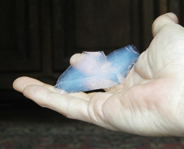
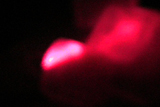
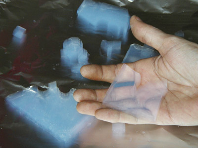
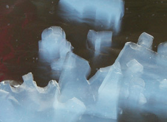
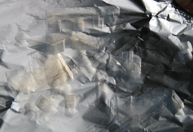
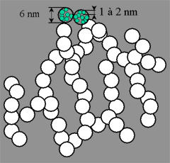
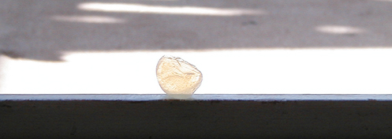
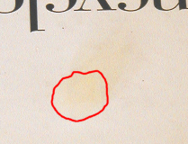
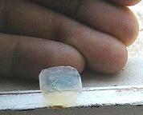
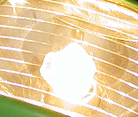

## L'aérogel - Les dialogues de Dotapea - Chapitre V
### Les aérogels - Les dialogues de Dotapea - Chapitre V
 Navig. page/section

  
  

\_\_\_\_\_

**Pages soeurs**

[I, A propos des liants](chap01liants.html)  
[II, Bulles, siccativ., struct. élec.](chap02bullessiccativation.html)  
[III, Caséine, phosphore, dissociation](chap03caseine.html)  
[IV, Les orbitales](chap04orbitales.html)  
V, L'aérogel  
[VI, Polarisation de la lumière](chap06polaris.html)  
[VII, Sfumato et diffusion Rayleigh](chap07rayleigh.html)  
[VIII, Les interférentielles](chap08interferences.html)  
[IX, Dextrine, farine et chiralité](chap09dextrine.html)  
[X, L'ocre bleue](chap10ocrebleue.html)  
[XI, Les métamatériaux](chap11metamateriaux.html)  
[XII, Le jaunissement](chap12jaunissement.html)  
[XIII, Laser etc.](chap13laser.html)  
[XIV, L'holographie](chap14holographie.html)  
[XV, L'holographie numérique](chap15holographienum.html)  
[XVI, Extérieur, intérieur, chaux](chap16interieurexterieurchaux.html)  
[XVII, L'électrolyse et les ions](chap17electrolyseions.html)  
[XVIII, L'électricité, un peu plus loin](chap18electriciteplusloin.html)  
[XIX, Oxydation, métaux](chap19oxydationsmetaux.html)  
[XX, Les échelles](chap20echelles.html)  
[XXI, Nature et évolution des résines](chap21resines.html)  
[XXII, Le mouillage pigmentaire](chap22mouillage.html)  
[XXIII, La molette](chap23molette.html)  
[XXIV, Blanche neige](chap24blancheneige.html)  
[XXV, Lumière et matière](chap25lumiereetmatiere.html)  
[XXVI, Magnétisme](chap26magnetisme.html)  
[XXVII, Ambre et vieilles branches](chap27ambre.html)  
[XXVIII, L'origami miroir](chap28origamimiroir.html)  
[XXIX, Le feu](chap29feu.html)  
[XXX, Peau du métal](chap30peaudumetal.html)  
[XXXI, La ville en un souffle](chap31bellastock.html)  
[XXXII, Oxyder des matériaux](chap32oxydermateriaux.html)  
[XXXIII, Ocre bleue, une solution](chap33ocrebleuesimulation.html)

\_\_\_\_\_

Copyright © www.dotapea.com

Tous droits réservés.  
[Précisions cliquer ici](droitscopie.html)

**Les dialogues sur la physique-chimie  
appliquée aux arts**

**Chapitre V**

**L'aérogel**

dial   dial   dial

Ce chapitre des [Dialogues de Dotapea](dialoguesdotapea.html) est une discussion entre Jean-Louis, physico-chimiste au CNRS, et un candide, Emmanuel.

Les personnages sont réels, la discussion aussi. Elle peut reprendre à tout moment et ce texte peut s'allonger.

Pour preuve, un ajout a été réalisé en fin d'article.  
Il concerne une nouvelle catégorie de gels.  
[Cliquer ici](chap05aerogel.html#elastique)

Nous parlons dans ce chapitre d'un produit très particulier :

Ne cherchez pas ce matériau étrange dans les commerces classiques, c'est inutile du moins pour le moment car il ne s'agit encore que de substances qui ne franchissent que rarement les murs des centres de recherches pour être intégrés typiquement dans des engins spatiaux. Une référence peut aider cependant, [cliquer ici.](http://p25ext.lanl.gov/~hubert/aerogel/agel_suppliers.html)

Ce sujet a de quoi faire rêver plus d'un plasticien et peut-être l'aérogel deviendra-t-il demain un produit familier. Son aspect irréel méritait un petit _apparte_ dans les dialogues de Dotapea, c'est ce que nous avons pensé. Pour le rêve.

Une utilisation combinée de l'aérogel, du laser et de la vidéo est présentée dans le court-métrage _"Laser, matériau transparent et vidéo"_ ([cliquer ici](players/laser030/index.html))

Jean-Louis : C'est un solide. D'ailleurs formé par la [polymérisation](chap01liants.html#polymerisation) de [silice colloïdale](silicepeinture.html#silicecolloidale). On fait un gel de silice avec des petites particules dispersées dans du solvant, on évapore le solvant dans des conditions particulières et on obtient un aérogel. Objet bizarre qui peut contenir jusqu'à 98% d'air et rester néanmoins solide !

Les aérogels ne sont pas très faciles à produire en grandes dimensions. On commence par former un gel contenant du [méthanol](methanol.html)...

Emmanuel : Du méthanol ? Parce que c'est un produit plutôt volatil peut-être ?

Jean-Louis : On utilise le méthanol parce que 1) c'est un solvant du produit de départ et 2) son [point critique](gazliquidessolides.html#pointtriplepointcritique) (240°C et 80 atmosphères, après vérification) est accessible.

  
On emploie des [autoclaves](autoclave.html) qui n'ont rien de particulier. Il faut juste qu'ils supportent la pression et la température. Pour faire des petits aérogels on utilise généralement une "bombe" que l'on place dans un four. La bombe est un petit conteneur en acier spécial résistant à la pression et dans lequel on place le gel de méthanol et de silice. C'est plus simple et moins dangereux que de construire et de mettre sous pression tout un four.

En théorie, on peut fabriquer un morceau d'aérogel aussi grand que l'on veut, pas de problème. Mais ensuite si on le laisse sécher, les [forces capillaires](chap01liants.html#capillarite) exercées par le solvant qui s'évapore détruisent la structure solide qui est très fragile. Alors on place le gel dans un autoclave et on le sèche dans des conditions dites "[critiques](gazliquidessolides.html#pointtriplepointcritique)". Dans ces conditions le méthanol ne possède plus de [tension superficielle](tensioactivite.html) et peut donc sortir du gel sans tout casser. Cela prend un certain temps (quelques jours) et il faut un autoclave de grande taille si l'on veut réaliser des grands échantillons.

  

\[note : le flou ne provient pas de la prise de vue\]

Emmanuel : Peux-tu en dire davantage sur ce matériau étrange qui est le plus léger solide que l'être humain ait produit ?

  
Jean-Louis : Les aérogels sont d'aspect bizarre, très légers, bien sûr, et très isolants thermiquement et acoustiquement. Ils peuvent être transparents et on a envisagé à une époque d'en incorporer dans les vitrages.

\[note : l'aérogel est légèrement jaune par transparence\]

Emmanuel : Je n'ai pas trouvé d'informations concernant son point de fusion. Il doit être élevé puisque l'une de ses utilisations consiste à piéger et conserver à peu près intactes des particules très rapides (poussières de chevelure cométaire dans le cas de la sonde Stardust).  
 

Jean-Louis : Le point de fusion des aérogels est celui de la silice, au dessus de 1 000°C.

Les structures les plus denses d'un aérogel sont des sphères non poreuses, de diamètre inférieur à 1nm, de densité égale à celle de la silice ordinaire (verre de silice).

Ces particules primaires se regroupent pour former des particules secondaires poreuses, d'environ 2 nm de diamètre, deux fois moins denses qu'un verre de silice. Enfin, l'aérogel proprement dit est une structure extrêmement poreuse constituée de branches de silice connectées aléatoirement. La taille moyenne des branches est de l'ordre de 6 nm. A titre indicatif, un aérogel de densité 0,25 possède des pores de taille moyenne 40 nm.

Emmanuel : Est-ce que l'on peut ajouter des oxydes métalliques pour obtenir un aérogel coloré ou luminescent ?

Jean-Louis : Tout à fait !

**L'aérogel, composé de [silice](silice.html) cuite, est une forme de [verre](verre.html) minéral.**

**Cependant, il s'agit aussi d'une appellation générique qui correspond à tout gel (siliceux ou non) où l'air est le milieu dominant, de même qu'il existe des hydrogels, des alcoogels, etc.**

**_Notes_**

_L'aérogel est d'aspect extrêmement changeant en fonction de l'éclairage, c'est en fait la raison majeure (mais pas la seule) pour laquelle nous avons choisi d'en parler sur ce site. Le voici donc sous différentes apparences._

Bien visible :

Plus discret, mais toujours capable de renvoyer une certaine quantité de lumière :

Sous certains angles, les contours semblent s'estomper. On obtient alors des effets **très peu ordinaires !** Ci-dessous, on frôle l'invisibilité. Sur l'image de droite, on remarque également de curieux effets de fusion des contours cette fois avec un fond noir.

Les contours se situent en fait ici :

L'aérogel renvoie une lumière bleue blanchâtre par réflexion (notamment quand le fond est sombre), et jaune par transparence :

Une autre des propriétés de l'aérogel est de bien diffuser la lumière (ici sur une lampe de poche) :

**Sur le plan plastique...**

_Pour ce qui concerne l'aérogel classique (voir détails [ci-dessous](chap05aerogel.html#elastique))._

Il est friable. Le prendre en ses doigts, c'est déjà le mettre à l'épreuve.

Pour le tailler, un plasticien aurait intérêt à travailler par abrasion et/ou par polissage à l'aide d'outils fins. Sans quoi il faut envisager de la casse. Mais la casse peut aussi être présenter un certain intérêt.

Il ne faut pas oublier qu'il s'agit du matériau solide le plus léger qui soit. Cet aspect extraordinaire peut également être utilisé dans des réalisations artistiques ou décoratives. Posons-le sur un liquide, plaçons-le dans un courant d'air...

**Complément : le xérogel-éponge**

Une innovation probablement majeure dans le domaine des gels a été apportée par Kazuoshi Kanamori, Kazuki Nakanishi et Teiichi Hanada (université de Kyoto) et Mamoru Aizawa (Dynax Corp.). Sa portée est à ce jour difficile à calculer. Jean-Louis nous explique de quoi il s'agit en resituant la découverte dans son contexte :

Les aérogels sont formés en solution par [polymérisation](polymere.html) d'un précurseur de type silicate (e.g. tétraméthylorthosilicate), ce qui donne un gel. Si on laisse sécher sans précautions ce gel (qui peut contenir jusqu'à 98% de liquide) on obtient un _xérogel_, un matériau poreux très dense.

Lors du séchage les forces capillaires font s'effondrer la structure originelle du gel et les atomes de silice des parois forment des liaisons [covalentes](covalence.html) qui bloquent la structure. Si on sèche le gel dans des conditions [critiques](gazliquidessolides.html#pointtriplepointcritique), on peut éliminer tout le solvant sans briser la structure, on a alors l'aérogel, qui contient jusqu'à 98% d'air. Ces matériaux sont très fragiles, coûtent cher et ne peuvent pas être fabriqué en grandes dimensions.

**Si** on introduit des molécules hydrophobes dans la structure initiale du gel, les parois ne peuvent pas se [réticuler](reticulation.html) lors du séchage, ce qui fait que le gel obtenu est élastique, si on le comprime il reprend sa forme initiale.

L'équipe japonaise a réalisé des xérogels élastiques, mais aussi des aérogels ayant la même propriété.

**Ajout 2007**

[La suite : chapitre VI](chap06polaris.html)

 

 [Communication](http://www.artrealite.com/annonceurs.htm) 

