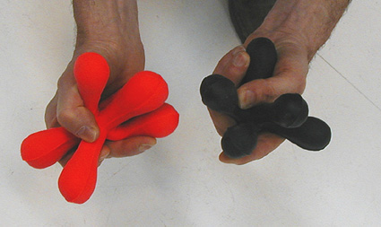

## L'élastomère silicone
### Les moules en élastomère silicone, leur emploi en arts plastiques
 **Les élastomères silicones**

**Description globale**

Liquides, ces produits se solidifient à l'air libre. Ils ont une longévité certaine. Pour les rendre élastiques, il faut leur adjoindre un [catalyseur](catalyse.html).

Les plus typiques sont les RTV/RTV2 ("_Room Temperature Vulcanising_" de générations plus ou moins récentes), séchant plus ou moins rapidement selon le catalyseur, mais toujours à température ambiante.

Il en existe différentes catégories, dont certaines permettent le coulage de métaux à basse température de fusion, jusqu'à 300°C environ. D'autres permettent le moulage de produits alimentaires, _voire même de corps vivants_ (peau). Leurs emplois sont multiples : fabrication de bougies, d'éléments de mobilier, de prototypes industriels, emplois en maroquinerie, fonderie, bijouterie, Beaux-arts, etc...

Bien souvent, les élastomères silicones sont utilisés pour effectuer des moulages, notamment de modèles en [plasticine](patesamodeler.html#plasticines).

La finesse de l'empreinte obtenue avec ces produits est particulièrement réputée.

Comme le [latex](latex.html), ils adhèrent à eux-mêmes, ce qui permet de réaliser certaines opérations en plusieurs temps.

**Un cas particulier**

Il faut mentionner un emploi marginal bien que tout à fait efficace : l'emploi de ces produits comme matériaux de coulage. Les variétés transparentes sont particulièrement conseillées. Elles permettent un pigmentation dans la masse. Ci-contre, un exemple de travaux de ce type réalisé par [Yves Bodiou](quinoussommes.html#yvesbodiou) (_Les tétrapodes plus deux_, 2004). Pour des volumes de plus grande taille, il n'est pas déconseillé d'employer un noyau de mousse quand cela est possible afin de limiter les coûts.

**Utilisation**

Les RTV nécessitent soit un [agent de démoulage](moulage.html#agentdemoulage) gras [saturé](saturation.html) banal, soit aucun agent.

L'épaisseur des moules obtenus est très variable, mais en principe une masse même assez importante peut être découpée. La forme peut être au moins aussi variée qu'avec un [latex](latex.html). Le modèle peut être simplement enduit à la brosse ("moule peau") ou plongé durablement dans un "bain" de silicone.

Le [retrait](retrait.html) est faible. Les temps de séchage et de polymérisation varient fortement en fonction des produits choisis. Les plus courants sont assez rapides (de l'ordre de 24 ou 48 heures).

Lors du coulage, des agents spécifiques ne sont pas utiles le plus souvent. Les silicones sont généralement compatibles avec la plupart des matériaux traditionnels "froids ou tièdes", voire même certains métaux, mais aussi différentes résines synthétiques et bien sûr... le silicone.

Il existerait cependant certaines incompatibilités. [Philippe Clérin](livres.html#philippeclerin) mentionne le soufre qui "_inhibe la prise de la résine_", ce qui disqualifierait le [plâtre](platre.html). Il faut signaler également les risques d'interaction dus à l'emploi de certains autres produits chimiques. Ces problèmes peuvent être contournés soit par le recours à des agents séparateurs adaptés, soit par l'emploi de variétés spécifiques d'élastomères silicones.

ATTENTION : certains élastomères silicones et leurs catalyseurs sont des produits potentiellement dangereux. Il est très important de lire les notices de sécurité et de disposer de tout l'équipement nécessaire (local et protections individuelles) non seulement lors de l'emploi de ces substances, mais aussi lors de leur _stockage_.

Voir aussi _[Polyuréthane](p.html#polyurethane)_.

 [Communication](http://www.artrealite.com/annonceurs.htm) 

