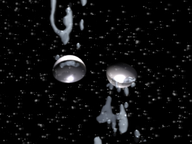

## L'éléctrlyse, les ions, l'électricité - Chapitre XVII des Dialogues de Dotapea
### L'électrolyse, les ions, l'électricité - Chapitre XVII des Dialogues de Dotapea
 Navig. page/section

  
  

\_\_\_\_\_

**Pages soeurs**

[I, A propos des liants](chap01liants.html)  
[II, Bulles, siccativ., struct. élec.](chap02bullessiccativation.html)  
[III, Caséine, phosphore, dissociation](chap03caseine.html)  
[IV, Les orbitales](chap04orbitales.html)  
[V, L'aérogel](chap05aerogel.html)  
[VI, Polarisation de la lumière](chap06polaris.html)  
[VII, Sfumato et diffusion Rayleigh](chap07rayleigh.html)  
[VIII, Les interférentielles](chap08interferences.html)  
[IX, Dextrine, farine et chiralité](chap09dextrine.html)  
[X, L'ocre bleue](chap10ocrebleue.html)  
[XI, Les métamatériaux](chap11metamateriaux.html)  
[XII, Le jaunissement](chap12jaunissement.html)  
[XIII, Laser etc.](chap13laser.html)  
[XIV, L'holographie](chap14holographie.html)  
[XV, L'holographie numérique](chap15holographienum.html)  
[XVI, Extérieur, intérieur, chaux](chap16interieurexterieurchaux.html)  
XVII, L'électrolyse et les ions  
[XVIII, L'électricité, un peu plus loin](chap18electriciteplusloin.html)  
[XIX, Oxydation, métaux](chap19oxydationsmetaux.html)  
[XX, Les échelles](chap20echelles.html)  
[XXI, Nature et évolution des résines](chap21resines.html)  
[XXII, Le mouillage pigmentaire](chap22mouillage.html)  
[XXIII, La molette](chap23molette.html)  
[XXIV, Blanche neige](chap24blancheneige.html)  
[XXV, Lumière et matière](chap25lumiereetmatiere.html)  
[XXVI, Magnétisme](chap26magnetisme.html)  
[XXVII, Ambre et vieilles branches](chap27ambre.html)  
[XXVIII, L'origami miroir](chap28origamimiroir.html)  
[XXIX, Le feu](chap29feu.html)  
[XXX, Peau du métal](chap30peaudumetal.html)  
[XXXI, La ville en un souffle](chap31bellastock.html)  
[XXXII, Oxyder des matériaux](chap32oxydermateriaux.html)  
[XXXIII, Ocre bleue, une solution](chap33ocrebleuesimulation.html)

\_\_\_\_\_

Copyright © www.dotapea.com

Tous droits réservés.  
[Précisions cliquer ici](droitscopie.html)

**Les dialogues sur la physique-chimie  
appliquée aux arts**

**Chapitre XVII**

**L'électrolyse et les ions**

**courants électriques**

dial   dial   dial

Ce chapitre des [Dialogues de Dotapea](dialoguesdotapea.html) est une discussion entre Jean-Louis, physico-chimiste au CNRS, et un candide, Emmanuel..

Ce texte est une sorte de préalable à deux autres articles ([chap. XVIII](chap18electriciteplusloin.html), [chap. XIX](chap19oxydationsmetaux.html)).

Ce triptyque "Électricité, oxydation et métaux" part de faits matériels abordés d'abord d'un point de vue théorique et se prolonge en direction d'applications liées aux arts plastiques.

_Note : sur l'étymologie du mot électrolyse,  
lire l'article [L'électrolyte](electrolyte.html) du glossaire_

Emmanuel : Jean-Louis comment a-t-on découvert les [ions](ion.html) ?

 

 

**« Magie » de l'électrolyse**

 

**Une étymologie imagée mais problématique**

 

**Qu'est-ce qu'un courant électrique ?**

 

**L'électron escargot**

 

**Carambolage dans un fil électrique**

Jean-Louis : Si tu mets du sel dans l'eau, NaCl, tu formes immédiatement des ions Na+ et Cl\-. Ils s'attirent, sans doute, mais ils ne fusionnent pas, ne s'annihilent pas. Au pire ils reformeraient NaCl \[lire [passage](chap03caseine.html#mesuredissociations) in Chap. III\]. Et dans l'eau il y a en fait le phénomène de [solvatation](diluantssolvants.html#solvatation) qui fait que les ions sont "cachés" derrière une épaisse barrière d'eau. Les charges sont "écrantées", donc les champs ne sont pas aussi intenses que ce qu'on pourrait croire.

**L'épaisse barrière de l'eau**

Emmanuel : Pourquoi parle-t-on de "rayonnements ionisants" pour des flux qui semblent a priori concerner surtout l'univers nucléaire, nucléique ?

Jean-Louis : Les "rayonnements ionisants" portent ce nom parce qu'ils ionisent les milieux qu'ils traversent. Le choc de particules énergétiques avec des atomes de matière plus ou moins immobiles entraîne des pertes d'électrons pour les atomes qui subissent les chocs. Cette ionisation des milieux est d'ailleurs ce qui rend les rayonnements ionisants dangereux.

Emmanuel : Pourquoi ?

Jean-Louis : Une molécule, à la base, c'est neutre. Ionisée, elle n'a pas le même comportement. En outre, dans le cas des molécules biologiques, l'ionisation implique très souvent une "fracture" de la molécule. Ceci fait qu'une cellule vivante qui se fait bombarder par des particules "ionisantes" devient totalement incapable de fonctionner normalement. Une cellule ou deux ça va, des milliers de cellules en moins, ça ne va plus.

Emmanuel : Cette "fracture", est-ce à cause de la quantité d'énergie qui est très forte je crois, dans ces rayonnements ?

  
Jean-Louis : Il y a certainement un effet d'échauffement, mais il est mineur. Ce n'est pas la cuisson des cellules qui est dangereuse, c'est vraiment la destruction physique (rupture) des constituants.  
 

Emmanuel : Donc il y a un phénomène surtout mécanique ?

  
Jean-Louis : C'est mécanique si tu vois le départ d'un électron comme la perte d'une pièce et le fractionnement d'une molécule comme une rupture. Sinon c'est toujours un phénomène électronique ou chimique.

**Les rayonnements ionisants**

[Chapitre suivant](chap18electriciteplusloin.html)

 

 [Communication](http://www.artrealite.com/annonceurs.htm)