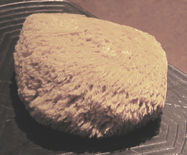

## L'éponge
### L'éponge, les éponges, usage en arts plastiques
 **Les éponges**

Il en existe deux catégories :

> **\*** l'éponge artificielle, qui n'autorise guère l'application de produits à cause de ses contours trop réguliers qui laissent une marque bien reconnaissable. Elle est surtout réservée à l'effacement, au nettoyage des surfaces. Nous ne la mentionnons que pour mémoire.
> 
> **\*** l'éponge naturelle (voir photo), de forme sphérique ou ovoïdale irrégulière. Certains peintres recherchent les éponges les plus irrégulières possibles.

Cette seconde catégorie, utilisée depuis l'Antiquité, autorise de très nombreux travaux des types suivants :

> **\*** application de produits colorants. Très souvent, un [chiqueté](chiquetis.html) est réalisé dans un premier temps. Les "chiques" (les taches) sont ensuite traitées par balayage, étalement ou poses laissant un "[imprimé](eponge.html#imprime)"
> 
> **\*** retrait avec une éponge non pigmentée ou un autre outil. C'est la technique du _[dépouillé](depouille.html)_.
> 
> **\*** dilution irrégulière par jeté d'éponge imprégnée de diluant sur une surface préparée (voir [article](surfacespreparees.html)) - technique assez "brute" ne fonctionnant pas avec n'importe quelle peinture
> 
> **\*** lâcher de colorant ou de diluant par essorage de l'éponge au-dessus de la surface picturale
> 
> **\*** etc.

On entend ici par "_imprimé_" toute technique laissant l'empreinte de l'éponge, de ses formes irrégulières.

L'éponge est l'un des outils d'application les plus rapides. Elle autorise les applications gestuelles expressives mais aussi des travaux "soignés". C'est un auxiliaire ancien mais toujours d'actualité qui mérite de la part des artistes peintres et plasticiens une attention mêlée d'un zeste d'humilité face à une technique certes originale mais puissante et déjà fort explorée.

 [Communication](http://www.artrealite.com/annonceurs.htm) 

