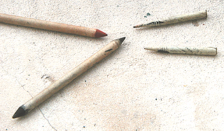

## L'estompe et le tortillon
### L'estompe et le tortillon, usage en dessin et arts plastiques
 **L'estompe et le tortillon**

Ces deux catégories d'outils sont les compléments de toutes les techniques à base de produits pulvérulents tels que les [fusains](fusain.html), les [pastels secs](pastelssecs.html), les craies [sanguines](sanguine.html), les [crayons pastels](crayon.html#crayonpastel), les [graphites](graphite.html), etc.

Leur rôle à tous deux est exactement le même : étaler et/ou estomper des tracés.

Leur matière est aussi sensiblement identique : une fibre de type papier ou carton.

L'estompe est en générale plus massive, d'un seul bloc. Elle a deux bouts en forme de cônes (à gauche sur l'image).

Le tortillon (à droite) est une sorte de papier ou de carton fin enroulé sur lui-même. Il ne présente qu'un seul bout pointu. Par contre, il a l'énorme avantage d'être vendu par lots très peu coûteux.

Le tortillon présente un avantage ergonomique indéniable : une seule couleur par tortillon, cela permet d'éviter les erreurs très courantes constatées lors de l'emploi des estompes. Avec celles-ci, le dessinateur se trompe souvent de côté. Il dépose alors, horreur ! une trace irrécupérable sur une portion de dessin subtilement traitée avec l'autre bout...

A noter : certains dessinateurs préfèrent à ces outils le Kleenex ® ou le Sopalin ® formés en coins.

Voir aussi _[Le procédé au coton](coton.html)_.

