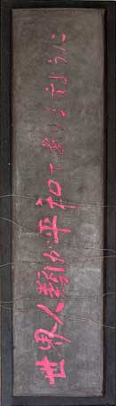
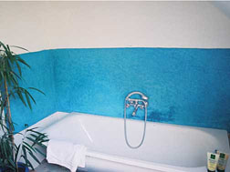
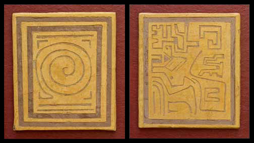
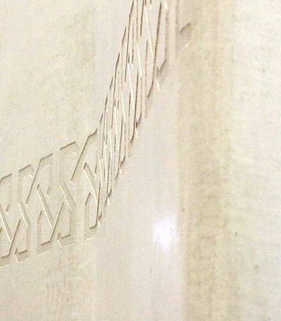
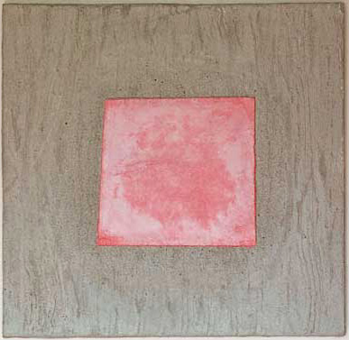
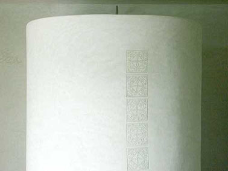
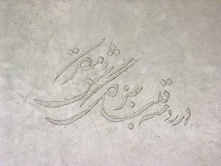
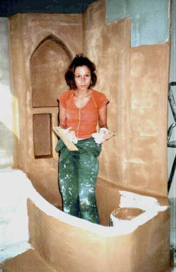

## L'exiérieur et la chaux - Chapitre XVI des Dialogues de Dotapea
### L'extérieur et la chaux - Chapitre XVI des Dialogues de Dotapea
 Navig. page/section

  
  

\_\_\_\_\_

**Pages soeurs**

[I, A propos des liants](chap01liants.html)  
[II, Bulles, siccativ., struct. élec.](chap02bullessiccativation.html)  
[III, Caséine, phosphore, dissociation](chap03caseine.html)  
[IV, Les orbitales](chap04orbitales.html)  
[V, L'aérogel](chap05aerogel.html)  
[VI, Polarisation de la lumière](chap06polaris.html)  
[VII, Sfumato et diffusion Rayleigh](chap07rayleigh.html)  
[VIII, Les interférentielles](chap08interferences.html)  
[IX, Dextrine, farine et chiralité](chap09dextrine.html)  
[X, L'ocre bleue](chap10ocrebleue.html)  
[XI, Les métamatériaux](chap11metamateriaux.html)  
[XII, Le jaunissement](chap12jaunissement.html)  
[XIII, Laser etc.](chap13laser.html)  
[XIV, L'holographie](chap14holographie.html)  
[XV, L'holographie numérique](chap15holographienum.html)  
XVI, Extérieur, intérieur, chaux  
[XVII, L'électrolyse et les ions](chap17electrolyseions.html)  
[XVIII, L'électricité, un peu plus loin](chap18electriciteplusloin.html)  
[XIX, Oxydation, métaux](chap19oxydationsmetaux.html)  
[XX, Les échelles](chap20echelles.html)  
[XXI, Nature et évolution des résines](chap21resines.html)  
[XXII, Le mouillage pigmentaire](chap22mouillage.html)  
[XXIII, La molette](chap23molette.html)  
[XXIV, Blanche neige](chap24blancheneige.html)  
[XXV, Lumière et matière](chap25lumiereetmatiere.html)  
[XXVI, Magnétisme](chap26magnetisme.html)  
[XXVII, Ambre et vieilles branches](chap27ambre.html)  
[XXVIII, L'origami miroir](chap28origamimiroir.html)  
[XXIX, Le feu](chap29feu.html)  
[XXX, Peau du métal](chap30peaudumetal.html)  
[XXXI, La ville en un souffle](chap31bellastock.html)  
[XXXII, Oxyder des matériaux](chap32oxydermateriaux.html)  
[XXXIII, Ocre bleue, une solution](chap33ocrebleuesimulation.html)

\_\_\_\_\_

Copyright © www.dotapea.com

Tous droits réservés.  
[Précisions cliquer ici](droitscopie.html)

**Les dialogues sur la physique-chimie  
appliquée aux arts**

**Chapitre XVI**

**Extérieur, intérieur, chaux**

**Le tadelakt et d'autres techniques aux applications multiples**

dial   dial   dial

Une distribution un peu particulière pour ce chapitre des [Dialogues de Dotapea](dialoguesdotapea.html) : Clothilde Bernair, professionnelle rompue aux techniques de la chaux (voir le site [Sable Rouge](http://www.sablerouge.be/)), [Jean-Louis](quinoussommes.html), physico-chimiste au CNRS (intervention unique en bleu clair) et Emmanuel, candide.

Les questions des lecteurs de Dotapea portent assez souvent sur le sujet de la peinture à l'extérieur, parfois dans des environnements extrêmes. Nous essayons ici de fournir quelques réponses.

A lire en complément :

[intervention in Courrier des Lecteurs](courrierdeslecteurs2009c090.html#20091126dlclothilde)

Emmanuel : La question est souvent posée par les lecteurs de Dotapea : quelle peinture utiliser à l'extérieur dans des domaines artistiques ou décoratifs ? Il existe plusieurs procédés. Certains sont solides, trop peut-être pour certaines applications. Un peu à l'opposé, les procédés à la chaux ont fait leurs preuves depuis des milliers d'années et autorisent des réalisation variées comme nous allons le voir au long de cet article. Ces images disséminées permettent de se rendre compte des possibilités de travailler non seulement en couleur, mais aussi, largement, en épaisseur.

Au-delà du fait fascinant de réaliser une peinture qui deviendra à terme rien moins que de la pierre ([lire passage in La chaux](chaux.html#cyclechaux)), les applications en art contemporain - et pas seulement en arts décoratifs - paraissent aller de soi. La plupart des dimensions, des styles et des emplacements (intérieur, extérieur) sont envisageables.

Clothilde Bernair ©

Tout particulièrement, on parle de plus en plus du [tadelakt](tadelakt.html) pour des atmosphères particulièrement humides telles que les salles d'eau.

Clothilde Bernair ©

Mais pensez-vous que l'on peut vraiment déplacer cette technique à l'extérieur ?

[Clothilde](http://www.sablerouge.be/) : Le tadelakt en extérieur ça me paraît tout à fait possible, surtout qu'il existe des produits hydrofuges laissant respirer la pierre ou les pierres reconstituées.

  
Emmanuel : Concrètement, tout [ciment](ciment.html) à base de [chaux hydraulique](chaux.html#grasseoumaigre) devrait convenir, non ?

  
[Clothilde](http://www.sablerouge.be/) : Oui, ça convient.

  
Emmanuel : Personnellement j'essayerais de travailler [à fresque](fresquegloss.html) dans du ciment blanc. Est-ce que cela vous paraît viable ?

  
[Clothilde](http://www.sablerouge.be/) : Ca me parait un peu difficile à cause de la rapidité de séchage, mais pourquoi pas essayer. Je le ferais plutôt à base de chaux.

Emmanuel : D'accord.

**Tadelakt, ciment blanc, chaux : que choisir ?**

Est-ce que l'on peut passer le galet sur une fresque ?

  
[Clothilde](http://www.sablerouge.be/) : Oui, comme sur n'importe quel enduit de chaux d'ailleurs, le seul ennui c'est que cela risque d'emporter une partie de la peinture et faire des taches floues. Pour des faux marbres, ça ne pose pas de problèmes, mais une peinture bien précise, c'est un peu triste.

  
Emmanuel : Si l'on ne passe pas le galet, l'eau entre trop, c'est ça ?

[Clothilde](http://www.sablerouge.be/) : Le galet permet de bien étirer la chaux, de la ferrer, et de faire effectivement une barrière étanche. 

**Le galet, outil du tadelakt : son rôle et ses limites**

Clothilde Bernair ©

Emmanuel : Que pensez-vous de l'adjonction d'agents (chimiques ou autres) dans la chaux pour en améliorer les performances (d'adhérence, cohésion,.) ?

[Clothilde](http://www.sablerouge.be/) : Je fais le tadelakt façon traditionnelle, puis il est toujours possible de le protéger avec des produits hydrofuges invisibles.  
 

Il faut faire attention à tous ces adjuvants que l'on a tendance à mettre dans la chaux, il ne faut pas oublier que si la chaux redevient pierre, c'est par le biais d'une réaction chimique. Les adjuvants peuvent la bloquer. La perméabilité à la vapeur d'eau n'est pas souhaitable.

Il faudrait les conseils d'un chimiste car je ne m'y connais pas assez à ce niveau-là. Ou relire Vitruve. C'est parfois juste une question de quantité.

Emmanuel : J'avais entendu parler de cires pour la finition mais je vois mal ça à l'extérieur. En fait, les corps gras ne me semblent pas forcément adaptés mais j'ai peut-être tort.

  
[Clothilde](http://www.sablerouge.be/) : Les corps gras cela peut aller, mais il faut y aller prudemment, attendre que la [carbonatation](chaux.html#carbonatation) ait eu lieu, et prendre un produit incolore. Éventuellement le diluer pour plus de précaution. Le danger est qu'il peut laisser des marques grasses s'il n'est pas absorbé régulièrement ou appliqué de manière uniforme. En ce qui concerne la cire, l'application doit aussi effectuée à intervalles réguliers sinon elle finit par s'en aller.

Clothilde Bernair © 

**Additifs et finitions**

Emmanuel : A vue de nez, vous comptez combien de temps de carbonatation  ?

  
[Clothilde](http://www.sablerouge.be/) : On compte grosso modo un bon mois mais cela dépend de l'épaisseur, de l'hydraulicité de la chaux, du taux d'humidité et de l'aération du lieu. Cela dépend de l'absorption du support aussi. Dans des maçonneries de l'époque romaine, certaines chaux n'ont toujours pas vu leur carbonatation, par manque d'air.

 

**Le temps crucial de la carbonatation**

Emmanuel : L'une des personnes qui ont posé des questions sur Dotapea me demandait si on peut utiliser à un moment donné de la caséine. Évidemment, caséine+chaux ça fait plutôt bon ménage et les qualités plastiques sont intéressantes. Mais pour l'extérieur... Qu'est-ce que vous en dites ?

  
[Clothilde](http://www.sablerouge.be/) : Eh bien moi, je ne suis pas trop pour la caséine avec la chaux, plutôt la chaux toute seule ou la caséine toute seule.

  
Emmanuel : Tiens ? Peut-être à cause de l'aspect pictural ou plastique ? La caséine pure est transparente, pas la chaux hydraulique. J'ai fait des essais caséine+chaux aérienne qui étaient intéressants plastiquement mais à mon avis insuffisants pour l'extérieur en termes de solidité. Ceci dit je n'ai pas vérifié ça.

[Clothilde](http://www.sablerouge.be/) : La caséine n'a pas besoin de chaux pour tenir, c'est un genre de colle à elle toute seule. La caséine dans la chaux, il faut faire attention à la proportion, un petit peu pour maintenir une certaine cohésion, mais pas trop pour ne pas bloquer la perméabilité à la vapeur d'eau et la carbonatation. Encore une fois, les conseils d'un chimiste seraient nécessaires.

Pour l'extérieur une chaux hydraulique naturelle est bien suffisante je pense. Sinon il faudrait peut-être essayer la caséine toute seule en extérieur, elle est plus "imperméable".

  
Concernant d'autres peintures, je ne sais pas trop. Je crois que je ne m'y connais pas assez de ce côté-là. La peinture à l'huile de lin et à la térébenthine me paraît une solution possible, mais à vrai dire je ne sais pas comment elle réagirait aux intempéries et dans le temps...

  
Emmanuel : Sur le métal ça tient plutôt bien (cf. [la Tour Eiffel](metaux.html#enductiondesmetauxpourlapeinture)). C'est assez étrange parce que sur support poreux on est loin d'obtenir des résultats aussi performants.

  
[Clothilde](http://www.sablerouge.be/) : En mettant un bon enduit préparatoire avant de peindre, pourquoi pas ?

  
Emmanuel : Le problème avec les supports poreux est l'évacuation de l'eau qu'ils contiennent. Par exemple avec un mur humide ça bloque et ça cloque. Avec un mur de granite ou de basalte ça doit marcher. Avec des calcaires, pas sûr.

  
[Clothilde](http://www.sablerouge.be/) : Quel que soit ce que l'on met sur un mur, un support humide est complètement déconseillé, à moins que cela soit des produits spécifiques à ce genre de problème. Il faut régler le problème avant de faire quoi que ce soit.  
 

  

Clothilde Bernair ©

 

**Chaux et caséine : toujours la question de la carbonatation**

Emmanuel : En principe on peut couler un [ciment](ciment.html) ou un [béton](beton.html) à la chaux hydraulique carrément sous l'eau. Mais là il s'agit d'enduire ou de peindre, enfin de faire adhérer à une surface. Donc est-ce que dans ce cas-là - je dis bien celui-la et pas un autre - c'est l'adhérence qui pose problème ? Le ciment colle mal s'il y a trop d'eau ?

  
[Clothilde](http://www.sablerouge.be/) : Je ne suis pas très sûre, le ciment moderne n'est pas ma spécialité. Toujours est-il que pour le tadelakt, l'apposer sur des surfaces humides empêche le séchage et la prise de la chaux et donc le travail de lissage. La chaux doit "prendre", sécher un peu, et cela est possible entre autres par l'absorption par le support de l'eau contenue dans la chaux. Si le support est humide (saturé d'eau), il ne peut absorber l'eau contenue dans la chaux. Celle-ci ne peut donc sécher ni adhérer, ni commencer sa carbonatation.

  
Emmanuel : Qu'est-ce qui empêche un enduit ou une peinture à la chaux hydraulique d'adhérer sur un support en milieu humide ou aqueux alors que ça marche dans un milieu aérien moyen ? A ton avis Jean-Louis...

  
Jean-Louis : Pour que la chaux prenne, il faut de l'eau et du CO2.

Dans le cas de la chaux dite "aérienne", les deux pourraient littéralement venir "de l'air", sous-entendu "ambiant". En pratique, pour mettre en oeuvre physiquement la chaux, on ajoute de l'eau lorsqu'on prépare le mortier ou l'enduit, pour faire une pâte. Ensuite cette pâte durcit.

Si c'est une chaux hydraulique elle durcit rapidement (comme un ciment) à cause des argiles, elle ne se carbonate qu'ensuite, plus lentement, comme la chaux "aérienne" qui ne durcit que par carbonatation.

  
La chaux est quasiment insoluble dans l'eau. Donc on prépare une suspension. On comprend que la quantité d'eau est critique, si on en met trop les grains de chaux ne peuvent plus être en contact suffisamment intime pour se lier les uns aux autres. C'est aussi se qui se passe si le support est trop humide, la couche de chaux est isolée du support par un film d'eau qui l'empêche d'y adhérer.  
  
 

Clothilde Bernair ©

 

**Sous l'eau, dans l'eau, avec l'eau, comment ça colle ?**

[Clothilde](http://www.sablerouge.be/) : Il faut aussi voir la réaction des pigments à la lumière et aux conditions climatiques...

  
Emmanuel : Oui. Justement, l'une des personnes qui ont posé ces questions sur la peinture à l'extérieur voulait une résistance de -25 à +35° (en montagne) et là à mon avis, il n'y a qu'un bon vieux dérivé de chaux qui ait une chance, et encore. Même une pierre peut se fendre.

[Clothilde](http://www.sablerouge.be/) : Clair ! La difficulté avec la chaux, c'est qu'il faut des conditions d'application stricte, avant la carbonatation (+5 à +30 ou 35°, pas de vent, pas de soleil trop fort, pas de pluie,...). Après c'est plus résistant et aussi plus élastique. Peut-être en la mélangeant à du plâtre bien que celui-ci ne soit pas résistant à l'eau ?

 

**Les conditions climatiques**

**\*\*\***

**A propos de ce que l'on lit ici ou là sur le tadelakt,  
quelques réactions de Clothilde Bernair**

Sur la base d'arguments commerciaux et d'indications diverses trouvés sur le web francophone (il s'agit de citations), Clothilde (qui réagit en violet) nous apporte un intéressant éclairage critique tantôt positif, tantôt négatif.

_"Le nom de Tadelakt provient du verbe 'dellek' qui signifie pétrir, comprimer."_  
D'après ce que je sais, ce serait plutôt « caresser, masser ». Cela me paraît important car cela évoque tout l'amour, la patience et l'attention que l'on doit accorder au tadelakt pendant sa réalisation.

_"\[La chaux qui est obtenue sur place, à Marrakech, par calcination\] est simplement calcinée, puis éteinte. Utilisée telle quelle sans aucun ajout, simplement tamisée, et teintée avec des pigments résistants à la chaux, elle permet d'obtenir un enduit qui possède la même densité que le béton utilisé en Europe dans les stations d'épuration. Les analyses effectuées en laboratoire ont montré qu'il s'agit d'une chaux fortement hydraulique."_  
Elle est naturellement argileuse mais pas si hydraulique que cela puisqu'elle ne sèche pas dans l'eau, seulement au contact de l'air, ou alors très très lentement.

**\[Outils\]**

  
_"L'outil le plus important pour cette technique reste la pierre, un galet qui présente une face plate avec des bords arrondis (...) la [taloche](taloche.html) \[en bois\] pour le serrage \[pour appliquer la chaux\] ou de simples petites planches rectangulaires confectionnées par les artisans, pour la finition une spatule faite avec du plastique de récupération._

_(...) A Marrakech, le Tadelakt s'applique à la truelle \[[truelle](truelle.html) et taloche\] en une couche, il est ensuite taloché, avant d'être serré au galet, puis à la spatule de plastique."_

Le serrage au galet permet de faire remonter le lait de chaux et de l'étirer pour faire une barrière résistante à l'eau. La difficulté est de sentir le bon moment pour le faire, et d'avoir les conditions « climatiques » appropriées.

Il faut aussi savoir l'appliquer sur le support de manière suffisamment régulière, à la fois dense sans trop revenir dessus.

**\[Supports\]**

  
_"A la place des panneaux de plâtre (placoplâtre ou fermacell), nous recommandons les panneaux de fibres de bois liées au ciment de magnésie (héraclith)."_

Tout à fait d'accord

Clothilde Bernair ©

**\[Au sujet d'un produit commercial spécifique pris comme exemple\]**

_"Nous avons \[...\] mis au point, avec les matières premières dont nous disposons ici, un produit qui présente les mêmes qualités que la chaux de Marrakech."_  
\[le rendement annoncé est "environ 2,5 kg par m2"\]

Vu cette quantité, il s'agit plutôt d'un enduit décoratif de finition (presque une peinture) qui va donner un autre résultat que le tadelakt de Marrakech. Celui-ci est un véritable plafonnage traditionnel qui demande deux à trois fois plus de matière (en poids).  
**L'idée maîtresse du tadelakt, c'est l'épaisseur, la solidité, la profondeur.**

"_Mortier en poudre à mélanger à l'eau, couleur blanche"_  
Bizarre, une chaux hydraulique naturelle est généralement teintée. Elle doit être très très proche du ciment blanc alors. Je doute que cela soit de la chaux hydraulique naturelle, ce qu'ils utilisent.

_"Composition :  
Chaux hydraulique naturelle, sables de quartz, poudres de marbres, argiles, cendres, diatomées, cellulose."_  
Il n'est pas bon de mélanger l'argile à la chaux, sauf cuite. Par contre le [quartz](quartz.html) donne une grande solidité à l'enduit. La cellulose je crois que c'est un retardateur de prise, je ne suis pas convaincue du mélange avec la chaux et cela n'est pas nécessaire sous nos climats, en tout cas avec la chaux de Marrakech. Bien sûr dans une chaux hydraulique cela pourrait être nécessaire. Les conseils d'un chimiste seraient les bienvenus mais les décorateurs européens ont un peu trop tendance à mettre des adjuvants synthétiques, colles etc. qui peuvent empêcher la carbonatation et empêcher que les murs respirent.

_"Le Tadelakt préparé est à utiliser dans les 10 heures qui suivent."_  
A cause de la chaux hydraulique, qui sèche dans l'eau. La chaux de Marrakech est quant à elle trempée pendant un mois minimum, donc son hydraulicité est moindre.

_"On peut aussi appliquer le Tadelakt sur d'autres supports qui conviennent moins - plaques de plâtre, plâtre-cellulose, enduit au plâtre, terre cuite, à condition de les recouvrir auparavant d'une sous-couche à base de colle à carrelage."_

C'est vrai qu'il y a moyen de "chipoter" et d'appliquer le tadelakt sur d'autres supports, moyennant quelques préparations, mais ce n'est pas idéal. Pas d'accord pour la colle à carrelage, cela bloque le fond. Poser un enduit par-dessus s'impose. Il pourra absorber l'eau de la chaux. Les fonds bloqués limitent grandement l'absorption et donc la carbonatation naturelle.

_"On passe le savon à lisser (utilisé pour le Stucco lustro) avec un pinceau jusqu'à saturation. On laisse tirer un peu, avant de polir avec le galet. On obtient ainsi un brillant plus soutenu ainsi qu'une meilleure résistance à l'eau et à la saleté : c'est la réaction chimique du savon avec la chaux du support qui donne cette qualité hydrofuge"_

Je ne pense pas que cela soit une réaction chimique, le savon est gras et s'imbibe dans la chaux pour former une barrière résistante à l'eau.

_"Pour l'entretien, utiliser une éponge trempée dans de l'eau tiède savonneuse. Ne pas utiliser d'abrasifs ni de détergents."_

Je dirais surtout, ne pas appliquer de produits anti-calcaires sur le tadelakt.

Le tadelakt est résistant une fois sa carbonatation réalisée et ne craint pas tant que ça les nettoyages, même énergiques. Seuls les produits anti-calcaires, gras ou colorés sont à éviter.

Clothilde Bernair ©

 

**Le tadelakt est un plafonnage (une enduction, un [stuc](stuc.html)age).**

[Chapitre suivant](chap17electrolyseions.html)

 

 [Communication](http://www.artrealite.com/annonceurs.htm)