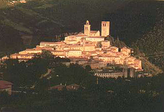
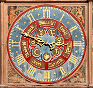
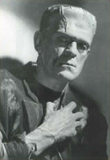
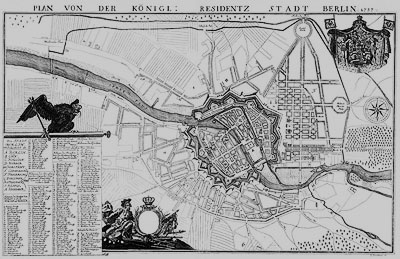
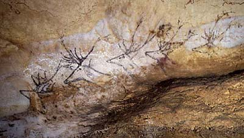

## L'ocre bleue
### L'ocre bleue, le bleu Degottex
 Navig. page/section

  
  

\_\_\_\_\_

**Pages soeurs**

[I, A propos des liants](chap01liants.html)  
[II, Bulles, siccativ., struct. élec.](chap02bullessiccativation.html)  
[III, Caséine, phosphore, dissociation](chap03caseine.html)  
[IV, Les orbitales](chap04orbitales.html)  
[V, L'aérogel](chap05aerogel.html)  
[VI, Polarisation de la lumière](chap06polaris.html)  
[VII, Sfumato et diffusion Rayleigh](chap07rayleigh.html)  
[VIII, Les interférentielles](chap08interferences.html)  
[IX, Dextrine, farine et chiralité](chap09dextrine.html)  
X, L'ocre bleue  
[XI, Les métamatériaux](chap11metamateriaux.html)  
[XII, Le jaunissement](chap12jaunissement.html)  
[XIII, Laser etc.](chap13laser.html)  
[XIV, L'holographie](chap14holographie.html)  
[XV, L'holographie numérique](chap15holographienum.html)  
[XVI, Extérieur, intérieur, chaux](chap16interieurexterieurchaux.html)  
[XVII, L'électrolyse et les ions](chap17electrolyseions.html)  
[XVIII, L'électricité, un peu plus loin](chap18electriciteplusloin.html)  
[XIX, Oxydation, métaux](chap19oxydationsmetaux.html)  
[XX, Les échelles](chap20echelles.html)  
[XXI, Nature et évolution des résines](chap21resines.html)  
[XXII, Le mouillage pigmentaire](chap22mouillage.html)  
[XXIII, La molette](chap23molette.html)  
[XXIV, Blanche neige](chap24blancheneige.html)  
[XXV, Lumière et matière](chap25lumiereetmatiere.html)  
[XXVI, Magnétisme](chap26magnetisme.html)  
[XXVII, Ambre et vieilles branches](chap27ambre.html)  
[XXVIII, L'origami miroir](chap28origamimiroir.html)  
[XXIX, Le feu](chap29feu.html)  
[XXX, Peau du métal](chap30peaudumetal.html)  
[XXXI, La ville en un souffle](chap31bellastock.html)  
[XXXII, Oxyder des matériaux](chap32oxydermateriaux.html)  
[XXXIII, Ocre bleue, une solution](chap33ocrebleuesimulation.html)

\_\_\_\_\_

Copyright © www.dotapea.com

Tous droits réservés.  
[Précisions cliquer ici](droitscopie.html)

**Les dialogues sur la physique-chimie  
appliquée aux arts**

**Chapitre X**

**L'ocre bleue  
Un bleu de Prusse plus naturel ?**

**De Berlin à l'Italie centrale,  
enquête sur d'étranges sfumatos bleutés**

dial   dial   dial

Ce chapitre des [Dialogues de Dotapea](dialoguesdotapea.html) est une discussion entre Jean-Louis, physico-chimiste au CNRS, et un candide, Emmanuel.

Les personnages sont réels, la discussion aussi. Elle peut reprendre à tout moment et ce texte peut s'allonger.

Cette page restitue l'histoire d'une enquête qui n'est pas tout à fait terminée. Elle peut donc s'enrichir de vos témoignages, de vos informations... et des nôtres.

Emmanuel : Cette histoire commence lorsqu'une étudiante laisse un mail dans l'ancienne boîte au lettre "Technique des arts plastiques" de Dotapea. Elle s'intéresse à une très curieuse couleur : le bleu du peintre Jean Degottex. En fait non, l'enquête commence avant : différents auteurs abordent le sujet d'une « terre de Sienne » rendue bleue par une manipulation mal décrite (à ce sujet, lire "La légende du bleu", un [passage](terresdesienne.html#lalegendedubleu) de l'article consacré aux terres de Sienne).

Caroline, cette étudiante, fait donc rebondir l'affaire en apportant quelques précisions : 

**Une vieille histoire**

Jean Degottex aurait acheté des "ocres de Roussillon", c'est-à-dire de [Okhrâ](refc.html#conservatoire), qu'il appliquait en sous-couche.

Par-dessus, il posait semble-t-il un "blanc d'ombre". J'ai fini par comprendre qu'il s'agissait vraisemblablement du blanc de Nocera Umbra, une ravissante bourgade située en Ombrie, en Italie (cliquer ici pour une [image satellite](http://maps.google.fr/maps?f=q&hl=fr&q=nocera+umbra,+italia&ie=UTF8&om=1&z=8&ll=43.113014,12.788086&spn=2.778839,5.789795&t=k&iwloc=addr)).

 Il se fournissait chez un détaillant du XIVème arrondissement de Paris. Je m'y suis rendu. Les gérants ont changé. Aucune donnée n'a pu être obtenue.

Concernant le blanc, j'ai demandé des informations auprès de la mairie de Nocera, en vain.

"L'enquête piétinait", lirait-on dans un roman policier. Oui, mais pas à tout point de vue.

**Un mystérieux pigment : le blanc d'ombre**

Note : Nocera Umbra produirait également une "terre d'ombre" apparentée en fait à une [terre de Cassel](noirs.html#laterredecassel) (lignite), donc un pigment pratiquement noir.

(informations [F. Perego](livres.html#perego))

En effet on a pu déterminer que selon une forte probabilité, ce blanc semble être une argile blanche que l'on trouve notamment dans la rivière ou les sources de la région et qu'elle est censée posséder des vertus curatives connues depuis l'Antiquité. Il y a des thermes sur place actuellement.

Ce blanc est également utilisé de nos jours en cosmétique. C'est un produit industriel.

Par ailleurs, Degottex aurait surtout peint à l'huile, mais était-ce bien le liant qu'il utilisait pour obtenir ce bleu ? Mystère. Il obtenait quelque chose qui ressemblait à l'image ci-contre (un simple détail pour donner une idée des couleurs obtenues, sortes de sfumatos bleutés).

De l'Ombrie jusqu'à Naples, de nombreux éléments atomiques et combinaisons moléculaires assez inhabituels se trouvent en surface car c'est une région géologiquement active (voir par exemple _[Le jaune de Naples](jaunedenaples.html)_) où les "remontées" ne sont pas rares.

Voilà donc les éléments initiaux de cette enquête.

Ce bleuissement inattendu évoque l'histoire du [bleu de Berlin](bleuschauds.html#lebleudeprusse) (ou de Prusse) dont voici à peu près la teinte "standard" :

  
Citation de [Pourpre.com](http://www.pourpre.com/)

On aurait bien vite fait de conclure que c'est le même phénomène qui permet de réaliser un bleu de Prusse que celui qui crée le bleuissement visible sur les toiles de Degottex. C'est d'autant plus intéressant que si c'était réellement le même, les inventeurs du bleu de Prusse n'auraient fait que reproduire une manipulation qui était peut-être déjà connue par les Étrusques ou les Romains.

 

**Une argile utilisée de l'Antiquité à l'âge industriel**

Jean-Louis : Les terres rouges contiennent généralement du fer, sous forme d'oxydes. Mais les terres blanches, ce n'est pas vraiment du [cyanure](cyanure.html), surtout si c'est réputé avoir des vertus thérapeutiques !... Alors pour faire un bleu de Prusse, je ne vois pas...

Emmanuel : Oui, c'est étrange. Sur le fond, on n'a rien compris à cette manip.

\[A ce stade du dialogue, un peu de temps passe, à Strasbourg...

... et à Paris.

L'enquête, à nouveau, tourne en rond.

 

**Un cyanure cosmétique ?**

Jean-Louis la fait redémarrer en découvrant sur le réseau un document datant de 1833\]

[Lien vers ce document (format Acrobat PDF)](http://www.cc-paysfouesnantais.fr/var/cc_paysfouesnantais/storage/original/application/phpveSCGy.pdf)

(si ce lien ne fonctionnait plus, merci de nous le signaler

car nous en avons pris copie pour archive)

Jean-Louis : Apparemment c'est documenté : sels de fer plus argile donnent bleu de Prusse.

Emmanuel : Donc l'ocre  fournit le fer, l'argile et la terre blanche fournissent [l'alumine](alumine.html). Qu'est-ce qui manque pour que cela vire au bleu ? Apparemment un [alcali](alcali.html) comme la [potasse](potasse.html) et puis un "charbon animal". Est-ce que celui-ci peut fournir de [l'osséine](noiranimal.html#osseine) et oxyder le tout ?

  
Jean-Louis : Le bleu de Prusse est un [cyanure](cyanure.html) de fer, donc il faut du fer dans deux états d'oxydation différents, du carbone et de l'azote. Je me demande d'ou vient l'azote \[note : l'azote du cyanure\]... C'est pas la potasse, donc il reste le noir animal. Ca tombe bien, c'est organique, donc il y peut y avoir de l'azote. Mais j'aurais cru que la calcination ne laissait que du carbone. Connaît-on la composition même approximative du [noir animal](noiranimal.html)...?

Emmanuel : Je ne l'ai pas. C'est [Xavier de Langlais](livres.html#langlais) qui en parle. Je n'ai rien trouvé sur le [Perego](livres.html#perego) ni sur le [Béguin](livres.html#beguin) ni sur le [Delcroix/Havel](livres.html#delcroix), pourtant je peux confirmer que cela existe et qu'un fournisseur célèbre en vendait encore il y a quelques années.

Le blanc d'ombre était-il oxydant ? Alcalin ?

Jean-Louis : Il semble paré d'un tas de vertus médicinales et cosmétiques, je doute qu'il ait des propriétés d'alcali. Ou alors gare à la peau qui tombe en plaques!

Emmanuel : Pourtant ce blanc semble être la clé de cette histoire. Ca ne marcherait pas avec du zinc ou du titane.

L'oxydant, dans le cas de la fabrication du bleu de Prusse, semble (cf. [document ci-dessus](chap10ocrebleue.html#fabricbleuprusse)) avoir été un « charbon animal ». A une certaine époque, on disait que le fameux [noir d'ivoire](noirs.html#lenoirdivoire) était trop siccatif pour la peinture à l'huile. En fait il est possible qu'il ait simplement été mal calciné. Du coup il aurait effectivement été oxydant et donc siccatif, comme le ["noir animal"](noiranimal.html).

  
En posant l'hypothèse que le rôle de la _perlasse_ (cf. document précité) est d'oxyder l'ensemble tout en apportant un alcali, on peut imaginer soit que l'on trouve l'équivalent dans le fameux blanc d'ombre, soit que cette terre blanche contient juste un alcali et que Degottex mettait une certaine quantité de siccatif dans sa peinture. Ou, à l'inverse, que la terre ne soit ni alcaline, ni oxydante et que le secret réside dans l'ajout pur et simple d'un alcali et d'un oxydant.

 

**Le bleu de Prusse "à l'ancienne"**

Revenons à la genèse du bleu de Prusse, au début du XVIIIème siècle. Elle est liée à un personnage, Dippel, qui n'a pas toujours été bien jugé par beaucoup d'auteurs, à tort ou à raison.

Commençons par la version la plus polémique de cette histoire. Elle proviendrait (sous toute réserve) de Pastoureau ou de Delamarre et des Guineau. J'ai pu retrouver un compte-rendu : [lien sur le site PaintCafé](http://www.paintcafe.com/fr/propos/histoire/prusse/). Des accusations très dures dont on aimerait pouvoir connaître les arguments concrets. Dans la même catégorie sensiblement, on trouve un texte sur Wikipedia ([lien](http://fr.wikipedia.org/wiki/Johann_Conrad_Dippel)). Amusant : Dippel serait né au château Frankenstein - inspirant Mary Shelley - et mort au château Wittgenstein - cela a-t-il inspiré le philosophe ? -, ça ne s'invente pas ! Ceci dit, cet article comme d'autres semble faire la part belle à la légende. S'agissait-il bien d'un "alchimiste" ou d'un "professeur Frankenstein" alors qu'il vivait au siècle des Lumières et non au Moyen-âge ni à l'époque moderne ?

Surtout, des auteurs aussi rigoureux que Perego ou Béguin ne sont absolument pas aussi affirmatifs concernant l'influence de la personnalité de Dippel dans la découverte du bleu de Prusse. Quant à de Langlais ou Delcroix et Havel, ils ne parlent pas du tout de l'aspect historique malheureusement. Le texte de Béguin m'a semblé le plus fin, le moins péremptoire et il a l'avantage d'être compatible avec les autres versions. En voici un extrait.

Il commence par une citation du _Traité sur les vernis_ de Tingry :

  
_« La découverte du bleu de Prusse "est due, comme beaucoup d'autres, à un heureux effet du hasard. Dippel, chimiste de Berlin, ayant jeté dans sa cour plusieurs liqueurs dont il ne devoit plus faire usage, ou enfin pour débarrasser son laboratoire, vit, avec surprise, que quelques uns des pavés étoient recouverts d'un bleu très éclatant._

_Il se rappela d'avoir jeté précédemment à la même place des résidus de solution de sulfate de fer (de vitriol de Mars, de vitriol vert) ; et comme les liqueurs dont il venoit de se débarrasser étoient de nature alcaline, et avoient servi aux rectifications répétées de l'huile de corne de cerf, il crut trouver la clef d'une découverte qui lui parut précieuse. Il dirigea donc ses recherches dans ce but et il parvint, après quelques expériences heureuses, à composer le bleu de Prusse par un procédé sûr."_

 

**Controverses sur l'aventure légendaire de la genèse du bleu de Prusse**

_On a donné une autre version de cette découverte faite "en 1720, par Diesbach, de Berlin, puis étudiée depuis par beaucoup de chimistes sous le rapport théorique, et par un grand nombre d'industriels sous celui de la fabrication." (Riffaut, etc.)._

_"En 1710, Diesbach, fabricant de couleurs à Berlin, préparait de la [laque de cochenille](laquesanciennes.html#carmindecochenille). Il prit une solution [d'alun](alun.html) (qui était un peu ferrugineuse). En ajoutant la décoction de cochenille et faisant chauffer, il se forme en pareil cas un précipité rouge (sulfate d'alumine basique retenant la matière colorante de la cochenille). Mais en saturant l'alun par le carbonate de potasse, Diesbach obtint un beau précipité bleu ; c'était le bleu de Prusse." D'après Guignet, l'auteur de ces lignes, Diesbach fit part à Dippel, qui lui vendait la potasse, de ses observations et c'est ensemble qu'ils auraient mis le bleu de Prusse au point, mais sans faire savoir, cependant, leur procédé.»_

Que s'est-il passé sur les pavés de Berlin en ce début de XVIIIème siècle ?

 

**Une élaboration en commun ?**

Difficile à dire. Derrière tout cela, je repense aux propos de [Anne Varichon](livres.html#annevarichon) sur le fait que les découvertes sont le fruit d'un travail de recherche plus que de hasards contrairement à ce que l'on entend partout. Si vraiment Dippel s'est aperçu que ses pavés avaient bleui, c'est a minima qu'il avait l'oeil, sinon c'est qu'il a cherché à susciter des réactions comme celle-là. C'est pareil avec Guimet et Vauquelin. Si Vauquelin n'avait pas vu du bleu sur les électrodes des fours de verriers, il n'y aurait peut-être pas [de bleu outremer](outremer.html). Même chose avec Acheson pour le [carborundum](carborundum.html). Le rôle du hasard est trop, beaucoup trop mis en exergue, cela ne rend pas justice au sens de l'observation des chercheurs.

Jean-Louis : Oui, on parle souvent du hasard dans les découvertes, mais en règle générale, il faut quand même très souvent quelqu'un qui était en train de chercher dans cette direction ou qui avait le matériel de mesure à portée de main.

 

**Chance et romantisme ou bien recherches et science ?**

Emmanuel : Je ne peux pas m'en empêcher, je repense à cet emploi de l'huile de corne de cerf (ou de "bois" de cerf) par Dippel dans l'une des hypothèses de Béguin. Sur un texte de l'université Paris V, assez amusant à cause des S/F à l'ancienne, il est question de l'alcalinité de certaines huiles animales : [lien](http://web2.bium.univ-paris5.fr/livanc/?cote=07410xM07&p=285&do=page)

Un autre texte (que l'on appréciera en toute liberté) [hdelboy.club.fr/reincrud.htm](http://hdelboy.club.fr/reincrud.htm), évoque la présence de "potasse de chaux" dans l'huile de bois de cerf. Des indices.

L'alcali est peut-être là, dans l'huile (et si Dippel l'a utilisée, pourquoi pas Degottex), et possiblement l'oxydant puisque c'est de l'os, enfin à peu près, plus ou moins. Alors le rôle de ce blanc très particulier ? Mystère, décidément.

Jean-Louis : L'huile qui sent l'ammoniaque, pourquoi pas, mais cette huile n'est pas censée intervenir lors de la synthèse du bleu de Prusse.

Emmanuel : Sur la version initiale, ça pose question. On ne sait pas.

Mais on sait quand même que Dippel utilisait cette huile de cerf. Enfin quand je dis "on sait", rien de sûr.

Jean-Louis : La synthèse du bleu de Prusse se fait en milieu aqueux, donc toute huile posera problème, même si elle contient des "principes actifs". Hétérogénéité du milieu réactionnel, séparation de phase, récupération finale du produit gras. On sait faire des synthèses en milieu hétérogène, mais après ce n'est pas toujours facile d'extraire le produit final : lyophilisation, passage par des solvants, etc etc., toutes techniques plutôt modernes.  
 

Je ne pense pas que la synthèse puisse se faire sur la toile, par réaction entre les terres, le noir, et l'huile. Ca me parait beaucoup espérer, et qu'en plus ça soit homogène, que ça sèche et tienne sur la toile et ne brûle pas tout, un miracle!

  
Emmanuel : Degottex a dû réduire le problème pour que cela marche aussi bien.

  
Le blanc a sûrement joué un rôle. Cela paraît improbable qu'il l'ait pioché au hasard.

 

**Le rôle du cerf**

Cet article se poursuit (et le mystère est éclairci) dans le chapitre XXXIII.

 **[Lien direct.](chap33ocrebleuesimulation.html)**

_Chapitre suivant : [XI, Les métamatériaux](chap11metamateriaux.html)_

 

 [Communication](http://www.artrealite.com/annonceurs.htm) 

