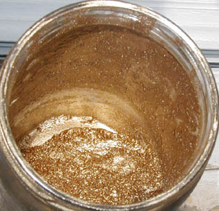

## L'or comme pigment
### L'or comme pigment, usage en arts plastiques
 **L'or (pigment)**  

[L'or](annexe1.html#au) véritable (voir photo) est très couvrant, très présent, à tel point qu'il vaut mieux parfois le combiner avec d'autres métaux et l'employer avec sagesse sans quoi il peut étouffer une oeuvre.

Lecture conseillée : [L'or sur Pourpre.com](http://pourpre.com/chroma/dico.php?typ=fiche&&ent=or)

Certains peintres semblent pris d'une " fièvre de l'or" lorsqu'ils ont l'occasion de travailler avec ce métal. Nous recensons par exemple un cas d'intoxication - aux conséquences heureusement bénignes - par inhalation de poudre d'or, dû à un excès d'enthousiasme peut-être un peu puéril.

Les imitations peuvent être intéressantes pour peu qu'elles conservent l'aspect _couvrant_ typique du métal précieux authentique, ce qui est rare.

L'or a une luminosité à la fois intense et subtile. Les imitations de type "or rouge" ou "or vieux" peuvent être satisfaisantes, particulièrement dans le domaine des patines à la cire, mais elles le sont moins souvent dans celui des peintures en tubes, souvent kitsch.

Il y a un avantage certain à reconstituer les variétés d'or à l'aide d'un or véritable combiné avec d'autres métaux.

C'est une constatation sans appel : l'or véritable est vraiment inimitable (que l'on veuille bien nous excuser pour cette formule qui peut évoquer certains slogans publicitaires).

