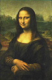
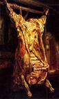

## La carnation
### La carnation, article du glossaire
 _Indirectement du latin_ caro, carnis_, chair  
par l'italien_ carnagione_, carnation (selon l'Académie française)_

Dans les arts picturaux (peinture, dessin, émaux, sculpture, et même photo ou vidéo), la carnation n'est autre que la représentation de la peau humaine. C'est un art difficile, puissant, ancien et toujours absolument contemporain. L'expressivité d'une oeuvre, son discours pictural, dépend bien souvent du traitement des carnations, que ce soit dans le nu, dans le portrait le plus pudique ou dans la fantasmagorie la plus outrée.

Insistons un moment sur l'importance expressive majeure de la représentation de la peau dans l'histoire de l'art puisque c'est la représentation de notre apparence, c'est une voix, un discours pictural par excellence.

Le traitement de ce sujet ne semble pas toujours à la hauteur de son rang, de son importance. Cela peut susciter des polémiques. Il semble notamment absurde de présenter un cours d'anatomie artistique sans évoquer les veines tant celles-ci pour ainsi dire nous parlent. Et pourtant, même dans les meilleures écoles d'art, certains se contentent d'évoquer mécaniquement os, muscles et tendons... un discours pédagogique qui peut paraître éventuellement améliorable.

Une autre chose peut-être plus choquante est la ["teinte chair"](terresrouges.html#teintechair) ou "ocre de chair" de certains fabricants de peinture. De quelle chair parle-t-on, de quelle couleur devrait être une "peau standard" imaginaire alors que les artistes depuis des millénaires travaillent à représenter l'épiderme dans une infinité de nuances et de couleurs réelles ou inventées ? A l'opposé, le tube de teinte chair est un rose plus que banal : oxyde de fer rouge et blanc de titane typiquement.

Prenons le temps de contempler, dans la rue, la couleur de la peau des passants en Occident à des latitudes moyennes. Elle est subtilement jaune et à peine rose (statistiquement parlant). Rappelons pour donner un repère frappant que la Joconde elle-même est jaune, non rose.

Les Asiatiques ne sont pas plus jaunes que les Occidentaux, et ceux-ci pas plus roses ni blancs, les Amérindiens pas plus rouges, soit dit en faisant abstraction du teint hâblé de certains montagnards ou marins et d'une multitude de cas particuliers. Des symbolismes ne devraient pas être pris pour des réalités.

L'épiderme humain, sur tous les continents, est un magnifique tissu opalescent imprégné de mélanine noire en quantités diverses variant même sur la surface de la peau d'une seule personne. Il est littéralement collé sur une autre couche corporelle, le derme (corps papillaire, chorion) puis l'hypoderme, sortes d'ensembles de cellules [lipidiques](lipide.html) blanc-jaune traversés de nombreuses petites artères rouges. Puis il y a les muscles et d'autres graisses et tissus divers, soit chromatiquement du rouge, du jaune et du bleu (veines). Cette série de couches forme une interface complexe et vivante : la peau est un organe. C'est peut-être ce que Rembrandt pourrait nous inciter à nous rappeler au travers d'un très célèbre tableau sans concessions (ci-contre). En dessous de l'épiderme, qu'il s'agisse d'un bovin ou d'un humain, il y a ça. Ce n'est pas rose, c'est une complexité qui définit en partie l'apparence que veut bien nous transmettre notre transparent épiderme.

Le prétendu rose de la peau est surtout d'un ordre symbolique, au mieux en relation avec l'émoi, au pire avec des considérations beaucoup moins poétiques, plutôt d'ordres politique ou idéologique, signalétique, historique, social, etc. Sur un plan concret c'est tout autre chose.

L'épaisseur de la peau humaine varierait à peu près du simple au triple en fonction de la région corporelle. La peau féminine aurait en moyenne une épaisseur légèrement supérieure (information non confirmée) qui pourrait éventuellement expliquer une luminosité ou une noirceur (voire la combinaison des deux et des [iridescences](iridescence.html)) qui semblent parfois aux frontières de l'irréel.

Face à une question récurrente, "comment réaliser une teinte chair", on répondra que la couleur de la peau n'est de toute façon pas un en-soi. L'interaction entre la peau du modèle, l'éclairage et la configuration du lieu donne une infinité de couleurs. Cette infinité est le moteur et/ou l'agent de l'expressivité du formidable travail des artistes depuis la nuit des temps. _Il n'y a pas d'ocre de chair ni de teinte chair,_ c'est un mirage.

Représenter la peau, _fare la carnagione_ est un travail artistique. Il n'existe pas de solution toute prête et la peau est autant une merveille réelle qu'une source d'inspiration particulièrement importante dans l'histoire de l'art. Une telle représentation nécessite une élaboration et s'inscrit dans une composition chromatique qui elle-même s'inscrit dans une intention artistique. Il est d'ailleurs également possible de jouer précisément sur la symbolique des couleurs et même sur leurs variations sérielles comme le fit Andy Warhol, produisant un tout autre discours pictural.

 [Communication](http://www.artrealite.com/annonceurs.htm) 

