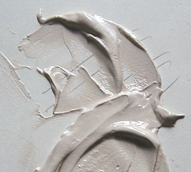
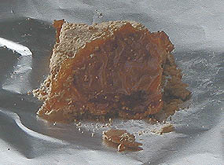

## La chaux
### La chaux, les chaux, usage en arts plastiques et autres
 **La chaux**

_[English text](english/lime.html) _ 

Pigments compatibles :  
[Cliquer ici](pourlafresque.html)

Sur le _rinzaffo_, _l'arriccio_ et _l'intonaco_  
lire [passage](courrierdeslecteurs2009c020.html#arriccio) in Courrier des Lecteurs

Sur le tadelakt et différents aspects techniques  
lire le [chapitre XVI](chap16interieurexterieurchaux.html) des Dialogues de Dotapea

**Le cycle de la chaux**

_La chaux est avant tout un oxyde de [calcium](annexe1.html#ca) (CaO) obtenu par la calcination des pierres à chaux. Celles-ci sont des carbon[ates](uresiresates.html) de calcium (principalement la [calcite](calcite.html) - CaCO3 -, mais aussi le [calcaire](calcaire.html), la [craie](craie.html) et le [marbre](marbres.html)) plus ou moins impurs. Pour les transformer en chaux, on leur fait perdre leur CO2 par calcination (terme provenant du latin_ calx_, chaux) aux alentours de 825°C. Le CaO obtenu est inondé d'eau, ce qui déclenche un lent processus dit extinction (voir [ci-dessous](chaux.html#extinction)) donnant des variétés différentes en fonction notamment de la quantité d'eau initiale : le_ grassello _(chaux éteinte en pâte), le [lait de chaux](chaux.html#badigeonlaitdechaux), et enfin l'eau de chaux, hydroxyde de calcium (Ca(OH)2), soit la chaux "typique", bien éteinte, séchée mais pas carbonatée, se présentant sous forme de poudre._

_Au fil du temps, la chaux absorbe et fixe plus ou moins lentement le dioxyde de carbone atmosphérique ou marin. Dans le cas de certains [mortiers](mortier.html), ce processus peut s'étaler sur des siècles. Plus couramment, il est modérément court ([lire passage](chap16interieurexterieurchaux.html#carbonatation) in_ Les dialogues de Dotapea, chap. XVI_)._

_S'associant naturellement au carbone, la chaux redevient lentement le carbonate de calcium, la calcite dont elle a été extraite initialement par calcination. Ce processus, nommé carbonatation, est abordé dans une perspective artistique et décorative dans le chapitre XVI des Dialogues de Dotapea ([lien direct](chap16interieurexterieurchaux.html#carbonatation)). Il est également possible de fixer artificiellement le carbone dans le CaO, mais le produit obtenu, le carbure de calcium, s'enflamme ou explose au contact de l'eau [(\*)](chaux.html#note)._

Sommaire

[Le cycle de la chaux](chaux.html#cyclechaux)

[Caractéristiques du "liant chaux"](chaux.html#caracteristiquesduliantchaux)

[Sous l'enduit, le support](chaux.html#support)

[Chaux et liant auxiliaire, chaux et eau, pulvérulence, lissage (_tadelakt_, ferrage)](chaux.html#support)

[La chaux a-t-elle besoin d'autres liants ?](chaux.html#chauxautresliants)

[Mise en solution, application et séchage](chaux.html#miseensolution)

[Pulvérulence, tadelakt et ferrage](chaux.html#pulverulencetadelaktferrage)

[Chaux et alun](chaux.html#chauxetalun)

[Vertus plastiques](chaux.html#vertusplastiques)

[Chaux vive ou éteinte, dangerosité](chaux.html#viveoueteinte)

[Grasse ou maigre, aérienne et/ou hydraulique](chaux.html#grasseoumaigre)

[Utilisation en peinture à l'huile](chaux.html#utilisationenpeinturealhuile)

[Badigeon lait de chaux et chaulage](chaux.html#badigeonlaitdechaux)

[Autres emplois de la chaux](chaux.html#autresemploisdelachaux)

_Le processus naturel par lequel la chaux redevient calcite est en partie comparable au dégazage massif qui a permis à l'atmosphère terrestre de devenir respirable par fixation au sol (marin) des quantités colossales de gaz carbonique atmosphérique des débuts de notre planète. Le carbone contenu dans ce gaz, associé au calcium des premiers coraux [(\*\*)](chaux.html#note2) fut ainsi fixé dans les anciens récifs tassés et devenus de gigantesques plateaux calcaires._

_Aujourd'hui encore, les coraux ou ce qu'il en reste continuent à recycler (davantage que les forêts) le gaz carbonique de l'air, véhiculé par d'innombrables microorganismes marins charriés par les courants. Un mur peint à la chaux remplit la même fonction - certes dans une proportion infiniment moins déterminante, malheureusement pour la qualité de notre air et celle de nos climats. Et ainsi elle ne fait que compenser l'émission initiale de CO2 qui l'avait transformée de CaCO3 à CaO._

**Caractéristiques du "liant chaux"**

_La chaux est un produit très utile et connu depuis des temps immémoriaux (de l'ordre de 6000 ans ou plus). Elle a la particularité de pouvoir être utilisée comme enduit protecteur, comme liant à [fresque](fresque.html), comme complément d'autres matériaux calciques et comme composant majeur de [mortiers](mortier.html). Elle permet à l'humidité de passer et, pour cette raison, vieillit bien, naturellement, ne piégeant pas l'eau dans les murs (voir [tadelakt](tadelakt.html))._

_Cependant d'un point de vue pratique elle pose souvent la question de l'interface avec son support. Par exemple, appliquée directement sur un autre matériau calcique tel que le [plâtre](platresupport.html), elle ne donne pas forcément de bons résultats. Un enduit est souvent nécessaire pour réaliser cette interface._

**_Sous l'enduit, le support_**

_On citera parmi d'autres comme supports possibles la pierre bien sûr, le [béton](beton.html) et le [ciment](ciment.html), le [béton cellulaire](betoncellulaire.html), le [carreau de plâtre](platresupport.html#lecarreaudeplatre) et certaines plaques de polystyrène extrudé pré-couvertes d'une couche de ciment fibré (lire [passage](courrierdeslecteurs2009c020.html#polystyreneextrude) in Courrier des Lecteurs)._

_Le bois n'est pas forcément conseillé à cause de ses déformations. Le "liant chaux" devenant [calcite](calcite.html) au fil du temps, il lui faut un support bien solide._

**_Chaux et liants auxiliaires, chaux et eau, pulvérulence, lissage (_tadelakt_, ferrage)_**

_La chaux peut être mêlée à un autre liant (la [caséine](caseine.html) particulièrement - même si cette alliance semble contestable, [voir lien](chap16interieurexterieurchaux.html#caseinechaux) -, mais aussi dans une certaine mesure l'acrylique, le vinyle, etc. - on mentionne même le [suif](suif.html), que nous ne conseillerons pas). Certains auteurs prétendent à l'inverse qu'elle n'aurait besoin que de très petites quantités de liant auxiliaire, voire pas du tout. Le processus de fixation du carbone serait généralement assez durcissant en lui-même, disent-ils. Mais cette polémique n'a pas de sens car la question n'est pas là :_

> _l'important est de savoir de quelle chaux on parle. Une chaux aérienne est beaucoup trop pulvérulente pour être utilisée telle quelle. Une chaux hydraulique le permet. Lire ci-dessous [chaux grasse et maigre](chaux.html#grasseoumaigre)._

_Mise en solution, application et séchage_

_[L'eau](eau.html) permet de [mettre en solution](diluantssolvants.html) la chaux afin de l'appliquer sur le support. La qualité de cette eau est importante. Une eau trop acide peut entraîner la [formation de sels](formationdesels.html) indésirables._

_Les conditions de séchage sont également déterminantes : si la température de l'atelier ou du chantier est élevée, s'il y a du soleil, du vent ou un courant d'air, l'eau s'évapore avant que la chaux commence à durcir et celle-ci part en poudre._

_Pulvérulence, tadelakt et ferrage_

Tout d'abord, il est conseillé, pour toutes ces raisons, de pratiquer quelques tests. Passez le doigt sur la surface séchée, vous saurez tout de suite ce qu'il en est de la pulvérulence de la chaux que vous avez appliquée. Il faut cependant tenir compte du fait que certains liants auxiliaires sont plus lents à durcir après l'évaporation. Il est donc prudent de retenter l'expérience quelques jours, voire quelques semaines plus tard (en fonction de la nature et de la proportion de l'auxiliaire) pour se faire une opinion fiable.

De plus, la pulvérulence n'est pas forcément un handicap dans la mesure où l'on pratique souvent un traitement après séchage : un lissage, une compression de la chaux.

En Europe, on désigne cette pratique sous le terme de "ferrage", l'outil servant à lisser étant métallique. On dit aussi quelquefois "serrage". Selon un aimable lecteur de Dotapea, ces deux termes seraient "_en fait identiques car le S et le F s'écrivaient souvent à l'identique dans l'écriture manuscrite il y a quelques siècles et cela fait que, aujourd'hui, le ferronnier et le serrurier travaillent tous deux le fer._"

Au Maroc, ce n'est pas un fer mais un galet qui est utilisé. La technique s'intitule _tadelakt_ ([lire absolument l'article du glossaire](tadelakt.html)).

_**Chaux et alun**_

Nous découvrons progressivement les témoignages de l'utilisation [d'alun](alun.html) dans la chaux. Il semblerait agir comme agent durcissant et augmentant la "permanence" de la peinture, tout comme il le fait dans le domaine de la teinture.

_**Vertus plastiques**_

_Grasse ou même un peu maigre, la chaux sèche est assez transparente, comparée au plâtre par exemple. Cette propriété de transparence est l'une des clés qui l'ont rendue aussi populaire que "de bon ton" depuis des milliers d'années : elle ne s'impose pas lourdement, elle modifie les surfaces picturales, sans plus. Certains auteurs vont jusqu'à affirmer peut-être exagérément qu'un badigeon à la chaux ayant bien vieilli (ayant bien fixé le carbone atmosphérique) finit par prendre l'apparence d'un glacis._

_La chaux présente une très relative élasticité (par rapport au plâtre) et seulement pendant un temps limité, mais surtout, comme on l'a dit, une aptitude à laisser l'eau s'échapper, propriétés qui la mettent à peu près à l'abri de certains accidents picturaux comme les craquelures et les cloques._

**_Chaux vive ou éteinte, dangerosité_**

En ce qui concerne la chimie de la chaux pure (distinguée de la calcite et des chaux siliceuses), il existe deux catégories principales  :

> \* la chaux vive, monoxyde de [calcium](calcium.html), CaO
> 
> \* la chaux éteinte, hydraulique ou aérienne. C'est un hydroxyde de calcium Ca(OH)2.

La chaux vive est transformée en chaux éteinte par un processus violent et dangereux donnant lieu à bouillonnement, mousse et échauffement (400°C). **La chaux vive, avide d'eau, brûlante, est un produit extrêmement dangereux**. Le processus d'extinction est long. Trois mois de trempage est vraiment un minimum. Les Anciens considéraient que trois ans étaient nécessaires. Une chaux mal éteinte est dangereuse, mais son emploi est bien spécialisé. Il ne concerne pratiquement que certaines chaux destinées au [chaulage](chaux.html#chaulage).

Comme on l'a dit, la chaux éteinte conserve un [pH](ph.html) assez élevé. Cela signifie que sans être véritablement caustique, elle n'est pas anodine. L'emploi de gants, de protections, n'est pas un luxe pour un emploi massif ou répété. Éviter le contact avec la peau et **surtout avec les yeux**. Certains auteurs comparent sa dangerosité à celle de l'eau de Javel, dans le sens où elle est quand même manipulable sans trop de danger moyennant quelques précautions.

On évoque parfois des chaux qui blanchissent grandement au séchage. En fait, tout dépend de la pureté de la chaux. Une chaux maigre ([voir ci-dessous](chaux.html#grasseoumaigre)), chargée de silice, blanchira évidemment plus qu'une chaux grasse. La présence d'huile de lin peut également influer sur l'aspect de la chaux (coloration brune, transparence).

_Toutes les formes de chaux non carbonatées sont assez fortement [alcalines](alcali.html).  
Pour cette raison, à tort ou à raison elles ont assez souvent été associées à la [caséine](caseine.html), parfois dès la préparation de celle-ci._

**_Grasse ou maigre, aérienne ou hydraulique_**

En fonction de sa charge initiale en [argile](argile.html) plus ou mois pure (concentration en [silice](silice.html), élément parfois adjoint artificiellement lors de la cuisson initiale), la chaux est :

> \* grasse (pas d'argile, donc abondance proportionnelle du liant, ce qui correspond à la définition du _[gras](gras.html)_).  
> Elle augmente au contact de l'eau, ne se combinant pas à celle-ci, ne la retenant en aucune manière : l'argile, jouant le rôle d'agent de liaison avec l'eau est ici absente. La chaux grasse ne se combine qu'à l'air, d'où l'appellation de "chaux aérienne". Elle réduit un peu à la prise. Elle peut être utilisée dans certains cas en peinture, notamment en très petites quantités [en émulsion avec les huiles à peindre](chaux.html#utilisationenpeinturealhuile), mais surtout, très couramment, avec de la [caséine](caseine.html) et en [badigeons](badigeon.html).
> 
> \* ou maigre (présence d'argile, de [silice](silice.html)). C'est la "chaux hydraulique".  
> Elle s'utilise étendue d'eau, comme enduit (_blanc de chaux_) pour les peaux et en agriculture, mais aussi bien sûr dans le domaine de la construction (voir _[ciment](ciment.html)_ et _[béton](beton.html)_). Elle est traitée par action de l'eau sur une variété particulière de chaux vive chargée d'argile cuite (donc maigre).  
> Elle réduit moins à la prise que la chaux grasse. Par contre, on mentionne une coloration blanche apparaissant au séchage.
> 
> La chaux maigre est dite hydraulique parce qu'elle est capable de durcir même en présence d'eau, voire dans l'eau.  
> Les premières études poussées sur la chaux hydraulique ne dateraient que du XIXème siècle (Vicat et Johnson).
> 
> Important : qu'elle soit aérienne ou hydraulique, une chaux peut être dite maigre si elle contient de grandes quantités d'impuretés. En ce cas, elle n'a pas tellement d'emplois en arts plastiques ni en décoration.
> 
> "Maigre" ou "grasse", cela réfère à la définition du liant. Tout ce qui est liant (insaturé) peut être dit gras. [Voir définition.](gras.html) Par conséquent, une chaux hydraulique, donc chargée de silice (saturée), est maigre par rapport à une chaux aérienne. Une chaux aérienne impure peut être dite maigre, mais une chaux hydraulique peut difficilement être nommée "maigre" puisqu'elle l'est par définition. Une certitude : une chaux, quelle qu'elle soit, lorsqu'elle est peu liante par rapport à la norme, peut tout simplement être nommée "impure". Les termes "chaux grasse" ou maigre pourraient être mis au rebus car ils entretiennent la confusion. Leur vocation n'est pas de masquer le fait qu'une chaux est pure ou impure.

**Utilisation en peinture à l'huile**

_L'adjonction d'huile dans ou sur la chaux est bien connue dans le domaine de la peinture décorative._ _Rien n'empêche l'artiste peintre de faire de même, mais à ses risques et périls._

_La chaux - en quantité notable - mise en présence d'huile devient brunâtre. Ce phénomène s'accroît terriblement avec le temps, nous l'avons constaté (voir ci-contre un mélange huile-chaux parfaitement raté : après dix-huit mois, l'huile a bruni considérablement, elle s'est concentrée en une sorte de croûte - la chaux était trop imbibée d'eau - mais heureusement, l'ensemble évoque un bon gâteau). Il ne faut pas oublier qu'une réaction chimique douce, [la saponification](saponification.html), se produit lorsque l'on met un [ester](ester.html) (l'huile) en présence d'une [base](base.html) (la chaux). Une raison de plus pour employer ce produit puissant à doses minimes._

_Il existe deux manières de placer la chaux dans l'huile :_

> \* _en jetant la poudre telle quelle_
> 
> \* _en la mêlant à un peu d'eau pour réaliser une sorte d'émulsion._

_La deuxième solution est viable seulement si la proportion d'eau est faible. L'eau est indispensable (sans quoi la chaux joue le rôle d'un siccatif monstrueux), mais en trop grande quantité, sa présence provoque des craquelures, des effritements (constatés expérimentalement). Phénomène étonnant quand on pense que le mariage s'effectue parfaitement lorsque l'huile est, à l'inverse, en très petite quantité. Une certitude, donc  : le dosage est déterminant._

_A la lumière de nos expérimentations sur le mélange huile-chaux, il apparaît que l'huile doit être considérée comme un adjuvant (plus qu'un émulsifiant) de peu d'intérêt en peinture artistique. Elle a quand même quelques atouts anecdotiques :_

> \* _elle homogénéise les mélanges par sa viscosité, un peu à la manière de la [standolie](standolie.html), au point de détruire les reliefs,_

> \* _elle freine la chute de charges [cristalloïdes](cristalloide.html) telles que [l'hydrate d'alumine](chargesincolores.html#lhydratedalumine) ou la [poudre de marbre](chargesincolores.html#lapoudredemarbre). Pourquoi, comment ? On peut poser plusieurs hypothèses. D'abord, la chaux est fortement visqueuse. Elle a du liant. Elle freinerait donc ce mouvement en s'associant plus rapidement que l'huile aux autres éléments présents. De plus, elle réagit non seulement par saponification de l'huile, mais aussi par association avec le carbone qu'elle peut trouver dans la pâte (voire peut-être aussi le soufre et d'autres éléments). Au cours de ces échanges, il n'est pas exclu qu'elle dégage un peu d'oxygène, "assimilé" par l'huile dans le cadre de la réaction normale de [siccativation](sechagesiccativation.html).  
> Il ne s'agit vraiment que d'hypothèses, mais les temps de séchages nous ont quand même semblé fort courts, même avec de petites quantités et même en empâtement,_
> 
> \* _la transparence de la chaux placée dans l'huile est assez notable. A ce point de vue, elle se comporte infiniment mieux que par exemple un [blanc de Meudon](terresblanches.html#meudon), qui contient également du calcium. Mais gare aux évolutions dans les mois qui suivent ([voir ci-dessus](chaux.html#utilisationenpeinturealhuile))._

_Présente dans certains médiums du commerce, elle ne doit pas être méprisée d'une manière univoque et définitive, mais son emploi nécessite une grande parcimonie._

**Badigeon lait de chaux et chaulage**

Pour commencer, signalons que ces techniques peuvent nécessiter l'intervention d'un professionnel spécialisé. Il existe certains dangers à la fois pour le manipulateur et tout simplement pour le résultat. La question de l'enduction préalable, particulièrement, nécessite un avis d'initié.

Le lait de chaux, employé dans la technique du [badigeon](badigeon.html), est constituée typiquement ainsi (recette [Sennelier](liens.html#sennelier) que nous communiquons telle quelle ou presque à titre indicatif) :

> \* un volume de chaux aérienne en solution dans 2 à 3 volumes d'eau
> 
> \* 10 à 25% en volume de pigments (10% pour les pigments les plus couvrants comme les oxydes ferreux)
> 
> \* 10 à 15% en volume d'un liant comme la caséine, l'acrylique ou le vinyle - _le liant auxiliaire joue un rôle déterminant car c'est lui qui empêche le lait de devenir trop pulvérulent au séchage. Certains auteurs évoquent cependant des quantités beaucoup plus faibles (une cuillerée à soupe pour un seau !). Nous conseillons de faire quelques essais préalables._ 
> 
> \* 5% de savon liquide ou de liquide vaisselle.

Le "lait de chaux" peut en fait avoir une composition fort variable.

Un badigeon plus épais, destiné au "[chaulage](chaulage.html)", peut être préparé avec les mêmes ingrédients mais seulement un volume d'eau pour un volume de chaux.

ATTENTION : certaines chaux destinées au chaulage ne sont pas totalement éteintes. Elles doivent donc être manipulées avec des protections pour les mains et les yeux, voire l'ensemble du corps. Elles ne doivent pas être appliquées par temps de pluie, par fort ensoleillement ou par grand vent. Elles sont parfois nommées "chaux blanches naturelles".

Si le chaulage est un traitement assez lourd, le badigeon doit, lui, être appliqué en couches fines plutôt diluées, mettant pleinement à profit la transparence de la chaux.

Les surfaces doivent être poreuses, propres, sans graisses. Elles doivent être mouillées et souvent "re-mouillées" pendant l'application.

[Voir aussi _Le crépi_](crepi.html)

**Autres emplois de la chaux**

Signalons pour l'instant l'emploi de chaux comme fondant dans la fabrication du verre ([lire passage in Le verre](verre.html#fondantsduverre)).

Voir aussi : page consacrée à la [caséine](caseine.html), [article du glossaire sur le badigeon](badigeon.html).

Voir également [stuc](stuc.html), [calcaire](calcaire.html), [craie](craie.html), [marne](marne.html), [_Autres huiles de lin et autres applications_ in _Huile de lin_](huiledelin.html#autreshuilesdelin).

\_\_\_\_\_

(\*) L'opération, assez brutale, est réalisée dans un four à arc électrique porté à 1700, 1800, voire 2000°C :

CaO + 3C + 108 300 calories   =   CaC2 + CO

Où CaC2 est le carbure de calcium. Il a longtemps été utilisé pour produire une substance importante - y compris pour les arts plastiques -, [l'acétylène](acetylene.html), qu'il dégage au contact de l'eau :

CaC2 + 2 H2O   =   Ca(OH)2 + C2H2 + chaleur (31 kcal)

Où Ca(OH)2 est de la chaux éteinte et C2H2, de l'acétylène.

Bien que l'acétylène soit principalement produite de nos jours par l'industrie pétrochimique, le carbure de calcium est encore fabriqué. L'une de ses utilisations concerne... _les ingénieuses lampes à acétylène_ des spéléologues. 

Pour retourner au corps du texte, cliquez sur le bouton "Précédent" de votre navigateur

(\*\*) Les coraux semblent jouer le rôle de patients fixateurs du carbone atmosphérique, à l'aide du calcium marin et de microorganismes intermédiaires (le plancton notamment). Les premiers coraux ont ainsi transformé l'atmosphère terrestre initiale. Ce sont essentiellement eux qui ont rendu vivable la surface de notre planète, tôt dans son histoire. Ainsi, les stromatolithes, premières roches coralliennes connues, dateraient environ de 3,5 milliards d'années.

Citons un court extrait d'un texte de Hervé Morin qui apporte un intéressant éclairage sur la nature typique du corail.

_"\[les\] récifs coralliens \[sont\] le fruit du patient travail de petits polypes, semblables à de minuscules méduses, qui édifient un squelette calcaire dans lequel ils s'abritent. Ils vivent en symbiose avec des micro algues unicellulaires, les zooxanthelles. Celles-ci bénéficient de certains composés organiques produits par le polype et fournissent, en échange, un apport supplémentaire d'oxygène à travers la photosynthèse. Les zooxanthelles protègent également la calcification, en dégradant certains acides produits par les polypes. Mais il suffit d'un stress causé, par exemple, par une élévation sensible de la température de l'eau, pour que les zooxanthelles soient expulsées et que s'engage le processus - parfois réversible - de blanchiment du corail."_

Pour autant, il existe également des "coraux des profondeurs" qui ne répondent pas à ces critères. Découverts plus récemment, fonctionnant différemment, ils sont emblématiques d'une question essentielle qui ne peut être présentée autrement qu'en forme de point d'interrogation à ce jour.

Pour retourner au corps du texte, cliquez sur le bouton "Précédent" de votre navigateur

 [Communication](http://www.artrealite.com/annonceurs.htm) 

