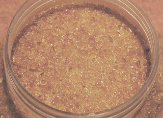

## La colle d'os
### La colle d'os, usage en arts plastiques
 **La colle d'os**  

_Colle en grain d'origine antique obtenue par [hydrolyse](hydrolyse.html) de cellules osseuse._

Elle se présente en "larmes" (voir photo).

Elle se travaille à chaud après une dissolution de trois à quatre heures. Concentration : 30 à 50% en poids dans l'eau.

_Fort tirant._

_Utilisée en ébénisterie, menuiserie, reliure et restauration._

Voir absolument [noir animal](noiranimal.html).

Toute précision, tout témoignage de l'utilisation de cette colle [seraient les bienvenus](ecrire.html). Merci d'avance.

_Un premier témoignage reçu en juin 2002_ nous a permis de cerner un problème majeur concernant ce produit : il n'est pas assez distribué. Les fabricants sont si rares que leurs clients (des professionnels) ne souhaitent pas divulguer leurs coordonnées de peur de se trouver en situation de pénurie.

_Autre témoignage (mai 2003)_ : en peinture décorative, la colle d'os serait parfois utilisée à défaut de colle de peau, à proportion égale à celle-ci, une part pour dix parts d'eau dont il faudrait enlever l'excédent après cuisson.

