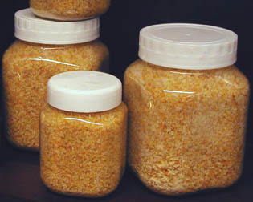

## La colle de peau
### La colle de peau, usage en arts plastiques
 **La colle de peau**

_La caractéristique la plus notoire de la colle de peau, par rapport à la [caséine](caseine.html) notamment, c'est sa souplesse. Parmi les colles anciennes, seules elle et la [colle de poisson](colledepoisson.html) authentique, contenant du [collagène](collagene.html), allient suffisamment de finesse et de souplesse pour l'enduction des supports souples comme les toiles. Pourtant, elles sont assez solides et résistantes pour polir du bronze ([cf. passage in Les abrasifs](abrasifs.html#patate))._

_Aujourd'hui, des problèmes de pénurie liés semble-t-il à de nouvelles réglementations (temporaires ? définitives ? bruits de couloirs ?) concernant tant la fabrication que l'importation, font que les rares colles de peau disponibles sont généralement de qualité médiocre (tirant très faible)._

_Quelle peau ?_

Il s'agit, dans le contexte classique des Beaux-arts, de peau de lapin.

Sommaire

[Quelle peau ?](colledepeau.html#quellepeau)

[Caractéristiques physico-chimiques, utilisation commune](colledepeau.html#caracteristiques)

[Préparation de la colle de peau, utilisation pour l'encollage de la toile](colledepeau.html#preparationsdelacolledepeau)

[La colle de peau utilisée pour l'encollage du bois](colledepeau.html#lacolledepeauutiliseepourlencollagedubois)

[La colle de peau utilisée comme liant](colledepeau.html#lacolledepeaucommeliant) (peinture à la colle de peau).

[A chaud](colledepeau.html#achaud)

[Liquéfaction à froid](colledepeau.html#liquefactionafroid)

Cependant, dans le passé d'autres colles de peaux animales ont été utilisées dans des champs très proches. Tout particulièrement, les déchets de fabrication des parchemins (à l'ancienne, parchemins animaux, [voir lien](parchemin.html#colledepeau)) ont été utilisés pour fabriquer la colle dite "de brochette" qui est également une colle aux collagènes, tout comme la [colle de poisson](colledepoisson.html).

Dans la suite de cette article nous nous concentrerons cependant sur la colle de peau de lapin de manière exclusive.

A lire aussi (in Courrier des Lecteurs) : [Totin : retour rétro sur cette colle de peau](courrierdeslecteurs2010c250.html#20101121abc)

_Caractéristiques physico-chimiques, utilisation commune_

_Diluant : [eau](eau.html)  
Température de liquéfaction ≥ 37°C_

_[L'acétone](acetone.html), [l'acétate d'alumine](chargesincolores.html#acetatedalumine), [l'alun](alun.html) et [l'alcool](alcools.html#actionsurproteines) auraient une action imperméabilisante ou insolubilisante sur la colle de peau. Cette action semble cependant sujette à caution. Ces produits rendraient les gélatines friables selon [Xavier de Langlais](livres.html#langlais). Nous n'avons recueilli pour l'instant aucun autre témoignage à ce sujet._

_\[sur ce point, lire le [courrier d'une lectrice](courrierdeslecteurs2011a230.html#20110414el) dédié à  
une enduction à la colle de peau\]_

_Le [formol](formol.html) aurait une action violemment dissolvante._

_L'acide phénique et le [nitrobenzène](essences.html#lessencedemirbane) sont signalés comme conservateurs. Attention : ce ne sont pas des produits anodins. L'ail est également mentionné ([lire l'article qui lui est consacré](ail.html))._

La colle de peau est surtout employée comme produit produit d'encollage des toiles, sujet qui sera donc abordé en premier lieu dans cet article. Cet exposé intéressera de toutes manières toute personne souhaitant en faire un autre usage ([enduction du bois](colledepeau.html#lacolledepeauutiliseepourlencollagedubois), [utilisation comme liant à peindre](colledepeau.html#lacolledepeaucommeliant), etc.) car la préparation est sensiblement identique dans tous les cas.

Préparation de la colle de peau,

utilisation pour l'encollage de la toile

_La colle de peau de lapin (dite "colle Totin", du nom d'une ancienne marque), qui a rendu dans le passé d'inestimables services comme enduit des supports souples, semble un rempart beaucoup trop faible contre l'humidité comparativement aux produits industriels actuels et même intrinsèquement : **en** **milieu fortement humide** (par temps de forte pluie), les toiles se détendent au point de former un "ventre" sur le châssis._

_Nous avons recueilli des témoignages sur ce phénomène, constaté à plusieurs reprises par plusieurs personnes, concernant des toiles préparées par des peintres différents. Cette brutale baisse de tension, d'un aspect assez inquiétant, peut altérer la couche picturale des tableaux peints à l'huile de manière irrémédiable. D'ailleurs, pourquoi ne pas citer [Xavier de Langlais](livres.html#langlais)  : "_La sensibilité de la gélatine à l'humidité et sa coagulation rapide dès que la colle cesse d'être chaude sont les deux grands défauts de ce produit._"_

_Il n'est pas exclu que l'[hygroscopie](hygroscopique.html) de la colle de peau soit encore accrue par l'adjonction massive de [glycérine](glycerine.html) dans les produits contemporains. Comme l'indique aussi [Xavier de Langlais](livres.html#langlais), cet assouplissant pourrait accentuer ce défaut. Mais c'est avant tout une question de proportion. La glycérine ne devrait jamais dépasser 5% du poids du produit. Or, nous ne savons rien des quantités éventuellement utilisées par les fabricants._

La composition réelle des colles de peau est incertaine : substituts, adjuvants ([glycérine](glycerine.html), comme nous le disions, mélasse), etc.

Ajoutons que le procédé de préparation et d'encollage à la colle de peau - aussi utile ait-il été dans le passé - se présente comme une liste d'inconvénients : il faut 

> \* broyer la colle en poudre ;
> 
> \* calculer la proportion d'eau à adjoindre (voir ci-dessous, [proportions](colledepeau.html#proportions)) ;
> 
> \* faire mariner 24 heures, _y compris pour la version en grains_, contrairement à ce qu'annoncent certains auteurs (3 heures, 12 heures, c'est insuffisant au regard des fabricants eux-mêmes : l'eau ne peut pénétrer que lentement dans les longues fibres intriquées), dans un récipient propre, en isolant totalement le mélange de l'extérieur avec un plastique alimentaire, sans quoi il pourrirait par la suite ;
> 
> \* cuire 1/4 d'heure en petite quantité au bain-marie dans un récipient propre pas trop grand, en verre, type pot de confiture, le plus propre possible (pour diminuer le risque de pourrissement ultérieur) et isolé du fond de la casserole par un objet interposé afin d'éviter la casse et surtout une surchauffe au fond du contenant ;
> 
> \* enduire immédiatement ou conserver (au réfrigérateur jusqu'à 5 jours, même en l'absence de traces d'altération) dans un plat large où vous viendrez puiser des portions à [réchauffer](colledepeau.html#rechauffage) ;
> 
> \* appliquer la colle à chaud, mais pas brûlante (elle traverserait la toile). L'odeur est alors assez incommodante pour dissuader certains peintres ;
> 
> \* laissez l'excédent se refroidir, se gélifier, conserver dans les conditions indiquées ci-dessus.

Vous croyez avoir fini ?

Vous avez tout faux ! Il fallait préparer deux couches **avec deux concentrations de colle différentes** !

En fait, dès le début, il vous faut calculer DEUX proportions d'eau à adjoindre à la poudre car il faut une préparation maigre ([5-6g](colledepeau.html#proportions)) pour la première couche et une [grasse](gras.html) (8-11g) pour la seconde.

Mais certains peintres n'appliquant qu'une couche de colle de peau et semblent satisfaits du résultat.

Malgré ces inconvénients déjà signalés depuis longtemps par les plus illustres auteurs, l'école de la peau de lapin demeure bien implantée en France et dans l'ensemble de l'Europe.

_Proportions_

> \* Colle très tirante, épaisse : 20g pour 100ml d'eau. Une telle concentration ne peut être employée pour encoller une toile. Le châssis risquerait d'éclater.
> 
> \* Colle faible : 5g pour 100ml.
> 
> \* Colle "normale", de 5 à 11g.
> 
> \* Liant : 7 à 9g.

Il est usuel de parler de "colle à n grammes" pour évoquer une concentration de poudre de colle de peau pour 100ml d'eau (soit un décilitre).

Ci-contre, une plaque de colle de peau de lapin, à réduire en grains ou en poudre avant usage.

_Réchauffement_

La colle de peau refroidie, devenue "gel", ne peut être réchauffée et refroidie indéfiniment. Il vaut mieux ne réchauffer que la quantité nécessaire et suffisante, au bain-marie.

Rappel : la température de liquéfaction de la colle de peau est ≥ 37°C.

**Ne jamais faire bouillir** : cela détruirait la colle.

_En grains ou en plaques ?_

Certains préfèrent les grains car il est plus facile de mesurer leurs poids et de les réduire en poudre. Par contre, quelques auteurs affirment que les plaques sont plus pures, mais il nous est impossible de confirmer ou d'infirmer cette information pour l'instant.

La colle de peau utilisée pour l'encollage du bois

Lire le paragraphe consacré à [l'encollage à la peau de lapin dans l'article sur _la préparation du bois_](preparatboispeinture.html#preparationduboisavecdelacolledepeaudelapin).

La colle de peau comme liant

_A chaud_

Il faut d'abord mentionner deux aspects très importants de l'utilisation de ce procédé de peinture :

> \* un inconvénient : il faut travailler à chaud, c'est à dire VITE et de manière organisée, sans rompre la "chaîne du chaud" ! Cette contrainte évoque la peinture à la [cire chaude](cires.html#peinturealencaustique).
> 
> \* un avantage, du moins une particularité remarquable : la colle de peau est un gel [thixotrope](thixotropie.html), pouvant revenir à l'état fluide lorsqu'il est agité (par des mouvements de brosse notamment), mais restant d'une bonne tenue au repos dans des conditions hygrométriques normales.

Concernant ce dernier point, spécifions que d'une manière générale, quelle que soit la technique de peinture employée, un **_médium à peindre_** (donc un additif) [thixotrope](thixotropie.html) ne pose en principe que de maigres problèmes lors d'un déplacement ou d'un léger réchauffement parce que l'architecture moléculaire de la pâte est déjà soutenue par un liant indifférent aux conditions de stockage et de transport. Par contre, un **_liant_** thixotrope pose un problème de fragilité structurelle évident, même si les répercussions de cette fragilité ne sont pas toujours clairement sensibles immédiatement à l'échelle de la vision humaine.

Cependant, ne nous bornons pas à ne citer que des inconvénients : certains auteurs ont raison de mentionner les qualités plastiques de la colle de peau, qui donnerait "_des pâtes fluides et nerveuses, des aplats veloutés, de superbes [vélatures](uv.html#velature)... et finalement des films aux réelles qualités techniques et esthétiques_". C'est tout à fait vrai, sauf en ce qui concerne "l'aspect velouté", un terme excessif pour désigner une sorte de satiné.

De nombreux gessos ([lire l'article sur l'histoire et la fabrication de gessos](fabriquerungesso.html)) ont été réalisés anciennement, et même de nos jours (notamment dans les domaines de la dorure et de la restauration) avec une colle de peau mêlée de pigments blancs. Cinq à douze couches peuvent être nécessaires. Chaque couche doit en principe être appliquée _avant_ le séchage complet de la couche précédente pour un bon accrochage. Tout ponçage doit être réalisé après séchage profond, c'est à dire après 48 heures environ.

Pour finir, signalons qu'il y a lieu, selon certains auteurs, de tamiser le pigment avant de l'incorporer à chaud _sans remuer_ sur le moment, afin d'éviter les grumeaux. Un peu plus tard, lorsque l'imbibition est entamée, c'est le moment de remuer, mais doucement, pour éviter de piéger l'air.

Concentration de la colle utilisée comme liant à chaud : voir [proportions](colledepeau.html#proportions).

_Liquéfaction à froid_

C'est l'acide acétique qui permet d'empêcher la gélification.

Il rend possible une utilisation [a tempera](tempera.html), pratiquées par quelques peintres, mais nous ne disposons pas de témoignages directs ([merci de nous faire par de cette expérience si vous êtes adepte de ce procédé de peinture](ecrire.html)).

Évidemment, si la solution obtenue s'avérait [acide](acides.html), elle disqualifierait certains pigments et produits [alcalins](alcali.html) dont les composés à base de [calcium](annexe1.html#ca) et autre métaux [alcalinoterreux](alcalinoterreux.html).

Attention : l'emploi de [vinaigre](vinaigre.html) n'est pas forcément à conseiller car celui-ci contient non seulement de l'acide acétique, mais aussi un [aldéhyde](aldehyde.html) acétique qui pourrait avoir un effet plus destructeur. Des tests préalables sont conseillés.

Lire aussi [L'enduction des toiles (paragraphe "Quelle colle ?")](enductiondestoiles.html#quellecolle), [Les colles](colles.html), [La gélatine](gelatine.html).

 [Communication](http://www.artrealite.com/annonceurs.htm) 

