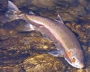

## La colle de poisson
### Le colle de poisson, usage en arts plastiques
 **La colle de poisson**  

_Selon plusieurs sources, la seule colle de poisson valable est celle qui est extraite de la vessie natatoire - voire de certains cartilages - de l'esturgeon et de quelques autres poissons. La meilleure qualité proviendrait de l'esturgeon noir qui vit dans les eaux salées et produit le caviar (information non confirmée)._

_Son emploi remonte à l'Antiquité._

Elle était encore utilisée pour les petits travaux artistiques jusqu'à la seconde guerre mondiale (c'est-à-dire l'avènement des colles vinyliques et acryliques). Elle peut toujours s'avérer adaptée à des supports souples comme la toile ou le papier.

Elle peut être utilisée à froid et peut être chargée de pigments. C'est donc un [liant](liants.html) autant qu'une colle. Au Japon par exemple, elle est utilisée dans la domaine de la peinture traditionnelle. On l'appelle NIKAWA. Elle est employée en Europe et ailleurs comme colle pour tissus, papier, carton et bois. [L'Isorel ®](bois.html#lisorel) serait réalisé avec ce type de colles mêlé à de la poudre de bois. Elle fut utilisée au Moyen-âge pour l'enduction de parchemins ([lien](parchemin.html#colledepoisson)) et différents autres usages.

La variété caspienne serait employée en restauration.

Dilution : généralement, la proportion de colle à placer dans l'eau est de l'ordre de 30 à 50% (en poids).

Elle est plus ou moins [réversible](liants.html#reversibilite) (sauf particularités ou traitement spécifique, notamment le traitement à chaud) et peut donc poser des problèmes de conservation des oeuvres, tant comme enduit que comme peinture. L'utilisation de [formol](formol.html) ou d'autres produits durcissants pourrait contribuer à une "fixation" durable de ce produit mais pourrait être fragilisant.

Voir [gélatine](gelatine2.html), [colle de peau](colledepeau.html).

