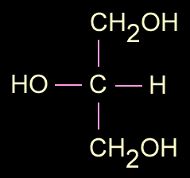
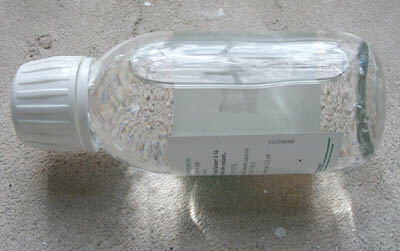

## La glycérine
### La glycérine, usage en arts plastiques
 **La glycérine  
****ou glycérol**

_[English version](english/glycerin.html) _ 

_Du grec_ glukeros_,_ glukus_, doux._

_La glycérine pure, forme d'alcool, ressemble beaucoup à un miel, un sirop, mais par rapport à ces produits, elle a les avantages suivants : composition parfaitement pure, totale transparence (voir [photo](glycerine.html#photo)), absence de coloration et souplesse._

_Elle rentre aussi dans la composition intime, moléculaire, de nombreux produits fondamentaux en arts plastiques comme les huiles à peindre par exemple. D'ailleurs, elle est très présente dans l'univers biologique. Donnons quelques précisions chimiques avant d'évoquer l'utilisation du produit en arts plastiques._

Lire [l'article **Alcool** du glossaire](alcool.html)

Sommaire

[Description](glycerine.html#description)

[Utilisation comme adjuvant en peinture](glycerine.html#utilisationenpeinture)

[Une réputation de blanchisseuse](glycerine.html#reputationdeblanchisseuse)

[Produits contemporains à base de glycérine (peinture)](glycerine.html#produitscontemporainsabasedeglycerine)

_Description_

La formule de la glycérine est CH2OH-CHOH-CH2OH (deux [fonctions alcool](alcool.html#fonctionsalcool) primaires CH2OH et une secondaire CHOH, soit C3H8O3). 

Elle présente donc trois fonctions alcool (elle est un [trialcool](polyalcoolpolyol.html)) et se combine avec des [acides](acides.html) (un triacide ou trois acides différents) pour former des [esters](ester.html) **qui ne sont autres que les** [**corps gras**](gras.html#corpsgras) (triglycérides).

Lire l'encadré [Formation d'un triglycéride _in_ La saponification et l'estérification](saponification.html#formationtriglyceride).

Les graisses qui sont en nous, êtres vivants, celles que nous consommons (voir [lipides](lipide.html), [glycéride](glyceride.html)) ainsi que les huiles, dont toutes celles qui sont employées en peinture, sont le résultat de ces combinaisons (voir [esterification](saponification.html#lesterification)).

Son point d'ébullition est de 290°C.

La glycérine produit des esters qui ont généralement la particularité d'être souples. Elle est elle-même un assouplissant (voir ci-dessous _[Utilisation comme adjuvant en peinture](glycerine.html#utilisationenpeinture)_), mais dans le contexte des arts plastiques, il est possible et souvent préférable d'assouplir des produits à l'aide d'esters glycérique lorsque c'est possible. En effet, la glycérine seule n'est pas liante. Elle ne fait qu'éloigner les molécules de liants, de pigments, les résines, etc. (voir ci-dessous, utilisation comme adjuvant). Pour devenir liante, elle doit se combiner à un acide [insaturé](saturation.html) sous la forme d'un ester.

La fabrication artificielle d'esters triglycérides est relativement difficile - bien que l'industrie maîtrise maintenant parfaitement ce processus - car l'efficacité de la glycérine dans le lent processus [d'estérification](saponification.html#lesterification) est plutôt faible comparativement aux autres alcools.

Concrètement, ce produit est disponible en pharmacie. Appelé _**glycérol**_ par les chimistes, il donne lieu à une multitude de produits pharmaceutiques, cosmétiques et industriels. Il est d'ailleurs lui-même un sous-produit de la fabrication des [savons](savon.html) et [bougies](ciredebougie.html). En tant que résidu, il aurait été, selon certaines sources, un polluant important des eaux avant que l'on songe à des emplois industriels. Information non confirmée.

La glycérine serait [hygroscopique](hygroscopique.html) selon certains auteurs. Vérification faite, il semblerait que des conditions précises doivent être réunies pour qu'une réaction à l'eau se produise. Il faut tenir compte, notamment, de la charge électrochimique du support qui, elle, est bien déterminante, nous l'avons constaté. Il n'y a vraiment pas d'hygroscopie spécifique à la glycérine ni à ses esters dans l'ensemble. Par contre, certains esters peuvent être hygroscopiques de par les propriétés des acides qu'ils contiennent.

Il est beaucoup plus important de souligner l'effet parfois radical des [alcalis](alcali.html) sur les esters glycériques.

_Utilisation comme adjuvant en peinture_

La glycérine, nous l'avons dit, est employée comme **agent assouplissant** mais aussi comme **retardateur du séchage** pour différentes peintures à l'eau et [badigeons](badigeon.html). Fortement épaisse (voir l'effet de loupe sur la photo), elle "dégonfle" considérablement au séchage, formant finalement, employée pure, une couche très fine sans plis, sans craquelures, sans accident. Son temps de séchage n'est pas celui de l'huile de lin mais il est quand même assez long. Elle n'a aucune efficacité en elle même en tant que liant. Lorsqu'elle est ajoutée à une pâte, elle doit être considérée comme un diluant, c'est-à-dire un produit qui va éloigner les molécules "liantes" ([insaturées](saturation.html)) et diminuer la viscosité de cette pâte. Elle peut donc fragiliser, appauvrir une peinture.

Elle crée des [interférences](chap08interferences.html) fugitives en surface lorsqu'elle est agitée. On remarque d'ailleurs des effets « prismatiques » près du goulot du flacon sur la photo. Cette propriété est discrète lorsque l'on ajoute de la glycérine à une peinture en faible quantité.

Pour toutes ces raisons, mais aussi parce que, en plus, elle affiche un important retrait au séchage, elle ne doit pas être dosée fortement (1/20ème tout au plus du poids total environ pour éviter tout problème, d'avantage, jusqu'à 1/10ème, ce qui est considérable, si l'on veut "forcer" une substance à devenir plus souple ou si l'on souhaite retarder grandement le séchage). Bien sûr, ces chiffres doivent être adaptés à la nature de la pâte et du support. Ils ne sont présentés ici qu'à titre indicatif.

_Dilution, fabrication de savons_

La glycérine se dissout dans [l'alcool](alcool.html) et aussi dans l'eau quoique assez mollement, à la manière d'un sirop qui a tendance à se concentrer au fond du récipient si l'on n'agite pas le mélange. C'est cette manière de ne pas se mêler naturellement qui autorise son extraction par décantation dans "l'eau glycérineuse", le résidu de la fabrication des savons évoqué ci-dessus. La séparation par hauteurs différenciées sur différentes étapes du processus serait l'une des principales clés de la réussite du procédé de fabrication marseillais.

_Une réputation de blanchisseuse_

Au point de vue de son utilisation à l'état pur dans les arts plastiques, la glycérine a acquis à la fois à tort et à raison une réputation parfois mauvaise : elle "blanchirait". En fait, c'est une utilisation inadéquate qui peut provoquer des altérations _par interaction avec des acides présents dans la couche picturale_ _ou le support_. Les peintures et supports neutres ou faiblement chargés ne poseront aucun problème. La glycérine peut même "neutraliser" partiellement l'acidité de certaines substances. Ce lent processus peut cependant donner des résultats variés, pas toujours souhaitables. Voir [_Saponification_](saponification.html).

_Produits contemporains à base de glycérine (peinture)_

La glycérine, on l'a dit, est présente à l'état naturel dans des peintures grasses traditionnelles. Depuis qu'elle a été synthétisée, les fabricants ont pu créer de nouveaux produits tels les [liants dits "glycérophtaliques"](glycerophtalique.html) et les liants [alkydes](alkydes.html). [L'acrylique](acryliquegloss.html) et le [vinyle](vinylegloss.html) ne contiennent pas de glycérine. Il s'agit bien d'esters également mais leurs alcools ne sont pas glycériques.

Voir [alcool](alcool.html), [glycol](glycol.html), [polyalcool](polyalcoolpolyol.html).

 [Communication](http://www.artrealite.com/annonceurs.htm) 

